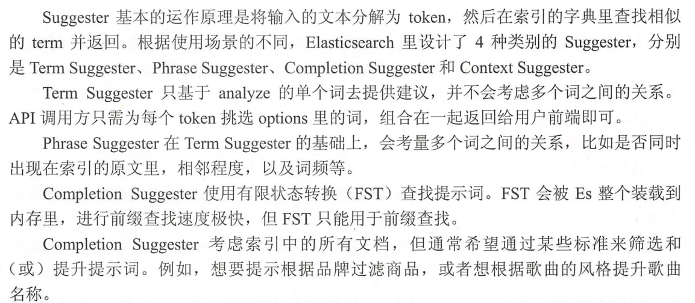

# elastic-search

[TOC]

## 技术栈

MySQL 有的功能，elastic search 一般都有。(elastic search 没有 acid 特性)

* 增量数据迁移 mysql => es: alibaba canal

  canal 有服务端(slaver管道)、adapter(消费者) 和 admin 三个主要程序

  配置特别麻烦，不适合多现场部署，版本兼容性也不咋地，太重了

* 全量数据迁移：logstash

## 视频教程

[ElasticSearch入门到精通2021最新教程](https://www.bilibili.com/video/BV1854y1E78p) 讲师-吴磊

elasticsearch笔记链接：https://pan.baidu.com/s/1dvrgjdiwf09cOhBiL7ezWQ 
提取码：8888 
Elasticsearch大数据搜索引擎链接：https://pan.baidu.com/s/14Tc8c6ZXZLZ61i-rKLXxGQ 
提取码：8888 
第二版：Elasticsearch 24 道链接：https://pan.baidu.com/s/15DadWyGblRA1Tenn7JthEg 
提取码：8888

## 数据高可用


高可用，就是数据冗余，elastic search 会进行数据冗余，副本分片是只读的，主要用来做搜索。

**集群健康值**

green-yellow-red

查看当前集群不健康的原因：`get _cluster/allocation/explain`

灰色的分片，是因为我们只有一个节点，数据是不可能有副本的，这违背了高可用原则。

怎么把黄色告警删除？把这个索引的副本分片设置为 0:

```json
put index_name/_settings
{
    "number_of_replicas": 1
}
```


## index, shards, replicas


elastic search 不能以 root 用户启动。

## 基于canal的MySQL=>ES数据同步方案 

1. ### 概念

   **canal [kə'næl]**，译意为水道/管道/沟渠，主要用途是基于 MySQL 数据库增量日志解析，提供增量数据订阅和消费

   早期阿里巴巴因为杭州和美国双机房部署，存在跨机房同步的业务需求，实现方式主要是基于业务 trigger 获取增量变更。从 2010 年开始，业务逐步尝试数据库日志解析获取增量变更进行同步，由此衍生出了大量的数据库增量订阅和消费业务。

   

2. ### 应用场景

   `Elasticsearch` 不支持`事务`。 ES通常在分布式系统架构中承担“搜索引擎”的角色，一般来说解决词类问题，可以把ES和支持ACID特性的关系型数据库结合起来使用。首先把对数据的更（增删改）操作在RDB中执行，然后把这些动作同步到`Elasticsearch`。 通过这种方式，你将受益于数据库 ACID 事务支持，并且在 Elasticsearch 中以正确的顺序产生变更。 并发在关系数据库中得到了处理。

   **以`MySQL`为例，如果要把数据从同步至ES，`canal + binary log`就是常用的一种增量解决方案。**

3. ### 原理

   

   #### MySQL主备复制原理

   - MySQL master 将数据变更写入二进制日志( binary log, 其中记录叫做二进制日志事件binary log events，可以通过 show binlog events 进行查看)
   - MySQL slave 将 master 的 binary log events 拷贝到它的中继日志(relay log)
   - MySQL slave 重放 relay log 中事件，将数据变更反映它自己的数据

   #### canal 工作原理

   - canal 模拟 MySQL slave 的交互协议，伪装自己为 MySQL slave ，向 MySQL master 发送dump 协议

   - MySQL master 收到 dump 请求，开始推送 binary log 给 slave (即 canal )

   - canal 解析 binary log 对象(原始为 byte 流)

     

4. ### 优势

   - 准实时性
   - 性能好
   - 一劳永逸

5. ### 玩法

   1. **环境**：

      ​	**Java和ES兼容性：https://www.elastic.co/cn/support/matrix#matrix_jvm**

      - JDK：1.8
      - Elasticsearch：7.x
      - MySQL： 5.7
      - Canal： 1.1.4

   2. **下载：**

      Github：				https://github.com/alibaba/canal/

      Github 咻咻咻：	https://github.com/fhefh2015/Fast-GitHub

   3. **步骤：**

      1. 保证`Elasticsearch`服务可用

      2. 保证`MySQL`服务可用

      3. 开启MySQL的binary log（主备模式）

         - **配置：**

         ```yaml
         server_id = 1 #开启主从模式后每个MySQL节点的id
         log-bin = mysql-bin #bin-log的存储位置
         binlog-format = ROW #选择存储binlog日志方式为ROW模式
         ```

         - **重启MySQL服务**

         - **验证是否开启成功**

           ```mysql
           SHOW VARIABLES LIKE 'log_bin';
           log_bin	ON #开启
           ```

      4. `canal-deployer`

         - 配置`conf/example/instance.properties`

           ```yaml
           #canal示例的slaveId
           canal.instance.mysql.slaveId=1234
           #mysql地址
           canal.instance.master.address= 127.0.0.1:3306
           #用户名
           canal.instance.dbUsername = root
           #密码
           canal.instance.dbPassword = 123456
           #指定需要同步的数据库
           canal.instance.defaultDatabaseName = msb_order
           #指定编码方式
           canal.instance.connectionCharset = UTF-8
           #监控的是所有数据库，所有的表改动都会监控到，这样可能会浪费不少性能，可能我只想监控的是某一个数据库下的表。
           #  .*\\..*表示监控所有数据库，canal\\..*表示监控canal数据库
           canal.instance.filter.regex = .\*\\\\..\*
           ```

         - 启动： ./startup.sh（Linux）

         - 验证：demo

      5. `canal-admin`

         - 配置`conf/application.yml`

           ```yaml
           server:
             port: 8089
           spring:
             jackson:
               date-format: yyyy-MM-dd HH:mm:ss
               time-zone: GMT+8
           
           spring.datasource:
             address: 127.0.0.1:3306
             database: canal_manager
             username: root
             password: 123456
             driver-class-name: com.mysql.jdbc.Driver
             url: jdbc:mysql://${spring.datasource.address}/${spring.datasource.database}?useUnicode=true&characterEncoding=UTF-8&useSSL=false
             hikari:
               maximum-pool-size: 30
               minimum-idle: 1
           canal:
             adminUser: admin
             adminPasswd: admin
           ```

         - 启动管理服务

         - 访问服务：`server_ip:8089`

      6. `canal-adapter`

         - 配置`conf/application.yml`

         ```yaml
         server:
           port: 8081
         spring:
           jackson:
             date-format: yyyy-MM-dd HH:mm:ss
             time-zone: GMT+8
             default-property-inclusion: non_null
         
         canal.conf:
           mode: tcp #tcp kafka rocketMQ rabbitMQ
           flatMessage: true
           zookeeperHosts:
           syncBatchSize: 1000
           retries: 0
           timeout:
           accessKey:
           secretKey:
           consumerProperties:
             # canal tcp consumer
             canal.tcp.server.host: 127.0.0.1:11111
             canal.tcp.zookeeper.hosts:
             canal.tcp.batch.size: 500
             canal.tcp.username:
             canal.tcp.password:
             # kafka consumer
             kafka.bootstrap.servers: 127.0.0.1:9092
             kafka.enable.auto.commit: false
             kafka.auto.commit.interval.ms: 1000
             kafka.auto.offset.reset: latest
             kafka.request.timeout.ms: 40000
             kafka.session.timeout.ms: 30000
             kafka.isolation.level: read_committed
             kafka.max.poll.records: 1000
             # rocketMQ consumer
             rocketmq.namespace:
             rocketmq.namesrv.addr: 127.0.0.1:9876
             rocketmq.batch.size: 1000
             rocketmq.enable.message.trace: false
             rocketmq.customized.trace.topic:
             rocketmq.access.channel:
             rocketmq.subscribe.filter:
             # rabbitMQ consumer
             rabbitmq.host:
             rabbitmq.virtual.host:
             rabbitmq.username:
             rabbitmq.password:
             rabbitmq.resource.ownerId:
         
           srcDataSources:
             defaultDS:
               url: jdbc:mysql://127.0.0.1:3306/msb_order?useUnicode=true
               username: root
               password: 123456
           canalAdapters:
           - instance: example # canal instance Name or mq topic name
             groups:
             - groupId: g1
               outerAdapters:
               - name: logger
               - name: es7
                 hosts: 127.0.0.1:9200 # 127.0.0.1:9200 for rest mode
                 key: exampleKey
                 properties:
                   mode: rest # transport or rest
                   # security.auth: test:123456 #  only used for rest mode
                   cluster.name: elasticsearch
         ```

         - 配置`conf/es7/my_order.yml`

         ```yaml
         dataSourceKey: defaultDS        # 源数据源的key, 对应上面配置的srcDataSources中的值
         outerAdapterKey: exampleKey     # 对应application.yml中es配置的key 
         destination: example            # cannal的instance或者MQ的topic
         groupId: g1                     # 对应MQ模式下的groupId, 只会同步对应groupId的数据_search
         esMapping:
           _index: msb_order             # es 的索引名称
           _type: _doc					# es7 固定'_doc'，es8删除
           _id: _id                      # es 的_id, 如果不配置该项必须配置下面的pk项_id则会由es自动分配
           upsert: true
           sql: "SELECT a.id as _id,	a.customer_phone, a.customer_name, a.customer_region, a.customer_city, a.customer_district, a.customer_addr, a.failure_phenomenon, a.failure_phenomenon_text, a.book_date, a.service_required, a.buyshop_detail, a.buy_shop, a.buy_way, a.product_type, a.model_no, a.process_type, a.ex_order_no, a.customer_country, a.source, a.matnr, a.buyDate, a.serviceReq, a.create_time, a.result, a.rvstatus, a.ip_address FROM msb_order_1 a"
           commitBatch: 3000  
         ```

         - 服务启动
         - 注意：
           - 索引`msb_order`的mapping必须提前创建好
           - 索引中的`id`字段是`_id`，因此需要查询的时候需要`id as _id`

      7. 按时

   

## 搜索推荐词


Query Suggestion



## 过滤

filter 对结果进行过滤。filter 不会贡献相关性得分。
