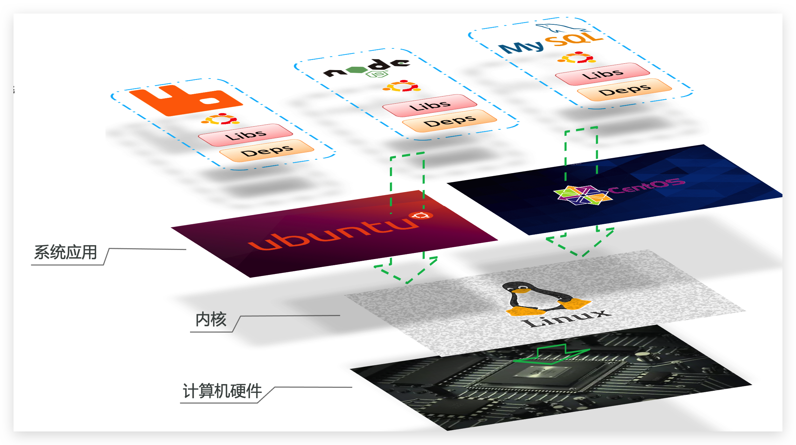
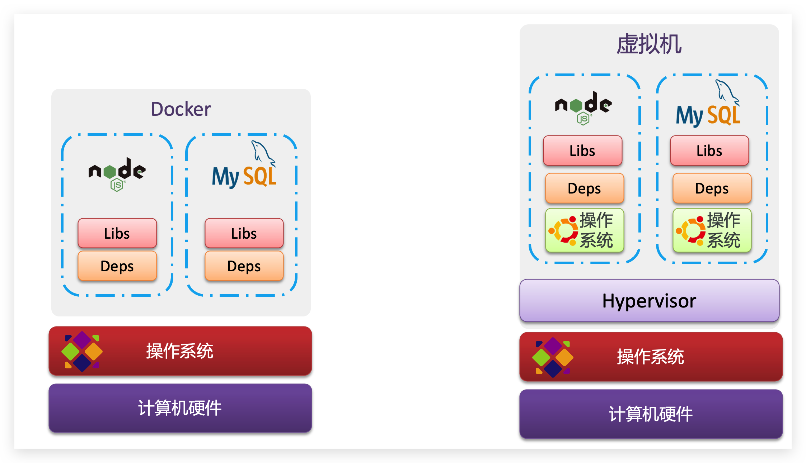
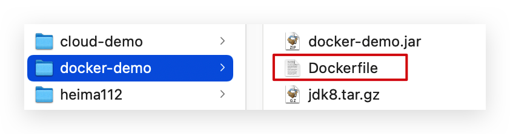
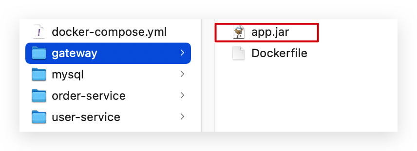

# Docker 

[TOC]

## Docker 我的理解

### 常用命令

```shell
# 查看正在运行的 docker 容器
docker ps

# 删除容器
docker rm container-name / hash

# 停止容器
docker stop container-name / hash

# 开启容器
docker start container-name

# 进入容器 mariadb 执行命令
docker exec -it mariadb /bin/bash
```


## Docker ARM

```shell
# 拉取 arm 版本的镜像，要加上 --platform 参数，优先使用 arm64 架构的
docker pull --platform linux/amd64 mysql
docker pull --platform linux/arm64 redis
```


### Docker 是什么

* 镜像是静态的，容器是跑起来的镜像，是动态的
* Dockerfile 是创建镜像的配置文件
* DockerCompose 是批量运行容器的配置文件

### Docker 使用感悟

* 在安装版本控制软件时，尝试过 gitlab 手动安装和 gogs docker 安装，docker 真的太丝滑了
* 每一个程序员，都应该像掌握 git 一样，熟练掌握 docker
* docker 将每一个软件的安装部署启动环节进行封装，相当于用 `run start stop` 等命令统一了各种软件的安装部署，属实牛批
* 任何封装在 Docker 中的服务，都不用安装到系统中了，以往我们如果想要用 mysql，还需要安装 mysql，现在 docker 的镜像屏蔽了安装这个步骤，用 mysql 的时候，只要跑一个 mysql 容器就行了，随用随关

### docker 使用注意事项

* container 是从镜像生成的，但是  container 也是一个实体，container 关闭后，仍然是存在的，是持久化的

### demo

```shell
docker run \
--name mariadb \
-v /root/mariadb/config:/etc/mysql/conf.d \
-v /root/mariadb/data:/var/lib/mysql \
--env MARIADB_USER=his \
--env MARIADB_PASSWORD=His@9700 \
--env MARIADB_ROOT_PASSWORD=His@9700 \
-dp 3307:3306 \
mariadb:10.3.28

# --name: 容器名称
# -v xxx:yyy: 把本地 xxx 目录挂载到容器内的 yyy 目录
# --env: mariadb 配置
# -d: detached 后端执行
# -p 3307:3306: 将容器内的 3306 端口映射到宿主机的 3307 端口，可以通过 3307 端口访问容器内的 mariadb
# mariadb:10.3.28: 从哪一个镜像生成容器，如果本地没有这个镜像，则会从远程仓库拉取
```


## Introduction

Docker is an open platform for developing, shipping, and running applications. Docker enables you to separate your applications from your infrastructure so you can deliver software quickly. 

Docker provides the ability to package and run an application in a loosely isolated environment called a container. The isolation and security allow you to run many containers simultaneously on a given host. Containers are lightweight and contain everything needed to run the application, so you do not need to rely on what is currently installed on the host. You can easily share containers while you work, and be sure that everyone you share with gets the same container that works in the same way.

Docker 是一个和 Git 一样提高工程师效率的工具。

**Docker 的机制**：

Linux 操作系统，分为 Linux 内核，和系统库，每一个 Linux 操作系统，内核基本上都是一样的，只有系统库的区别，而 Docker 则将应用程序和系统库一起打包，这样就屏蔽了不同系统的系统库，直达 Linux 内核。

Docker如何解决不同系统环境的问题？

- Docker将用户程序与所需要调用的系统(比如Ubuntu)函数库一起打包
- Docker运行到不同操作系统时，直接基于打包的函数库，借助于操作系统的Linux内核来运行



### Image and Container

An **image** is an **executable** package that includes everything needed to run an application: the code, a runtime, libraries, environment variables, and configuration files.

When running a container, it uses an isolated filesystem. This custom filesystem is provided by a **container image**. Since the image contains the container’s filesystem, it must contain everything needed to run an application - all dependencies, configuration, scripts, binaries, etc. The image also contains other configuration for the container, such as environment variables, a default command to run, and other metadata.

镜像是一个可以执行的包，包中打包了一个应用所需要的运行环境，运行库，环境变量，代码和配置文件等所有的依赖。这是一个静态的镜像，类似于创建的虚拟机的镜像。

A **container** is a runtime instance of an image.

一个镜像被加载运行后，就成了一个容器，容器是动态的，类似于正在运行的虚拟机。

Simply put, a container is simply another process on your machine that has been isolated from all other processes on the host machine. That isolation leverages [kernel namespaces and cgroups](https://medium.com/@saschagrunert/demystifying-containers-part-i-kernel-space-2c53d6979504), features that have been in Linux for a long time.

Container 就是一个进程。

### Container vs Virtual machine



### Dockerfile

Docker 镜像的配置 manifest 文件，包括：网络接口和存储设备的映射，要加入镜像的依赖/文件等配置。

### Docker and Kubernetes

Kubernetes can automate the whole container deployment process. 

Kubernetes 可以实现 Docker 管理，相当于 Dockers 的中控平台。

### Docker architecture

Docker uses a client-server architecture. The Docker *client* talks to the Docker *daemon*, which does the heavy lifting of building, running, and distributing your Docker containers. 

* The Docker daemon

  The Docker daemon (`dockerd`) listens for Docker API requests and manages Docker objects such as images, containers, networks, and volumes. A daemon can also communicate with other daemons to manage Docker services.

* The Docker client

  The Docker client (`docker`) is the primary way that many Docker users interact with Docker. When you use commands such as `docker run`, the client sends these commands to `dockerd`, which carries them out. The `docker` command uses the Docker API. The Docker client can communicate with more than one daemon.

* Docker registries

  A Docker *registry* stores Docker images. Docker Hub is a public registry that anyone can use, and Docker is configured to look for images on Docker Hub by default. You can even run your own private registry.

  When you use the `docker pull` or `docker run` commands, the required images are pulled from your configured registry. When you use the `docker push` command, your image is pushed to your configured registry.

  Docker 官方的 Registry: DockerHub，类似于 GitHub，我们可以在上面分享自己的 Docker 镜像。

* Docker images

  An *image* is a read-only template with instructions for creating a Docker container. Often, an image is *based on* another image, with some additional customization. For example, you may build an image which is based on the `ubuntu` image, but installs the Apache web server and your application, as well as the configuration details needed to make your application run.

  You might create your own images or you might only use those created by others and published in a registry. To build your own image, you create a *Dockerfile* with a simple syntax for defining the steps needed to create the image and run it. Each instruction in a Dockerfile creates a layer in the image. When you change the Dockerfile and rebuild the image, only those layers which have changed are rebuilt. This is part of what makes images so lightweight, small, and fast, when compared to other virtualization technologies.

### The underlying technology

Docker is written in the [Go programming language](https://golang.org/) and takes advantage of several features of the Linux kernel to deliver its functionality. Docker uses a technology called `namespaces` to provide the isolated workspace called the *container*. When you run a container, Docker creates a set of *namespaces* for that container.

These namespaces provide a layer of isolation. Each aspect of a container runs in a separate namespace and its access is limited to that namespace.

## Installation

### Windows

Docker Desktop for Windows 只支持 Windows 10 Professional or Enterprise 64-bit，不符合的 Windows 版本，例如 Win10 教育版/家庭版或者Win7 的版本，需要安装 [Docker Toolbox](<https://github.com/docker/toolbox/releases>) 来进行 Docker 的兼容。

Docker Toolbox 包含以下组件：

* Docker CLI client for running Docker Engine to create images and containers
* Docker Machine so you can run Docker Engine commands from Windows terminals
* Docker Compose for running the `docker-compose` command
* Kitematic, the Docker GUI
* the Docker QuickStart shell preconfigured for a Docker command-line environment
* Oracle VM VirtualBox

注意，如果 Git 已经安装过了，那么 Docker 的 CLI 就打不开，因为其依赖于 Git 的 Bash，此时需要修改 Docker CLI 的打开路径，将其默认路径替换成 Git 中 bash.exe 的路径：`/Git/bin/bash.exe`

如果 WIndows 开启了 Hyper-V，则需要关闭 Hyper-V。

## Docker Doc

[Docker Doc](https://docs.docker.com/) 文档学习。


## Docker 镜像

### 镜像名称

首先来看下镜像的名称组成：

- 镜名称一般分两部分组成：[repository]:[tag]。
- 在没有指定tag时，默认是latest，代表最新版本的镜像

如图：


这里的mysql就是repository，5.7就是tag，合一起就是镜像名称，代表5.7版本的MySQL镜像。

### 镜像命令

常见的镜像操作命令如图：


```shell
docker images
docker rmi
docker pull
docker push
docker save
dokcer load
```


docker save/load

```shell
# -o: output
docker save -o mariadb-docker-image.tar mariadb:10.3.28

# -i: input
docker load --input mariadb-docker-image.tar
```


## Docker 容器

### 容器相关命令

容器操作的命令如图：


容器保护三个状态：

- 运行：进程正常运行
- 暂停：进程暂停，CPU不再运行，并不释放内存
- 停止：进程终止，回收进程占用的内存、CPU等资源

其中：

- docker run：创建并运行一个容器，处于运行状态
- docker pause：让一个运行的容器暂停
- docker unpause：让一个容器从暂停状态恢复运行
- docker stop：停止一个运行的容器，文件系统不清理
- docker start：让一个停止的容器再次运行
- docker rm：删除一个容器，而且会把文件系统也干掉

### 创建并运行一个容器

创建并运行nginx容器的命令：

```sh
docker run --name containerName -p 80:80 -d nginx
```

命令解读：

- docker run ：创建并运行一个容器
- --name : 给容器起一个名字，比如叫做mn
- -p ：将宿主机端口与容器端口映射，冒号左侧是宿主机端口，右侧是容器端口
- -d：后台运行容器
- nginx：镜像名称，例如 nginx

这里的`-p`参数，是将容器端口映射到宿主机端口。

默认情况下，容器是隔离环境，我们直接访问宿主机的80端口，肯定访问不到容器中的nginx。

现在，将容器的80与宿主机的80关联起来，当我们访问宿主机的80端口时，就会被映射到容器的80，这样就能访问到nginx了：


### 进入容器，修改文件

**需求**：进入Nginx容器，修改HTML文件内容，添加“传智教育欢迎您”

**提示**：进入容器要用到docker exec命令。


**步骤**：

1）进入容器。进入我们刚刚创建的nginx容器的命令为：

```sh
docker exec -it mn bash
```

命令解读：

- docker exec ：进入容器内部，执行一个命令

- -it : 给当前进入的容器创建一个标准输入、输出终端，允许我们与容器交互

- mn ：要进入的容器的名称

- bash：进入容器后执行的命令，bash是一个linux终端交互命令


2）进入nginx的HTML所在目录 /usr/share/nginx/html

容器内部会模拟一个独立的Linux文件系统，看起来如同一个linux服务器一样：


nginx的环境、配置、运行文件全部都在这个文件系统中，包括我们要修改的html文件。

查看DockerHub网站中的nginx页面，可以知道nginx的html目录位置在`/usr/share/nginx/html`

我们执行命令，进入该目录：

```sh
cd /usr/share/nginx/html
```

 查看目录下文件：


3）修改index.html的内容

容器内没有vi命令，无法直接修改，我们用下面的命令来修改：

```sh
sed -i -e 's#Welcome to nginx#传智教育欢迎您#g' -e 's#<head>#<head><meta charset="utf-8">#g' index.html
```


在浏览器访问自己的虚拟机地址，例如我的是：http://192.168.150.101，即可看到结果：


## Docker 数据卷

在之前的nginx案例中，修改nginx的html页面时，需要进入nginx内部。并且因为没有编辑器，修改文件也很麻烦。

这就是因为容器与数据（容器内文件）耦合带来的后果。


要解决这个问题，必须将数据与容器解耦，这就要用到数据卷了。

### 什么是数据卷

**数据卷（volume）**是一个虚拟目录，指向宿主机文件系统中的某个目录。


一旦完成数据卷挂载，对容器的一切操作都会作用在数据卷对应的宿主机目录了。

这样，我们操作宿主机的/var/lib/docker/volumes/html目录，就等于操作容器内的/usr/share/nginx/html目录了

### 数据卷操作命令

数据卷操作的基本语法如下：

```sh
docker volume [COMMAND]
```

docker volume命令是数据卷操作，根据命令后跟随的command来确定下一步的操作：

- create 创建一个volume
- inspect 显示一个或多个volume的信息
- ls 列出所有的volume
- prune 删除未使用的volume
- rm 删除一个或多个指定的volume

### 创建和查看数据卷

**需求**：创建一个数据卷，并查看数据卷在宿主机的目录位置

① 创建数据卷

```sh
docker volume create html
```

② 查看所有数据

```sh
docker volume ls
```

结果：


③ 查看数据卷详细信息卷

```sh
docker volume inspect html
```

结果：


可以看到，我们创建的html这个数据卷关联的宿主机目录为`/var/lib/docker/volumes/html/_data`目录。

**小结**：

数据卷的作用：

- 将容器与数据分离，解耦合，方便操作容器内数据，保证数据安全

数据卷操作：

- docker volume create：创建数据卷
- docker volume ls：查看所有数据卷
- docker volume inspect：查看数据卷详细信息，包括关联的宿主机目录位置
- docker volume rm：删除指定数据卷
- docker volume prune：删除所有未使用的数据卷

### 挂载数据卷

我们在创建容器时，可以通过 -v 参数来挂载一个数据卷到某个容器内目录，命令格式如下：

```sh
docker run \
  --name mn \
  -v html:/root/html \
  -p 8080:80
  nginx \
```

这里的-v就是挂载数据卷的命令：

- `-v html:/root/htm` ：把html数据卷挂载到容器内的/root/html这个目录中

### 案例-给nginx挂载数据卷

**需求**：创建一个nginx容器，修改容器内的html目录内的index.html内容

**分析**：上个案例中，我们进入nginx容器内部，已经知道nginx的html目录所在位置/usr/share/nginx/html ，我们需要把这个目录挂载到html这个数据卷上，方便操作其中的内容。

**提示**：运行容器时使用 -v 参数挂载数据卷

步骤：

① 创建容器并挂载数据卷到容器内的HTML目录

```sh
docker run --name mn -v html:/usr/share/nginx/html -p 80:80 -d nginx
```

② 进入html数据卷所在位置，并修改HTML内容

```sh
# 查看html数据卷的位置
docker volume inspect html
# 进入该目录
cd /var/lib/docker/volumes/html/_data
# 修改文件
vi index.html
```

### 案例-给MySQL挂载本地目录

容器不仅仅可以挂载数据卷，也可以直接挂载到宿主机目录上。关联关系如下：

- 带数据卷模式：宿主机目录 --> 数据卷 ---> 容器内目录
- 直接挂载模式：宿主机目录 ---> 容器内目录

如图：


**语法**：

目录挂载与数据卷挂载的语法是类似的：

- -v [宿主机目录]:[容器内目录]
- -v [宿主机文件]:[容器内文件]


**需求**：创建并运行一个MySQL容器，将宿主机目录直接挂载到容器

实现思路如下：

1）在将课前资料中的 mysql.tar 文件上传到虚拟机，通过load命令加载为镜像

2）创建目录/tmp/mysql/data

3）创建目录/tmp/mysql/conf，将课前资料提供的hmy.cnf文件上传到/tmp/mysql/conf

4）去DockerHub查阅资料，创建并运行MySQL容器，要求：

① 挂载/tmp/mysql/data到mysql容器内数据存储目录

② 挂载/tmp/mysql/conf/hmy.cnf到mysql容器的配置文件

③ 设置MySQL密码

### 小结

docker run的命令中通过 -v 参数挂载文件或目录到容器中：

- -v volume名称:容器内目录
- -v 宿主机文件:容器内文件
- -v 宿主机目录:容器内目录

数据卷挂载与目录直接挂载的

- 数据卷挂载耦合度低，由docker来管理目录，但是目录较深，不好找
- 目录挂载耦合度高，需要我们自己管理目录，不过目录容易寻找查看


## Dockerfile 自定义镜像

dockerfile 是创建镜像的配置文件。

### 镜像结构

镜像是将应用程序及其需要的系统函数库、环境、配置、依赖打包而成。

我们以MySQL为例，来看看镜像的组成结构：


简单来说，镜像就是在系统函数库、运行环境基础上，添加应用程序文件、配置文件、依赖文件等组合，然后编写好启动脚本打包在一起形成的文件。我们要构建镜像，其实就是实现上述打包的过程。

### Dockerfile 语法

构建自定义的镜像时，并不需要一个个文件去拷贝，打包。

我们只需要告诉 Docker，我们的镜像的组成，需要哪些BaseImage、需要拷贝什么文件、需要安装什么依赖、启动脚本是什么，将来Docker会帮助我们构建镜像。而描述上述信息的文件就是Dockerfile文件。

**Dockerfile**就是一个文本文件，其中包含一个个的**指令(Instruction)**，用指令来说明要执行什么操作来构建镜像。每一个指令都会形成一层 Layer。


更新详细语法说明，请参考官网文档： https://docs.docker.com/engine/reference/builder

### 构建 Java 项目

#### 基于 Ubuntu 构建 Java 项目

需求：基于 Ubuntu 镜像构建一个新镜像，运行一个 java 项目

- 步骤1：新建一个空文件夹docker-demo

  

- 步骤2：拷贝课前资料中的docker-demo.jar文件到docker-demo这个目录

  

- 步骤3：拷贝课前资料中的jdk8.tar.gz文件到docker-demo这个目录

  

- 步骤4：拷贝课前资料提供的Dockerfile到docker-demo这个目录

  

  其中的内容如下：

  ```dockerfile
  # 指定基础镜像
  FROM ubuntu:16.04
  # 配置环境变量，JDK的安装目录
  ENV JAVA_DIR=/usr/local
  
  # 拷贝jdk和java项目的包
  COPY ./jdk8.tar.gz $JAVA_DIR/
  COPY ./docker-demo.jar /tmp/app.jar
  
  # 安装JDK
  RUN cd $JAVA_DIR \
   && tar -xf ./jdk8.tar.gz \
   && mv ./jdk1.8.0_144 ./java8
  
  # 配置环境变量
  ENV JAVA_HOME=$JAVA_DIR/java8
  ENV PATH=$PATH:$JAVA_HOME/bin
  
  # 暴露端口
  EXPOSE 8090
  # 入口，java项目的启动命令
  ENTRYPOINT java -jar /tmp/app.jar
  ```

- 步骤5：进入 docker-demo

  将准备好的 docker-demo 上传到虚拟机任意目录，然后进入docker-demo目录下

- 步骤6：运行命令：

  ```sh
  docker build -t javaweb:1.0 .
  ```


最后访问 http://192.168.150.101:8090/hello/count，其中的ip改成你的虚拟机ip

#### 基于 java8 构建 Java 项目

虽然我们可以基于 Ubuntu 基础镜像，添加任意自己需要的安装包，构建镜像，但是却比较麻烦。所以大多数情况下，我们都可以在一些安装了部分软件的基础镜像上做改造。

例如，构建 java 项目的镜像，可以在已经准备了 JDK 的基础镜像基础上构建。

需求：基于 java:8-alpine 镜像，将一个 Java 项目构建为镜像

实现思路如下：

- ① 新建一个空的目录，然后在目录中新建一个文件，命名为Dockerfile

- ② 拷贝课前资料提供的docker-demo.jar到这个目录中

- ③ 编写Dockerfile文件：

  - a ）基于java:8-alpine作为基础镜像

  - b ）将app.jar拷贝到镜像中

  - c ）暴露端口

  - d ）编写入口ENTRYPOINT

    内容如下：

    ```dockerfile
    FROM java:8-alpine
    COPY ./app.jar /tmp/app.jar
    EXPOSE 8090
    ENTRYPOINT java -jar /tmp/app.jar
    ```

- ④ 使用 docker build 命令构建镜像

- ⑤ 使用 docker run 创建容器并运行

总结：

1. Dockerfile的本质是一个文件，通过指令描述镜像的构建过程

2. Dockerfile的第一行必须是FROM，从一个基础镜像来构建

3. 基础镜像可以是基本操作系统，如Ubuntu。也可以是其他人制作好的镜像，例如：java:8-alpine

## DockerCompose 

DockerCompose 是容器的批量运行脚本。

Docker Compose可以基于 Compose 文件帮我们快速的部署分布式应用，而无需手动一个个创建和运行容器！


### 了解 DockerCompose

Compose文件是一个文本文件，通过指令定义集群中的每个容器如何运行。格式如下：

```json
version: "3.8"
 services:
  mysql:
    image: mysql:5.7.25
    environment:
     MYSQL_ROOT_PASSWORD: 123 
    volumes:
     - "/tmp/mysql/data:/var/lib/mysql"
     - "/tmp/mysql/conf/hmy.cnf:/etc/mysql/conf.d/hmy.cnf"
  web:
    build: .
    ports:
     - "8090:8090"

```

上面的Compose文件就描述一个项目，其中包含两个容器：

- mysql：一个基于`mysql:5.7.25`镜像构建的容器，并且挂载了两个目录
- web：一个基于 `docker build` 临时构建的镜像容器，映射端口时8090

DockerCompose 的详细语法参考官网：https://docs.docker.com/compose/compose-file/

其实 DockerCompose 文件可以看做是将多个 docker run 命令写到一个文件，只是语法稍有差异。

### 部署微服务集群

**需求**：将之前学习的cloud-demo微服务集群利用DockerCompose部署

**实现思路**：

① 查看课前资料提供的cloud-demo文件夹，里面已经编写好了docker-compose文件

② 修改自己的cloud-demo项目，将数据库、nacos地址都命名为docker-compose中的服务名

③ 使用maven打包工具，将项目中的每个微服务都打包为app.jar

④ 将打包好的app.jar拷贝到cloud-demo中的每一个对应的子目录中

⑤ 将cloud-demo上传至虚拟机，利用 docker-compose up -d 来部署

#### compose文件

查看课前资料提供的cloud-demo文件夹，里面已经编写好了 docker-compose 文件，而且每个微服务都准备了一个独立的目录：


内容如下：

```yaml
version: "3.2"

services:
  nacos:
    image: nacos/nacos-server
    environment:
      MODE: standalone
    ports:
      - "8848:8848"
  mysql:
    image: mysql:5.7.25
    environment:
      MYSQL_ROOT_PASSWORD: 123
    volumes:
      - "$PWD/mysql/data:/var/lib/mysql"
      - "$PWD/mysql/conf:/etc/mysql/conf.d/"
  userservice:
    build: ./user-service
  orderservice:
    build: ./order-service
  gateway:
    build: ./gateway
    ports:
      - "10010:10010"
```

可以看到，其中包含5个service服务：

- `nacos`：作为注册中心和配置中心
  - `image: nacos/nacos-server`： 基于nacos/nacos-server镜像构建
  - `environment`：环境变量
    - `MODE: standalone`：单点模式启动
  - `ports`：端口映射，这里暴露了8848端口
- `mysql`：数据库
  - `image: mysql:5.7.25`：镜像版本是mysql:5.7.25
  - `environment`：环境变量
    - `MYSQL_ROOT_PASSWORD: 123`：设置数据库root账户的密码为123
  - `volumes`：数据卷挂载，这里挂载了mysql的data、conf目录，其中有我提前准备好的数据
- `userservice`、`orderservice`、`gateway`：都是基于Dockerfile临时构建的


查看mysql目录，可以看到其中已经准备好了cloud_order、cloud_user表：


查看微服务目录，可以看到都包含Dockerfile文件：


内容如下：

```dockerfile
FROM java:8-alpine
COPY ./app.jar /tmp/app.jar
ENTRYPOINT java -jar /tmp/app.jar
```

#### 修改微服务配置

因为微服务将来要部署为docker容器，而容器之间互联不是通过IP地址，而是通过容器名。这里我们将order-service、user-service、gateway服务的mysql、nacos地址都修改为基于容器名的访问。

如下所示：

```yaml
spring:
  datasource:
    url: jdbc:mysql://mysql:3306/cloud_order?useSSL=false
    username: root
    password: 123
    driver-class-name: com.mysql.jdbc.Driver
  application:
    name: orderservice
  cloud:
    nacos:
      server-addr: nacos:8848 # nacos服务地址
```

#### 打包

接下来需要将我们的每个微服务都打包。因为之前查看到Dockerfile中的jar包名称都是app.jar，因此我们的每个微服务都需要用这个名称。

可以通过修改pom.xml中的打包名称来实现，每个微服务都需要修改：

```xml
<build>
  <!-- 服务打包的最终名称 -->
  <finalName>app</finalName>
  <plugins>
    <plugin>
      <groupId>org.springframework.boot</groupId>
      <artifactId>spring-boot-maven-plugin</artifactId>
    </plugin>
  </plugins>
</build>
```

打包后：


#### 拷贝jar包到部署目录

编译打包好的app.jar文件，需要放到Dockerfile的同级目录中。注意：每个微服务的app.jar放到与服务名称对应的目录，别搞错了。

user-service：


order-service：


gateway：



#### 部署

最后，我们需要将文件整个cloud-demo文件夹上传到虚拟机中，理由DockerCompose部署。

上传到任意目录：


部署：

进入cloud-demo目录，然后运行下面的命令：

```sh
docker-compose up -d
```

## Docker 镜像仓库

Docker Registry。

公共仓库：DockerHub，网易云镜像仓库，阿里云镜像仓库

私有仓库：私有 Docker Registry

### 简化版镜像仓库

Docker官方的Docker Registry是一个基础版本的Docker镜像仓库，具备仓库管理的完整功能，但是没有图形化界面。

搭建方式比较简单，命令如下：

```sh
docker run -d \
    --restart=always \
    --name registry	\
    -p 5000:5000 \
    -v registry-data:/var/lib/registry \
    registry
```


命令中挂载了一个数据卷registry-data到容器内的/var/lib/registry 目录，这是私有镜像库存放数据的目录。

访问http://YourIp:5000/v2/_catalog 可以查看当前私有镜像服务中包含的镜像

### 带有图形化界面版本

使用DockerCompose部署带有图象界面的DockerRegistry，命令如下：

```yaml
version: '3.0'
services:
  registry:
    image: registry
    volumes:
      - ./registry-data:/var/lib/registry
  ui:
    image: joxit/docker-registry-ui:static
    ports:
      - 8080:80
    environment:
      - REGISTRY_TITLE=传智教育私有仓库
      - REGISTRY_URL=http://registry:5000
    depends_on:
      - registry
```

### 配置 Docker 信任地址

我们的私服采用的是http协议，默认不被Docker信任，所以需要做一个配置：

```sh
# 打开要修改的文件
vi /etc/docker/daemon.json
# 添加内容：
"insecure-registries":["http://192.168.150.101:8080"]
# 重加载
systemctl daemon-reload
# 重启docker
systemctl restart docker
```

### 推送、拉取镜像

推送镜像到私有镜像服务必须先tag，步骤如下：

① 重新tag本地镜像，名称前缀为私有仓库的地址：192.168.150.101:8080/

 ```sh
docker tag nginx:latest 192.168.150.101:8080/nginx:1.0 
 ```

② 推送镜像

```sh
docker push 192.168.150.101:8080/nginx:1.0 
```

③ 拉取镜像

```sh
docker pull 192.168.150.101:8080/nginx:1.0 
```

## -------------------------------------------

## CLI

### docker ps 查看当前正在运行的容器

### docker version 查看版本

```shell
docker --version
```

### docker image

Docker 镜像的命名规范：

```shell
# ls all images in local
docker image ls
```

### docker container

```shell
# ls all container in local
docker container ls # running
docker container ls --all # all
docker container ls -aq # all in quiet mode
```

### docker run

```shell
docker run -d -p 80:80 docker/getting-started
```

You'll notice a few flags being used. Here's some more info on them:

- `-d` - run the container in detached mode (in the background)
- `-p 8000:80` - map port 8000 of the host to port 80 in the container
- `docker/getting-started` - the image to use

注意，docker run 以后就创建了一个 container（实体），在 container 关闭后，container 还是存在的，要 rm 掉原来的 container 然后重新编译。

如果本地没有这个 docker 镜像，就会从远程仓库里面找。

### docker build

This command used the Dockerfile to build a new container image. 

```shell
docker build -t getting-started .
```

This command used the Dockerfile to build a new container image. You might have noticed that a lot of “layers” were downloaded. This is because we instructed the builder that we wanted to start from the `node:12-alpine` image. But, since we didn’t have that on our machine, that image needed to be downloaded.

After the image was downloaded, we copied in our application and used `yarn` to install our application’s dependencies. The `CMD` directive specifies the default command to run when starting a container from this image.

Finally, the `-t` flag tags our image. Think of this simply as a human-readable name for the final image. Since we named the image `getting-started`, we can refer to that image when we run a container.

The `.` at the end of the `docker build` command tells that Docker should look for the `Dockerfile` in the current directory.

### Update

代码变更后，更新 Docker 的流程。

#### docker build 

先重新编译

```shell
docker build -t getting-started .
```

#### docker ps

Get the ID of the container by using the `docker ps` command.

```shell
 docker ps
```

#### docker stop

Use the `docker stop` command to stop the container.

```shell
 # Swap out <the-container-id> with the ID from docker ps
 docker stop <the-container-id>
```

#### docker rm

Once the container has stopped, you can remove it by using the `docker rm` command.

```shell
 docker rm <the-container-id>
```

You can stop and remove a container in a single command by adding the “force” flag to the `docker rm` command. For example: `docker rm -f <the-container-id>`

### docker login

登录 DockerHub：

```shell
docker login -u username
```

### docker tag

Create a tag TARGET_IMAGE that refers to SOURCE_IMAGE

```shell
# docker tag SOURCE_IMAGE[:TAG] TARGET_IMAGE[:TAG]
docker tag getting-started wansho/getting-started
```

### docker push

把本地的 docker 镜像 push 到远程仓库。默认推送到 dockerhub。

```shell
 docker push YOUR-USER-NAME/getting-started
```


### docker pull

从远程仓库拉取 docker image

```shell
docker pull wansho/getting-started:latest
```

## Docker 数据持久化 

While containers can create, update, and delete files, those changes are lost when the container is removed and all changes are isolated to that container. With volumes, we can change all of this.

[Volumes](https://docs.docker.com/storage/volumes/) provide the ability to connect specific filesystem paths of the container back to the host machine. If a directory in the container is mounted, changes in that directory are also seen on the host machine. If we mount that same directory across container restarts, we’d see the same files.

There are two main types of volumes. We will eventually use both, but we will start with **named volumes**.

### 1. named volumes

#### docker volume create

```shell
docker volume create todo-db # 创建一个 named volumes
# 把 todo-db 作为镜像 getting-started 的 volume，并挂载 todo-db 到 /etc/todos 上(实际上并没有真正挂在到 /etc/todos 下面)
docker -dp 3000:3000 -v todo-db:/etc/todos getting-started 

# 查看 docker 实际把我们的数据存储到哪里了
docker volume inspect todo-db
```

```json
[
    {
        "CreatedAt": "2021-04-25T20:11:13+08:00",
        "Driver": "local",
        "Labels": null,
        "Mountpoint": "/var/lib/docker/volumes/todo-db/_data",
        "Name": "todo-db",
        "Options": null,
        "Scope": "local"
    }
]
```

### 2. bind mounts

With **bind mounts**, we control the exact mountpoint on the host. We can use this to persist data, but it’s often used to provide additional data into containers. When working on an application, we can use a bind mount to mount our source code into the container to let it see code changes, respond, and let us see the changes right away.


## Multi container apps

Up to this point, we have been working with single container apps. But, we now want to add MySQL to the application stack. The following question often arises - “Where will MySQL run? Install it in the same container or run it separately?” In general, **each container should do one thing and do it well.** A few reasons:

- There’s a good chance you’d have to scale APIs and front-ends differently than databases
- Separate containers let you version and update versions in isolation
- While you may use a container for the database locally, you may want to use a managed service for the database in production. You don’t want to ship your database engine with your app then.
- Running multiple processes will require a process manager (the container only starts one process), which adds complexity to container startup/shutdown

### docker network

If two containers are on the same network, they can talk to each other. If they aren’t, they can’t.

```shell
# Create the network.
docker network create todo-app

# Start a MySQL container and attach it to the network. 
# You’ll notice we’re using a volume named todo-mysql-data here and mounting it at /var/lib/mysql, which is where MySQL stores its data. However, we never ran a docker volume create command. Docker recognizes we want to use a named volume and creates one automatically for us.
sudo docker run -d \
     --network todo-app --network-alias mysql \
     -v todo-mysql-data:/var/lib/mysql \
     -e MYSQL_ROOT_PASSWORD=secret \
     -e MYSQL_DATABASE=todos \
     mysql:5.7
     
# To confirm we have the database up and running, connect to the database and verify it connects.
docker exec -it <mysql-container-id> mysql -u root -p
```

Our app only simply needs to connect to a host named `mysql` and it’ll talk to the database! It doesn’t get much simpler than that!

重启 getting-started 容器：

```shell
#  # -w working dir; -v volume
sudo docker run -dp 3000:3000 \
   -w /app -v "$(pwd):/app" \
   --network todo-app \
   -e MYSQL_HOST=mysql \
   -e MYSQL_USER=root \
   -e MYSQL_PASSWORD=secret \
   -e MYSQL_DB=todos \
   node:12-alpine \
   sh -c "yarn install && yarn run dev"
```

### docker logs

```
docker logs container-id
```

```
 # Previous log messages omitted
 $ nodemon src/index.js
 [nodemon] 1.19.2
 [nodemon] to restart at any time, enter `rs`
 [nodemon] watching dir(s): *.*
 [nodemon] starting `node src/index.js`
 Connected to mysql db at host mysql
 Listening on port 3000
```

### docker exec

进入容器执行命令

```shell
# 在容器中连接 mysql
docker exec -it <mysql-container-id> mysql -u root -p
```

## Docker Compose

Docker compose 的作用是对 docker run 进行配置封装。ubuntu 安装 docker-compose 的命令：`sudo apt-get install docker-compose `

docker-compose 的优点：

* 自动创建 network
* 对 docker run 进行封装，进而可以进行版本控制

`docker-compose.yml`:

```yml
version: "2.0"

services:
  app:
    image: node:12-alpine
    command: sh -c "yarn install && yarn run dev"
    ports:
      - 3000:3000
    working_dir: /app
    volumes:
      - ./:/app
    environment:
      MYSQL_HOST: mysql
      MYSQL_USER: root
      MYSQL_PASSWORD: secret
      MYSQL_DB: todos

  mysql:
    image: mysql:5.7
    volumes:
      - todo-mysql-data:/var/lib/mysql
    environment: 
      MYSQL_ROOT_PASSWORD: secret
      MYSQL_DATABASE: todos

volumes:
  todo-mysql-data:
```

```shell
# 在 docker-compose.yml 所在文件夹下，执行该命令，就可以调起两个容器
docker-compose up -d 
```

```shell
# 运行日志
 Creating network "app_default" with the default driver
 Creating volume "app_todo-mysql-data" with default driver
 Creating app_app_1   ... done
 Creating app_mysql_1 ... done
```

You’ll notice that the volume was created as well as a network! By default, Docker Compose automatically creates a network specifically for the application stack (which is why we didn’t define one in the compose file).

查看实时的运行日志：

```shell
docker-compose logs -f # 所有的日志
docker-compose logs -f app # 单个容器的日志
```

When the app is starting up, it actually sits and waits for MySQL to be up and ready before trying to connect to it. Docker doesn’t have any built-in support to wait for another container to be fully up, running, and ready before starting another container. For Node-based projects, you can use the [wait-port](https://github.com/dwmkerr/wait-port) dependency. Similar projects exist for other languages/frameworks.

关闭 compose

```shell
docker-compose down
```

Removing Volumes

By default, named volumes in your compose file are NOT removed when running `docker-compose down`. If you want to remove the volumes, you will need to add the `--volumes` flag. The Docker Dashboard does *not* remove volumes when you delete the app stack.


## ------------------------------------------------------

## 青云 KubeSphere

对 K8s 进行封装，做可视化配置。
