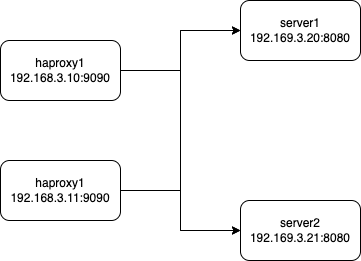
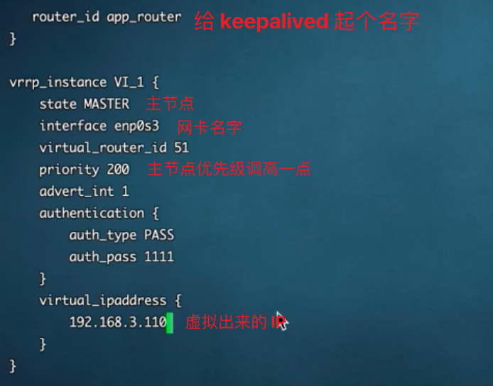
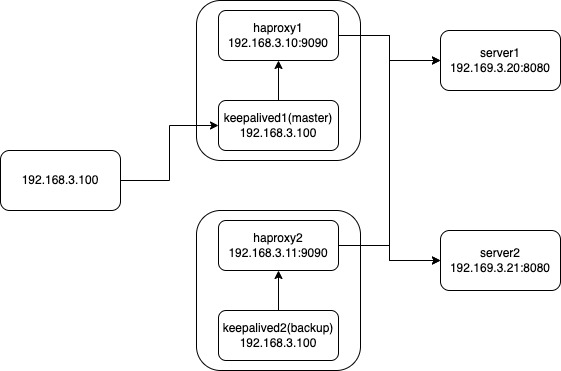

# HAProxy keepalived

高可用架构

## HAProxy 配置

The Reliable, High Performance TCP/HTTP Load Balancer

haproxy 的定位，就是负载均衡，做反向代理。

https://www.bilibili.com/video/BV1Fh411Y7hc

通常部署两个 haproxy 实例，用来做负载均衡。（这里 HA 的负载均衡，也是反向代理）

上图的架构有一个问题，ha 虽然对后端服务进行了抽象，但是对外暴露出两个访问端点，而且只要有一个 ha 机器挂了，那么从那个端点进行访问的请求就会失败。

## keepalived

上面的 ha 架构对外暴露出两个访问端点，这里我们利用 keepalived 虚拟出一个 ip，对 ha 暴露出来的两个端点进行抽象，对外暴露出一个虚拟的 IP。这样同一时间，只有一个 haproxy 在工作。

| 主节点                                                       | 备用节点                                                     |
| ------------------------------------------------------------ | ------------------------------------------------------------ |
|  |  |

当 ha1 机器宕机后，keepalived 会让 192.168.3.100 飘到 ha2 机器上，保证高可用。

