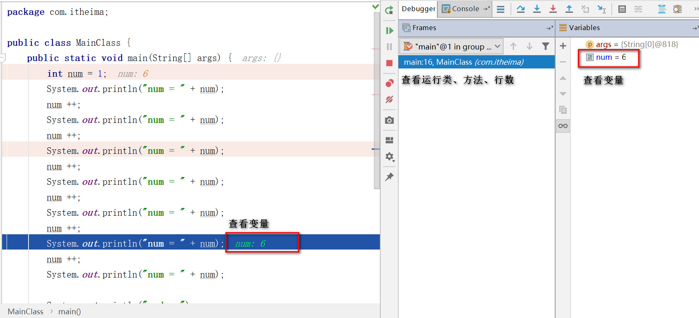
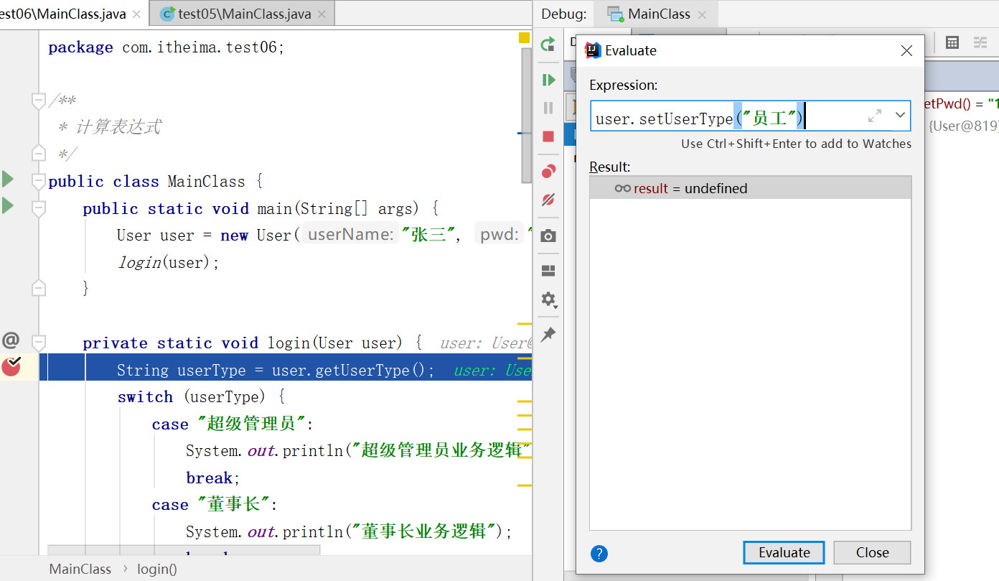

# IDEA Debug

[程序调试入门](https://www.bilibili.com/video/BV1LJ41187hu)

[TOC]

## IDEA中的Debug步骤

+ 设置断点（F9）

+ 调试程序（8个按钮）

  

  | 按钮                                                         | 说明                                                         |
  | ------------------------------------------------------------ | ------------------------------------------------------------ |
  |                             | (Alt + F10)：如果你的光标在其它行或其它页面，点击这个按钮可跳转到当前代码执行的行 |
  |                             | (F8)：步过，一行一行地往下走，如果这一行上有方法不会进入方法。 |
  |  | (F7)：步入。如果当前行有方法，可以进入方法内部，**一般用于进入自定义方法内，不会进入官方类库的方法。** |
  |                             | (Alt + Shift + F7)：强制步入，能进入任何方法，查看底层源码的时候可以用这个进入官方类库的方法。 |
  |                             | (Shift + F8)：步出，从步入的方法内退出到方法调用处，此时方法已执行完毕，只是还没有完成赋值。 |
  |                             | 回退断点。返回到当前方法的调用处。(时光机器)                 |
  |                             | (Alt + F9)：运行到光标处，你可以将光标定位到你需要查看的那一行，然后使用这个功能，代码会运行至光标行，而不需要打断点。 |
  |                             | (Alt + F8)：计算表达式。                                     |

+ 观察变量

  + 查看变量有三种方式：
    + 程序区查看变量
    + Debugger的Variables中查看变量
    + 鼠标悬停到变量名上会弹出当前变量的值

  

+ 查看输出

  

 

## 计算表达式

动态修改正在运行的变量。牛批。

- 计算表达式

  - 计算表达式按钮（Alt + F8）

    

- 作用

  - 设置变量，在计算表达式的框里，可以改变变量的值，这样有时候就能很方便我们去调试各种值的情况了。 

## 条件断点

- 条件断点

  - 右键单击断点处，可以设置进入断点的条件

    

- 作用

  - 通过设置断点条件，在满足条件时，才停在断点处，否则直接运行。

    

## 多线程调试

+ 步骤
  + 多线程调试，需要调整断点挂起级别为Thread

    

  + Frame中选择线程进行调试

## 其他按钮

| 按钮                                                         | 说明                         |
| ------------------------------------------------------------ | ---------------------------- |
|  | 重新运行 debug               |
|  | 跳到下一个断点               |
|  | 批量管理断点（例如删除断点） |
|  | 让所有断点失效               |

