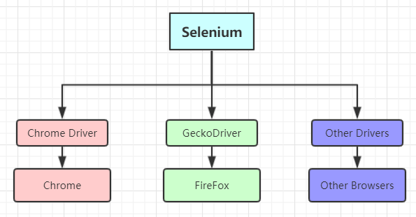

# Selenium

[TOC]

## Introduction

Selenium(硒的英文) 是一个用于 浏览器自动化 的工具集，其常用于**网站自动化测试**和**爬虫**(获取 Cookie)。

Selenium 本质上是一个接口工具，其提供了与浏览器进行交互的编程接口。提供了多种编程语言的实现：`Java, Python, C#, JavaScript, …`。Selenium 就像是 Java 操作数据库的接口：JDBC 一样，针对不同的数据库，实现了统一的接口访问，也就是说，Selenium 针对不同的浏览器，实现了统一的接口访问。与 JDBC 不同的是，Selenium 想要访问不同的浏览器，需要对应浏览器的 Web'Driver:



## Selenium 支持的浏览器

最常见的两种：

| 浏览器                                                       | WebDriver                                                    | is support headless |
| ------------------------------------------------------------ | ------------------------------------------------------------ | ------------------- |
| [Chrome最新版](https://dl.google.com/linux/direct/google-chrome-stable_current_amd64.deb) [Chrome历史版本](https://www.chromedownloads.net/chrome64linux/) | [Chrome Driver](http://chromedriver.storage.googleapis.com/index.html) | yes                 |
| FireFox                                                      | [Firefox GeckoDriver](https://github.com/mozilla/geckodriver/releases) | yes                 |

**注意**：

* Chrome 的版本和 Chrome Driver 的版本必须匹配！
* Selenium 已经放弃了对于 phantomjs 的支持


## API

官方文档：[Selenium browser_manipulation](https://selenium.dev/documentation/en/webdriver/browser_manipulation/)

注意：

使用 Selenium，最常见的问题是：` element not interactable`，原因是浏览器的运行加载速度，远远慢于代码的运行速度，换句话说，浏览器之所以没有相应，是因为网页还没有加载出来。Selenium 提出了 Waits 来解决浏览器异步加载的问题：

### Explicit wait

freeze thread 直到 condition 满足。 

*Explicit waits* are available to Selenium clients for imperative, procedural languages. They allow your code to halt program execution, or freeze the thread, until the *condition* you pass it resolves. The condition is called with a certain frequency until the timeout of the wait is elapsed. This means that for as long as the condition returns a falsy value, it will keep trying and waiting.

```Python
from selenium import webdriver
from selenium.webdriver.common.by import By
from selenium.webdriver.support.ui import WebDriverWait
from selenium.webdriver.support import expected_conditions as EC

# WebDriverWait(driver, timeout=3).until(some_condition)
# 等待 10 秒，直到发现了 loginName 这个 ID 出现，表明 DOM 加载完毕
WebDriverWait(driver, 10).until(
    EC.visibility_of_element_located((By.ID, "loginName")
).send_keys("scmevwqlgkwis-gef@yahoo.com")
driver.find_element_by_id(self.login_passwd_id).send_keys("TCqkwqbfvw02")
```

### Implicit wait

WebDriver会在一定时间内轮询 DOM 以尝试查找元素。该模式是默认关闭的，需要手动打开。

WebDriver polls the DOM for a certain duration when trying to find *any* element. This can be useful when certain elements on the webpage are not available immediately and need some time to load.

```python
driver = Firefox()
driver.implicitly_wait(10) # 重点是这条语句，开了就 OK 了！
driver.get("http://somedomain/url_that_delays_loading")
my_dynamic_element = driver.find_element_by_id("myDynamicElement")
```

### Fluent wait

是 Explicit 的升级版，加了 check condition 的次数。

## Ubuntu16.04 上运行 headless Chrome 

### 环境配置

```bash
# 下载 chromedriver
mkdir ~/webservice/dependency/chromedriver && cd $_
# 各版本 Chromedriver 下载 http://chromedriver.storage.googleapis.com/index.html
wget https://chromedriver.storage.googleapis.com/78.0.3904.105/chromedriver_linux64.zip
unzip chromedriver_linux64.zip
sudo ln chromedriver /usr/bin

# 下载 Chrome
# 各版本 Chrome 下载：https://www.chromedownloads.net/chrome64linux/
sudo apt-get install libxss1 libappindicator1 libindicator7
wget https://dl.google.com/linux/direct/google-chrome-stable_current_amd64.deb # latest stable version 
sudo dpkg -i google-chrome*.deb  # Might show "errors", fixed by next line
sudo apt-get install -f

# 安装 selenium
pip install selenium
```

### Demo

```python
class CookieUpdate:
    """更新 Cookie 的脚本，每 1 天的凌晨 1.30 检查一次"""
    login_url = "https://passport.weibo.cn/signin/login?entry=mweibo&r=https://weibo.cn/"
    login_name_id = "loginName"
    login_passwd_id = "loginPassword"
    login_button_id = "loginAction"
    weibo_index_valid_name = "friends" # 验证微博页面加载出来的 name

    def execute(self):
        invalid_accounts = self.get_accounts()
        for invalid_account in invalid_accounts:
            driver = self.init_driver()
            username = invalid_account["account"]
            passwd = invalid_account["passwd"]
            login_result = self.login(username, passwd, driver)
            if not login_result:
                continue
            cookie = self.get_cookie(driver)
            if not cookie:
                continue
            cookie_str = self.cookie_parse(cookie)
            models.sina_account.objects.filter(account=username).update(cookie=cookie_str,
                                                                        is_valid="Y",
                                                                        last_modify_time=datetime.datetime.now())
            logger.info("cookie update success, "
                        "username: {username}, "
                        "cookie:{cookie}".format(username=username, cookie=cookie_str))
            self.quit_driver(driver)


    def init_driver(self):
        chrome_options = webdriver.ChromeOptions()
        chrome_options.add_argument('--headless')
        chrome_options.add_argument('--disable-gpu')
        chrome_options.add_argument('--no-sandbox')
        driver = webdriver.Chrome(chrome_options=chrome_options, executable_path="chromedriver.exe")
        driver.maximize_window()
        driver.set_page_load_timeout(30)
        driver.set_window_size(1124, 850)
        return driver

    def quit_driver(self, driver):
        driver.quit()

    def login(self, username, passwd, driver):
        login_result = False
        # driver.implicitly_wait(10)
        driver.get(self.login_url)
        try:
            WebDriverWait(driver, 10).until(
                EC.visibility_of_element_located((By.ID, self.login_name_id))
            ).send_keys(username)
            driver.find_element_by_id(self.login_passwd_id).send_keys(passwd)
            button_login = driver.find_element_by_id(self.login_button_id)
            button_login.click()
            login_result = True
        except Exception as e:
            logger.error("senti_weibo CookieUpdate 登陆失败，账号：{username}, 密码：{passwd}。".format(username=username,
                                                                                           passwd=passwd) + str(e))
        return login_result

    def get_cookie(self, driver):
        cookie = ""
        # 等待 index 页面加载完毕
        try:
            WebDriverWait(driver, 10).until(
                EC.visibility_of_element_located((By.NAME, self.weibo_index_valid_name))
            )
            cookie = driver.get_cookies()
        except Exception as e:
            logger.error("senti_weibo CookieUpdate 获取 Cookie 失败:" + str(e))
        return cookie

    def cookie_parse(self, cookie):
        """
        :param cookie: dict in list name: value
        :return:
            cookie_string
        """
        cookie_str = "; ".join([pairs["name"] + "=" + pairs["value"] for pairs in cookie])
        return cookie_str

    def get_accounts(self):
        """获取需要更新的账户，更新的原则为：
        1. 手机的账号不再更新
        2. 更新 7 天没有更新 Cookie 的账号
        3. 更新 Cookie 已经失效的账号
        """
        seven_days_ago = datetime.datetime.now() - datetime.timedelta(days=7)
        columns = ["account", "passwd"]
        invalid_accounts = list(models.sina_account.objects.filter(
            Q(last_modify_time__lte=seven_days_ago) | Q(is_valid="N")
        ).exclude(account__istartswith="16").values(*columns))
        return invalid_accounts

```


## 开源项目参考

* [Smart Login](https://github.com/SpiderClub/smart_login)