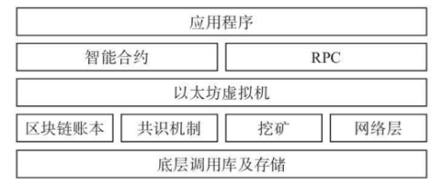

# Web3.0

[TOC]

## 我的理解

以太坊是一个开源可编程的智能合约平台，兼容多种语言。

## web3.0 

期待打破传统互联网巨头的垄断，创造一个全新的自由世界。

围绕个体构建起来的网络。

Web 2.0 的范式是：用户创造、平台所有、平台控制、平台分配。

Web 3.0 的范式是：**用户创造、用户所有、用户控制、协议分配**。

## Ethereum 以太坊

**以太坊(Ethereum)**是一个基于区块链技术，允许任何人构建和使用去中心化应用的区块链平台。以太坊提供了一个“图灵完备”的虚拟机，称为**[以太坊虚拟机](https://www.zhihu.com/search?q=以太坊虚拟机&search_source=Entity&hybrid_search_source=Entity&hybrid_search_extra={"sourceType"%3A"article"%2C"sourceId"%3A"29028693"})(Ethereum Virtual Machine)**，简称**EVM**，用户可以在EVM上创建**智能合约(Smart Contract)**。以太坊平台中的通用货币为**[以太币](https://www.zhihu.com/search?q=以太币&search_source=Entity&hybrid_search_source=Entity&hybrid_search_extra={"sourceType"%3A"article"%2C"sourceId"%3A"29028693"})(Ether)**，简称ETH，以太币可用于账号间的转账交易或者为EVM上运行的合约消耗的资源付费。

以太坊是一门合约编程语言。以太坊语言编写的 app，叫做 DECENTRALIZED APPLICATIONS。通过智能合约的设计开发，以太坊可以实现各种商业与非商业环境下的复杂逻辑，如众筹系统、数字货币、融资租赁资产管理、多重签名的安全账户、供[应链](https://www.zhihu.com/search?q=应链&search_source=Entity&hybrid_search_source=Entity&hybrid_search_extra={"sourceType"%3A"answer"%2C"sourceId"%3A"282577523"})的追踪监控等。通过智能合约的应用，可以将传统的软件系统链化，发挥出更强大的管理能力，相当于隐藏了底层技术的复杂性而让应用开发者更多地专注在应用逻辑及商业逻辑上。

作者：蒋勇
链接：https://www.zhihu.com/question/51131233/answer/282577523
来源：知乎
著作权归作者所有。商业转载请联系作者获得授权，非商业转载请注明出处。

我们来看一下以太坊的组成结构：

以太坊中的智能合约是运行在虚拟机上的，也就是通常说的 EVM（Ethereum Virtual Machine，以太坊虚拟机）。这是一个智能合约的沙盒，合约存储在以太坊的区块链上，并被编译为以太坊虚拟机字节码，通过虚拟机来运行智能合约。由于这个中间层的存在，以太坊也实现了多种语言的合约代码编译，网络中的每个以太坊节点运行 EVM 实现并执行相同的指令。如果说比特币是二维世界的话，那么以太坊就是三维世界，可以实现无数个不同的二维世界。

## DApp

Dapps have their backend code (smart contracts) running on a decentralized network and not a centralized server. They use the Ethereum blockchain for data storage and smart contracts for their app logic.

## 元宇宙

## DAO

