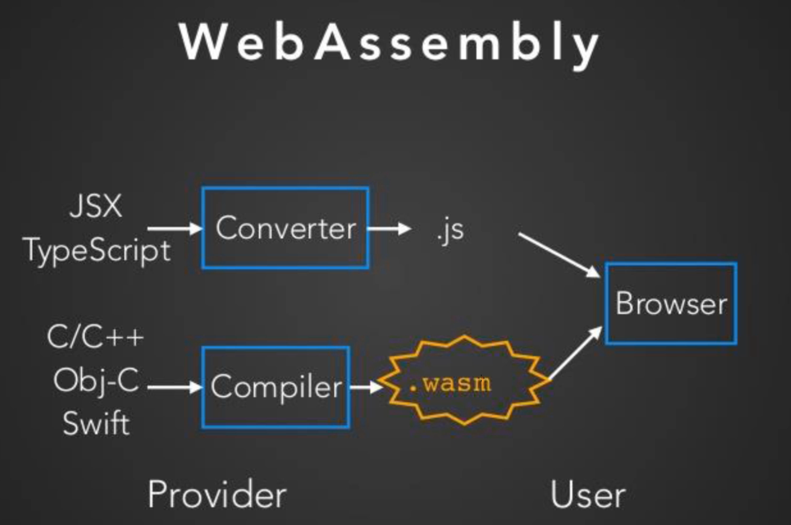

# wasm

[TOC]

## 介绍

wasm 是 web 的第四大开发技术。将其他语言的代码，编译成 wasm，然后在浏览器中执行。

https://www.bilibili.com/video/BV13i4y1n74s

## 生态

* [wasm org](https://webassembly.org/getting-started/developers-guide/)
* python -> wasm: [Pyodide](https://pyodide.org/en/stable/), a Python distribution for the browser and Node.js based on WebAssembly.
* python -> wasm: [PyScript](https://pyscript.net/) Run Python in Your HTML 
* C++ -> wasm 的在线工具：https://mbebenita.github.io/WasmExplorer/

## demo

计算斐波那契，f(40)，C++ 用了 200ms，JavaScript 用了 700+ms，wasm 用了 500+ms