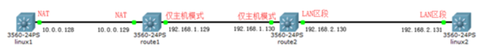
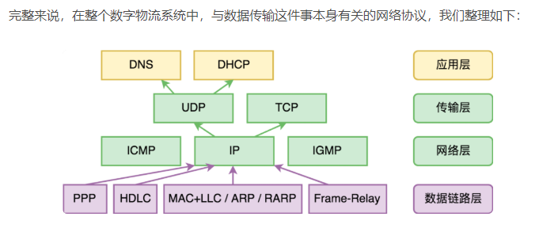
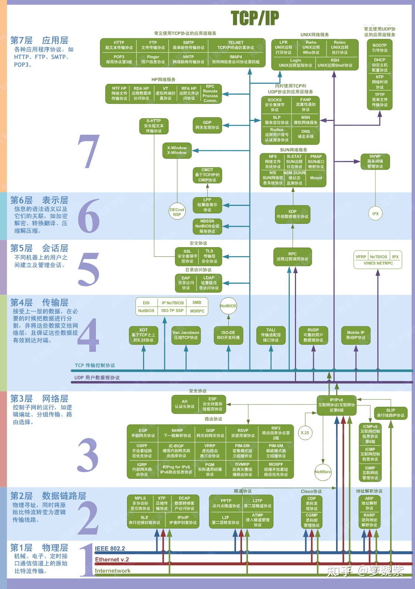

# 计算机网络

[TOC]

## 路由

路由就是实现一个网段到另一个网段之间的通信，路由分为静态路由、动态路由。


[[举例讲解]](https://www.cnblogs.com/ssgeek/p/9220690.html)



```
有四台机器，按照顺序 1，2，3，4 连在一起

Linux1:
	10.0.0.128
	
Linux2:
	10.0.0.129
	192.168.1.129
	
Linux3:
	192.168.1.130
	192.168.2.130

Linux4:
	192.168.2.131

其中 Linux2,3 作为路由器

添加静态路由常用参数：

add 增加路由

del 删除路由

-net 设置到某个网段的路由

-host 设置到某台主机的路由

gw     出口网关 IP地址

dev 出口网关 物理设备名


设置到某个网段的路由:
	route add -net 目标网段 gw 网关(路由器)
	例如：
	从 1 到 3，经过路由 2：route add –net 192.168.1.0/24 gw 10.0.0.129
	从 3 到 1，经过路由 2：route add -net 10.0.0.0/24 gw 10.0.0.129
```


## 正向代理和反向代理

正向代理隐藏真实客户端 VPN，反向代理隐藏真实服务端 Nginx。


## 分层传输

计算机网络的分层协议，可以形象的转换成快递不断封装的一个过程。

1. **分批次**
2. **套上第一个信封**，写上寄件单位的部门（源**端口号**），收件单位的部门（目标端口号），批次编号。**传输层**负责该任务，有两个协议：TCP/UDP，UDP 并不能保证对方一定能收到，信封上没写批次编号。有了端口号，就能保证信封到达后，能发送到指定的部门，端口号保证了属于**局域网**内的传输。
3. **套上第二个信封**，写上寄件单位地址（源IP），收件单位地址（目标IP），有了 IP 地址，就能保证快递在广域网上进行流通（由多段快递公司负责传输）。**网络层**负责该任务，该层最重要的协议是 IP 协议。
4. **套上第三个信封**，信封上写的内容，由负责该段运输的快递公司决定，当快递从一个快递公司交接到另一个公司时，拆掉信封，重新换上新的信封。

## 各层协议



DNS()：域名解析协议

DHCP(Dynamic Host Configuration Protocol)：计算机接入网络时的初始化，分配 IP 地址并配置网关

ARP(Address Resolution Protocol)：局域网中的协议，解析目的地的主机 IP 地址得到 MAC 地址

RARP(Reverse Address Resolution Protocol)：MAC 地址解析成 IP 地址，很少用到

ICMP(Internet Control Message Protocol)：检测网络连接状态，ping, traceroute

