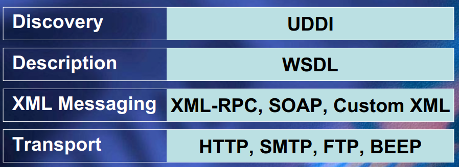

# WebService 详解

[TOC]

## Questions

* Web Service 是什么
* XML 与 HTML 的两个最大的不同点
* Restful 位于 Webservice 的哪一层


## Introduction

Web 服务是什么？Web 服务就是在计算机和计算机之间交换数据。

WebService = HTTP 协议(传输协议) + 数据（JSON / XML）

传统的 Web Service 定义：




## XML

**XML 与 HTML 的区别**

* HTML 的标签集合优先，XML 可以自己定义标签
* HTML 是面向用户的，而 XML 面向的是计算机，是为了计算机能够读懂数据

```HTML
<HTML>
    <BODY>
        <H1>XML in a Nutshell</H1>
        <H2>Elliot Harold Rusty</H2>
        <I>O’Reilly & Associates,</I>
        <B>2002</B>
    </BODY>
</HTML>
```

HTML 本质上是一种格式化标签语言，将一串 HTML 扔给计算机，计算机并不能理解 HTML 标签包裹的数据，其只能对数据进行格式化。

```xml
<BOOK>
    <TITLE> XML in a Nutshell</TITLE>
    <AUTHOR> Elliot Harold Rusty </AUTHOR>
    <DATE>2002</DATE>
    <PUBLISHER>O’Reilly & Associates</PUBLISHER>
</BOOK>
```

而 XML 是面向计算机的语言，对于每一条数据，其都有对应的解释，其是 key: value 型的数据结构。之所以用 xml 来进行数据的传递，是因为 xml 语言对计算机的可解释性，其独立于任何计算机系统/软件/语言的，换句话说，只要是 key-value 型的数据，都可以当作信息传递的载体。


## SOAP

 **Simple Object Access Protocol**, SOAP 是基于 XML 的通信方式，其 request 和 reponse 都是 XML 格式的请求。Here is a sample SOAP request to a weather service：

```xml
<?xml version='1.0' encoding='UTF-8'?>
<SOAP-ENV:Envelope
    xmlns:SOAP-ENV="http://www.w3.org/2001/09/soap-envelope/"
    xmlns:xsi="http://www.w3.org/2001/XMLSchema-instance"
    xmlns:xsd="http://www.w3.org/2001/XMLSchema">
    <SOAP-ENV:Body>
        <ns1:getWeather
            xmlns:ns1="urn:examples:weatherservice"
            SOAP-ENV:encodingStyle="http://www.w3.org/2001/09/soap-encoding/">
            <zipcode xsi:type="xsd:string">10016</zipcode>
        </ns1:getWeather>
    </SOAP-ENV:Body>
</SOAP-ENV:Envelope>
```


## SOAP vs Rest

SOAP 是一项协议，而 Rest 是一种标准。SOAP 的客户端和服务端是紧密耦合在一起的，而 Rest 的客户端和服务端是解耦合的。

SOAP 是 HTTP + XML

Rest 是 HTTP + json


