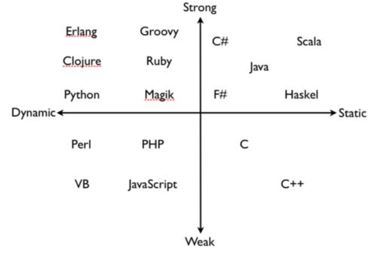

# How to Think Like a Computer Scientist  C Version

[TOC]

## C 语言起源和什么是编程

程序员最重要的能力：解决问题的能力。（对问题进行计算机的抽象，并解决问题）

编程：programming is the process of breaking a large, complex task up into smaller and smaller subtasks until eventually the subtasks are simple enough to be performed with one of these basic operations.

C 语言在 1970 年代由 Dennis M. Ritchie  在贝尔实验室创造。

## 什么是程序

**任何程序都是由 输入，输出，条件语句，循环语句，数学运算符/操作符 所构成**

## 什么是 Debug

* Compile-time errors  编译时问题
* Run-time errors  运行时问题
* Logic errors and semantics  逻辑问题

## 翻译高级语言的方式

* Interpreting

  translates the program line-by-line  边解释边执行

* Compiling

  translates it all at once and generate a executable object 一次编译，多次执行

注意，一种语言不能被简单地归类为编译型语言或者解释型语言：

C 语言在很多人的印象中是编译型语言，但是 TCC 却可以解释执行 C；

Java 是先将源码编译成字节码，然后由虚拟机逐条解释执行；

CPython 是将 Python 源码编译成字节码，有可能存到 .pyc 的字节码文件中，然后由解释器解释执行；

## 编程语言的分类



### High Level vs Low Level

* high level (高级语言)
  * C，Java，Python，C++
* low level (低级语言)
  * 汇编语言

计算机只能运行低级语言，所有以高级语言编写的程序，都要被**翻译**成低级语言，然后再运行。翻译的过程需要耗费一定的时间，这也是高级语言的一个缺点。

### 强类型 vs 弱类型

强弱和内存有关。

* 强类型

  一个变量在定义的时候，就已经确定好了这个变量的类型，后面不能再改变。没有强制类型转换之前，不允许两个类型不能的变量进行相互操作；**一块内存只能看作一种类型**；

  error cases:

  ```java
  int a = 1.1; // java
  ```

  ```python
  a = 1
  a = a + '1' # python
  ```

* 弱类型

  数据类型可以被忽略。一个变量可以被赋予不同类型的值；**允许将一块内存看作多种类型**，例如 C 语言可以将整型变量和字符型变量相加。C 语言中的类型实际上就是一块内存的别称。
  
  right cases:
  
  ```c
  int a = 1;
  printf("%d \n", a + '1'); % 50
  ```

### 动态类型 vs 静态类型

动态 or 静态和编译运行有关

* 动态类型

  在**程序运行时**检查数据类型，python 就是动态类型

  example:

  ```python
  >>> a = 1
  >>> type(a)
  <type 'int'>
  >>> a = "s"
  >>> type(a)
  <type 'str'>
  ```

* 静态类型

  在**编译阶段**检查数据类型

  error cases:

  ```java
  int a = 1.1; // java，在编译成字节码 class 文件时就会报错
  ```

## 代码风格

* **variableNames**: 首字母小写，驼峰风格

* **FunctionNames**: 首字母大写，驼峰风格；最好包含一个可以描述该函数的动词；返回布尔值的函数以 'Is Are' 开始
* **UserDefinedTypes_t**: always end in ’_t’. Type names names must be capitalised in order to avoid conflict with POSIX names.  
* **pointerNames_p**: in order to visually separate pointer variables from ordinary variables you should consider ending pointers with ’_p’.    

```c
if (condition) {
    statement1;
    statement2;
}

/*
* File: test.c
* Author: Peter Programmer
* Date: May, 29th, 2009
*
* Purpose: to demonstrate good programming
* practise
* /

#include <stdlib.h>

/*
* main function, does not use arguments
*/
int main (void){
	return EXIT_SUCCESS;
}
```

