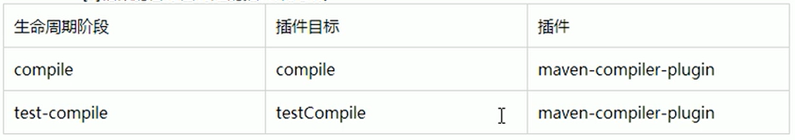

# Maven

[TOC]

## 参考文档

* [maven 官方文档](https://maven.apache.org/pom.html)
* [廖雪峰教程](https://www.liaoxuefeng.com/wiki/1252599548343744/1309301196980257)
* [尚硅谷 maven 教程](https://www.bilibili.com/video/BV1TW411g7hP)


## 经验总结

### scope 范围

* 默认的 scope 是 compile，如果设置了 compile，那么该库的所有类，都会引入到当前的项目中。

* 对于所有的 maven 依赖包，都要**显式**地指定其依赖范围

  例如 MySQL 的 jdbc 驱动 jar 包，如果没有配置其依赖范围，那么其代码就会被引入当前 IDE 中，虽然也能正常编译，但是在IDE里写程序的时候，会多出来一大堆类似`com.mysql.jdbc.Connection`这样的类，非常容易与Java标准库的JDBC接口混淆，所以坚决不要设置为`compile`


### 把 jar 包导入 maven 仓库并引用

把 jar 包导入本地 maven 库：

```shell
mvn install:install-file -DgroupId=com.jxdinfo -DartifactId=lcdp_push_sdk -Dversion=2.0.3 -Dpackaging=jar -Dfile=jar包地址

mvn install:install-file -DgroupId=org.elasticsearch.plugin -DartifactId=x-pack-sql-jdbc -Dversion=7.6.2 -Dpackaging=jar -Dfile=x-pack-sql-jdbc-7.6.2.jar

mvn install:install-file -DgroupId=com.apusic -DartifactId=aams-spring-boot-starter -Dversion=2.1.7.RELEASE -Dpackaging=jar -Dfile=
```

然后在 POM 文件中引用该 sdk：

```xml
<dependency>
    <groupId>com.jxdinfo</groupId>
    <artifactId>lcdp_push_sdk</artifactId>
    <version>2.0.3</version>
</dependency>
```


### dependency 分析插件

IDEA Maven Helper

可以对依赖进行树形分析，并且可以直接搜索。


## 简介

Maven是一个 Java 项目管理和构建工具，它可以定义项目结构、项目依赖，并使用统一的方式进行自动化构建，是 Java 项目不可缺少的工具。它的主要功能有：

- 提供了一套标准化的项目结构；
- 提供了一套标准化的构建流程（编译，测试，打包，发布……）；
- 提供了一套依赖管理机制。

**自动化构建工具历史**：

Make -> Ant -> Maven -> Gradle

## 构建和部署

### 构建是什么

构建就是以我们编写的 Java 代码、框架配置文件、国际化等其他资源文件、JSP 页面和图片等静态资源作为原材料，去生产出一个可以运行的项目的过程。

**编译结果和 web 工程的区别**：

开发过程中,所有的路径或配置文件中配置的类路径等都是以编译结果的目录结构为标准的


### 构建中的各个环节

**清理**：将以前编译得到的旧的 class 字节码文件删除,为下一次编译做准备

**编译**：将 Java 源程序编程成 class 字节码文件

**测试**：自动测试！自动调用 JUnit 程序进行测试。

**报告**：测试程序执行的结果。

**打包**：动态 Web 工程打 war 包，Java 工程打 jar 包。

**安装**：Maven 特定的概念一将打包得到的文件复制到 "仓库”中的指定位置

#### 部署

将动态 Web 工程生成的 war 包复制到 Servlet 容器的指定目录下,使其可以运行

## Maven 的安装

maven 依赖 JDK，而且是根据 JAVA_HOME 的环境变量找 JDK 的，所以 JAVA_HOME 就起到了配置 JDK 环境变量的作用。


## mvn cmds

运行Maven命令时一定要进入 pom.xml 文件所在的目录！

**Maven 的核心程序中仅仅定义了抽象的生命周期，但是具体的工作必须由特定的插件来完成。**而插件本身并不包含在Maven的核心程序中。当我们执行的Maven命令需要用到某些插件时，Maven核心程序会首先到本地仓库中查找。本地仓库的默认位置: `C:\USERS\USERNAME\.m2\repository`。Maven 核心程序如果在本地仓库中找不到需要的插件，那么它会到中央仓库下载。

### demos

```shell
# Maven先执行 clean 生命周期并运行到 clean 这个 phase，然后执行 default 生命周期并运行到 package 这个 phase
mvn clean package

# 清理所有生成的class和jar
mvn clean 

# 先清理，再执行到compile；
mvn clean compile

# 先清理，再执行到package
mvn clean package

# 查看版本
mvn -v

```

### clean


### compile

编译主程序，还会执行测试。


### test-compile

编译测试程序

### test

执行测试

### package

打包。打包的时候会触发测试。

跳过测试的 pom 配置：

```xml
<properties>
    <skipTests>true</skipTests>
</properties>
```


### install

安装

### deploy

部署


## Maven 核心概念

### 目录结构

一个标准的 Java Maven 项目（这是 maven 的标准！）：

```
a-maven-project
├── pom.xml
├── src
│   ├── main
│   │   ├── java
│   │   │   ├── top.wansho.demo
│   │   └── resources
│   └── test
│       ├── java
│       └── resources
└── target
```

约定 > 配置 > 编码，能配置，就不要编码。

### POM 文件

A Project Object Model（项目对象模型） or POM is the fundamental unit of work in Maven. It is an XML file that contains information about the project and configuration details used by Maven to build the project. It contains default values for most projects. 

项目对象模型：将项目中的对象，封装成对象，然后作为一个模型来研究。

### 坐标

一个 dependency 由 groupId、artifactId 和 version 三个参数唯一决定。artifact(工艺品)

Demo:

```xml
<dependency>
    <groupId>javax.servlet</groupId>
    <artifactId>javax.servlet-api</artifactId>
    <version>4.0.0</version>
    <scope>provided</scope>
</dependency>
```

Maven 工程的坐标与仓库中路径的对应关系：

```xml
<groupId> org.springframework </groupId>
<artifactId> spring-core </artifactId>
<version>4.0.0.RELEASE </version>
```

```
org/springframework/spring-core/4.0.0.RELEASE/spring-core-4.0.0.RELEASE.jar
```


### 依赖

Maven解析依赖信息时会到本地仓库中查找被依赖的jar包。对于我们自己开发的 Maven 工程,使用 mvn install 命令安装后就可以进入仓库。

Maven定义了几种依赖关系 ，分别是`compile`、`test`、`runtime`和`provided`：

默认的 scope 就是 compile。

注意，不同的 scope 依赖关系，会有不同的导入策略，例如 h2 数据库，如果是想用 h2 作为内存数据库，则导包策略如下：

```xml
<dependency>
  <groupId>com.h2database</groupId>
  <artifactId>h2</artifactId>
  <scope>provided</scope>
  <version>1.4.193</version>
</dependency>
```

如果是想用 h2 的 server 模式，则导包策略如下：

```xml
<dependency>
  <groupId>com.h2database</groupId>
  <artifactId>h2</artifactId>
  <scope>compile</scope>
  <version>1.4.193</version>
</dependency>
```

不同的导入策略，导入的类也有所不同，Runtime 模式就不会导入 `org.h2.tools.Server` 类。

| scope    | 说明                                            | 示例               | 是否需要打包进程序 |
| :------- | :---------------------------------------------- | :----------------- | ------------------ |
| compile  | 编译时需要用到该jar包                           | commons-logging    | 需要               |
| test     | 编译Test时需要用到该jar包                       | junit              | 不需要             |
| runtime  | 编译时不需要，但运行时需要用到                  | mysql              | 需要               |
| provided | 编译时需要用到，但运行时由 JDK 或某个服务器提供 | servlet-api tomcat | 不需要             |

#### compile 类型

- 对**主程序**是否有效：有效
- 对测试程序是否有效：**有效**
- 是否参与打包：参与
- 是否参与部署：参与
- 典型例子：spring-core


#### test 类型

- 对主程序是否有效：无效
- 对测试程序是否有效：有效
- 是否参与打包：不参与
- 是否参与部署：不参与
- 典型例子：junit

#### provided 类型

- 对主程序是否有效：有效
- 对测试程序是否有效：有效
- 是否参与打包：不参与
- 是否参与部署：不参与（由 servlet 容器提供）
- 典型例子：servlet-api.jar

#### runtime 类型

* 对主程序是否有效：有效
* 对测试程序是否有效：？
* 是否参与打包：参与
* 是否参与部署：参与
* 典型例子：jdbc jar 包


### 依赖【高级】

#### 依赖的传递性

A -> B，C -> A 则 C -> B。

底层的依赖包，在底层依赖引入就好。

好处：可以传递的依赖不必在每个模块工程中都重复声明，在”最下面”的工程中依赖一次即可。

注意：**非 compile 范围的依赖不能传递（也就是说 test 和 provided 类型依赖是传递不了的）。所以在各个工程模块中，如果有需要就得重复声明依赖。**

#### 依赖的排除

排除传递过来的依赖。

```xml
<dependency>
    <groupId> org.springframework </groupId>
    <artifactId> spring-core </artifactId>
    <version>4.0.0.RELEASE </version>
    <exclusions>
        <exclusion>
            <groupId>commons-logging</groupId>
            <artifactId>commons-logging</artifactId>
        </exclusion>
    </exclusions>
</dependency>
```

注意：依赖的排除也有传递性。

#### 依赖的原则

解决 jar 包冲突问题。

两个原则：

* 最短路径优先原则（就近原则）
* 路径相同时，先声明者优先

#### 统一管理依赖的版本 

一个实际的需求：需要对 spring 各个jar包的依赖版本进行管理，从 4.0.0 升级到 4.1.1，手动逐一修改不靠谱。

建议配置方式：

1. 使用 properties 标签内使用自定义标签统一声明版本号
2. 在需要统一版本的位置,使用`${自定义标签名}`引用声明的版本号

Demo:

```xml
<properties>
    <cvzhanshi.spring.version>4.0.0.RELEASE</cvzhanshi.spring.version>
</properties>

<version>${cvzhanshi.spring.versio}</version>
```

注意：properties 中还可以定义其他变量。凡是需要统一声明后再引用的场合都可以使用。例如：

```xml
<properties>
    <cvzhanshi.spring.version>4.0.0.RELEASE</cvzhanshi.spring.version>
    <project.build.sourceEncoding>UTF-8</project.build.sourceEncoding>
</properties>
```


### 仓库


* 本地仓库：

* 远程仓库
  * 私服：搭建在局域网，Nexus 是 Maven 私服的一个实现。私服没有的包，私服会从中央仓库拉过来。
  * 中央仓库：架设在 Internet 上,为全世界所有 Maven 工程服务，负载沉重
  * 中央仓库镜像：为了分担中央仓库的流量，提升用户访问速度


- 仓库中保存的内容：Maven 工程
  - Maven 自身所需的插件
  - 第三方框架或工具的 jar 包（第一方：jdk，第二方：我们）
  - 自己开发的 Maven 工程

### 生命周期 / 插件 / 目标

**maven 有三套相互独立的生命周期**

* Clean Lifecycle 在构建前进行清理

  clean 包含有以下三个阶段

  ```
  pre-clean
  clean （注意这个clean不是lifecycle而是phase）
  post-clean
  ```

* Default Lifecycle 构建的核心部分，编译、测试、打包、安装、部署

  default 包含有以下阶段：

  ```
  validate
  initialize
  generate-sources
  process-sources
  generate-resources
  process-resources
  compile
  process-classes
  generate-test-sources
  process-test-sources
  generate-test-resources
  process-test-resources
  test-compile
  process-test-classes
  test
  prepare-package
  package
  pre-integration-test
  integration-test
  post-integration-test
  verify
  install
  deploy
  ```

* Site Lifecycle 生成项目报告，站点，发布站点

每一个周期都有很多阶段。

**注意**

* 各个构建环节执行的顺序: 不能打乱顺序，必须按照既定的正确顺序来执行
* Maven 的核心程序中定义了抽象的生命周期，**生命周期中各个阶段的具体任务是由插件来完成的**
* **不论现在要执行生命周期中的哪一个阶段，都是从这个生命周期最初的阶段开始执行**

**插件和目标**

- 生命周期的各个阶段仅仅定义了要执行的任务是什么
- 各个阶段和插件的目标是对应的
- 相似的目标由特定的插件来完成
- 可以将目标看作调用插件功能的命令



**Demo**

* 如果我们运行`mvn package`，Maven就会执行`default`生命周期，它会从开始一直运行到`package`这个phase为止
* 运行`mvn clean package`，Maven先执行`clean`生命周期并运行到`clean`这个phase，然后执行`default`生命周期并运行到`package`这个phase

### 继承

问题描述：

```
Hello 依赖的 junit: 4.0
HelloFriend 依赖的 junit: 5.0
MakeFriend 依赖的 junit: 4.9

由于 test 范围的依赖没有传递性，所以必然分散在各个模块中，很容易造成版本不一致。
```

需求：统一管理各个模块工程中对 junit 依赖的版本

解决思路：将 junit 依赖统一提取到“父”工程中，在子工程中声明 junit 依赖时不指定版本，以父工程中统一设定的为准，也便于修改。

步骤：

1. 创建一个Maven工程作为**父工程**。注意：打包的方式为 pom

   ```xml
   <groupId>com.cvzhanshi.maven</groupId>
   <artifactId>Parent</artifactId>
   <version>0.0.1-SNAPSHOT</version>
   <packaging>pom</packaging>
   ```

2. 在子工程中声明对父工程的引用

   ```xml
   <!-- 子工程中声明父工程 -->
   <parent>
       <groupId>com.cvzhanshi.maven</groupId>
       <artifactId>Parent</artifactId>
       <version>0.0.1-SNAPSHOT</version>
   
       <!-- 以当前文件为基准的父工程 pom.xml 文件的相对路径 -->
       <relativePath>../Parent/pom.xml</relativePath>
   </parent>
   ```

3. 将子工程的坐标中与父工程坐标中重复的内容删除

4. 在父工程中统一管理 junit 的依赖（注意，在父类的 dependencyManagement 中定义的 dependency，不会被继承到子 module 中 [参考链接](https://stackoverflow.com/questions/2619598/differences-between-dependencymanagement-and-dependencies-in-maven)）

   ```xml
   <!-- 配置依赖的管理 -->
   <dependencyManagement>
       <dependencies>
           <dependency>
               <groupId>junit</groupId>
               <artifactId>junit</artifactId>
               <version>4.9</version>
               <scope>test</scope>
           </dependency>
       </dependencies>
   </dependencyManagement>
   ```

5. 在子工程中删除 junit 依赖的版本号部分

注意：配置继承后，执行安装命令时要先安装父工程

### 聚合 / 模块化

作用：一键安装各个模块工程

配置方式：在一个 ”总的聚合工程“ 中配置各个参与聚合的模块

```xml
<project xmlns="http://maven.apache.org/POM/4.0.0"
    xmlns:xsi="http://www.w3.org/2001/XMLSchema-instance"
    xsi:schemaLocation="http://maven.apache.org/POM/4.0.0 http://maven.apache.org/maven-v4_0_0.xsd">

    <modelVersion>4.0.0</modelVersion>
    <groupId>com.itranswarp.learnjava</groupId>
    <artifactId>build</artifactId>
    <version>1.0</version>
    <packaging>pom</packaging>
    <name>build</name>

    <modules>
        <module>parent</module>
        <module>module-a</module>
        <module>module-b</module>
        <module>module-c</module>
    </modules>
</project>
```

在聚合工程的pom.xml上点右键->run as->maven install（eclipse中）

**注意，要先在聚合工程上 clean -> install，然后再在子模块上 install。**


## IDEA + Maven

IDEA 搜索依赖并添加：

在 pom 文件中，`alt + insert`，generate，选择 `Dependency`，然后就可以搜索以来了，例如搜索 mysql 的依赖。添加到 pom 文件后，`ctrl + shift + O` 就可以加载该依赖。

版本仲裁：

SpringBoot 中对常见的依赖进行了版本的配置(哪个版本最合适，默认版本)，我们在导入一些常见依赖的时候，不需要再填写版本了：

```
<dependency>
    <groupId>javax.servlet</groupId>
    <artifactId>javax.servlet-api</artifactId>
    <scope>provided</scope>
</dependency>
```

## 插件 plugins

Maven 自带了很多插件：

| 插件名称 | 对应执行的phase |
| :------- | :-------------- |
| clean    | clean           |
| compiler | compile         |
| surefire | test            |
| jar      | package         |

实际上，执行每个phase，都是通过某个插件（plugin）来执行的，Maven本身其实并不知道如何执行`compile`，它只是负责找到对应的`compiler`插件，然后执行默认的`compiler:compile`这个goal来完成编译。

如果标准插件无法满足需求，我们还可以使用自定义插件。使用自定义插件的时候，需要声明。例如，使用`maven-shade-plugin`可以创建一个可执行的jar，要使用这个插件，需要在`pom.xml`中声明它：

```xml
<project>
    ...
	<build>
		<plugins>
			<plugin>
				<groupId>org.apache.maven.plugins</groupId>
				<artifactId>maven-shade-plugin</artifactId>
                <version>3.2.1</version>
				<executions>
					<execution>
						<phase>package</phase>
						<goals>
							<goal>shade</goal>
						</goals>
						<configuration>
                            ...
						</configuration>
					</execution>
				</executions>
			</plugin>
		</plugins>
	</build>
</project>
```

下面列举了一些常用的插件：

- maven-shade-plugin：打包所有依赖包并生成可执行jar；
- cobertura-maven-plugin：生成单元测试覆盖率报告；
- findbugs-maven-plugin：对Java源码进行静态分析以找出潜在问题。


## 模块化 Demo

一个大项目拆成三个 module

```ascii
mutiple-project
├── module-a
│   ├── pom.xml
│   └── src
├── module-b
│   ├── pom.xml
│   └── src
└── module-c
    ├── pom.xml
    └── src
```

Maven可以有效地管理多个模块，我们只需要把每个模块当作一个独立的Maven项目，它们有各自独立的`pom.xml`。例如，模块A的`pom.xml`：

```xml
<project xmlns="http://maven.apache.org/POM/4.0.0"
    xmlns:xsi="http://www.w3.org/2001/XMLSchema-instance"
    xsi:schemaLocation="http://maven.apache.org/POM/4.0.0 http://maven.apache.org/xsd/maven-4.0.0.xsd">
    <modelVersion>4.0.0</modelVersion>

    <groupId>com.itranswarp.learnjava</groupId>
    <artifactId>module-a</artifactId>
    <version>1.0</version>
    <packaging>jar</packaging>

    <name>module-a</name>

    <properties>
        <project.build.sourceEncoding>UTF-8</project.build.sourceEncoding>
        <project.reporting.outputEncoding>UTF-8</project.reporting.outputEncoding>
        <maven.compiler.source>11</maven.compiler.source>
        <maven.compiler.target>11</maven.compiler.target>
        <java.version>11</java.version>
    </properties>

    <dependencies>
        <dependency>
            <groupId>org.slf4j</groupId>
            <artifactId>slf4j-api</artifactId>
            <version>1.7.28</version>
        </dependency>
        <dependency>
            <groupId>ch.qos.logback</groupId>
            <artifactId>logback-classic</artifactId>
            <version>1.2.3</version>
            <scope>runtime</scope>
        </dependency>
        <dependency>
            <groupId>org.junit.jupiter</groupId>
            <artifactId>junit-jupiter-engine</artifactId>
            <version>5.5.2</version>
            <scope>test</scope>
        </dependency>
    </dependencies>
</project>
```

模块B的`pom.xml`：

```xml
<project xmlns="http://maven.apache.org/POM/4.0.0"
    xmlns:xsi="http://www.w3.org/2001/XMLSchema-instance"
    xsi:schemaLocation="http://maven.apache.org/POM/4.0.0 http://maven.apache.org/xsd/maven-4.0.0.xsd">
    <modelVersion>4.0.0</modelVersion>

    <groupId>com.itranswarp.learnjava</groupId>
    <artifactId>module-b</artifactId>
    <version>1.0</version>
    <packaging>jar</packaging>

    <name>module-b</name>

    <properties>
        <project.build.sourceEncoding>UTF-8</project.build.sourceEncoding>
        <project.reporting.outputEncoding>UTF-8</project.reporting.outputEncoding>
        <maven.compiler.source>11</maven.compiler.source>
        <maven.compiler.target>11</maven.compiler.target>
        <java.version>11</java.version>
    </properties>

    <dependencies>
        <dependency>
            <groupId>org.slf4j</groupId>
            <artifactId>slf4j-api</artifactId>
            <version>1.7.28</version>
        </dependency>
        <dependency>
            <groupId>ch.qos.logback</groupId>
            <artifactId>logback-classic</artifactId>
            <version>1.2.3</version>
            <scope>runtime</scope>
        </dependency>
        <dependency>
            <groupId>org.junit.jupiter</groupId>
            <artifactId>junit-jupiter-engine</artifactId>
            <version>5.5.2</version>
            <scope>test</scope>
        </dependency>
    </dependencies>
</project>
```

可以看出来，模块A和模块B的`pom.xml`高度相似，因此，我们可以提取出共同部分作为`parent`：

```xml
<project xmlns="http://maven.apache.org/POM/4.0.0"
    xmlns:xsi="http://www.w3.org/2001/XMLSchema-instance"
    xsi:schemaLocation="http://maven.apache.org/POM/4.0.0 http://maven.apache.org/xsd/maven-4.0.0.xsd">
    <modelVersion>4.0.0</modelVersion>

    <groupId>com.itranswarp.learnjava</groupId>
    <artifactId>parent</artifactId>
    <version>1.0</version>
    <packaging>pom</packaging>

    <name>parent</name>

    <properties>
        <project.build.sourceEncoding>UTF-8</project.build.sourceEncoding>
        <project.reporting.outputEncoding>UTF-8</project.reporting.outputEncoding>
        <maven.compiler.source>11</maven.compiler.source>
        <maven.compiler.target>11</maven.compiler.target>
        <java.version>11</java.version>
    </properties>

    <dependencies>
        <dependency>
            <groupId>org.slf4j</groupId>
            <artifactId>slf4j-api</artifactId>
            <version>1.7.28</version>
        </dependency>
        <dependency>
            <groupId>ch.qos.logback</groupId>
            <artifactId>logback-classic</artifactId>
            <version>1.2.3</version>
            <scope>runtime</scope>
        </dependency>
        <dependency>
            <groupId>org.junit.jupiter</groupId>
            <artifactId>junit-jupiter-engine</artifactId>
            <version>5.5.2</version>
            <scope>test</scope>
        </dependency>
    </dependencies>
</project>
```

注意到parent的`<packaging>`是`pom`而不是`jar`，因为`parent`本身不含任何Java代码。编写`parent`的`pom.xml`只是为了在各个模块中减少重复的配置。现在我们的整个工程结构如下：

```ascii
multiple-project
├── pom.xml
├── parent
│   └── pom.xml
├── module-a
│   ├── pom.xml
│   └── src
├── module-b
│   ├── pom.xml
│   └── src
└── module-c
    ├── pom.xml
    └── src
```

这样模块A就可以简化为：

```xml
<project xmlns="http://maven.apache.org/POM/4.0.0"
    xmlns:xsi="http://www.w3.org/2001/XMLSchema-instance"
    xsi:schemaLocation="http://maven.apache.org/POM/4.0.0 http://maven.apache.org/xsd/maven-4.0.0.xsd">
    <modelVersion>4.0.0</modelVersion>

    <parent>
        <groupId>com.itranswarp.learnjava</groupId>
        <artifactId>parent</artifactId>
        <version>1.0</version>
        <relativePath>../parent/pom.xml</relativePath>
    </parent>

    <artifactId>module-a</artifactId>
    <packaging>jar</packaging>
    <name>module-a</name>
</project>
```

模块B、模块C都可以直接从`parent`继承，大幅简化了`pom.xml`的编写。

如果模块A依赖模块B，则模块A需要模块B的jar包才能正常编译，我们需要在模块A中引入模块B：

```xml
    ...
    <dependencies>
        <dependency>
            <groupId>com.itranswarp.learnjava</groupId>
            <artifactId>module-b</artifactId>
            <version>1.0</version>
        </dependency>
    </dependencies>
```

最后，在编译的时候，需要在根目录创建一个`pom.xml`统一编译（新建一个工程用来聚合也行）：

```xml
<project xmlns="http://maven.apache.org/POM/4.0.0"
    xmlns:xsi="http://www.w3.org/2001/XMLSchema-instance"
    xsi:schemaLocation="http://maven.apache.org/POM/4.0.0 http://maven.apache.org/maven-v4_0_0.xsd">

    <modelVersion>4.0.0</modelVersion>
    <groupId>com.itranswarp.learnjava</groupId>
    <artifactId>build</artifactId>
    <version>1.0</version>
    <packaging>pom</packaging>
    <name>build</name>

    <modules>
        <module>parent</module>
        <module>module-a</module>
        <module>module-b</module>
        <module>module-c</module>
    </modules>
</project>
```

这样，在根目录执行`mvn clean package`时，Maven根据根目录的`pom.xml`找到包括`parent`在内的共4个`<module>`，一次性全部编译。

