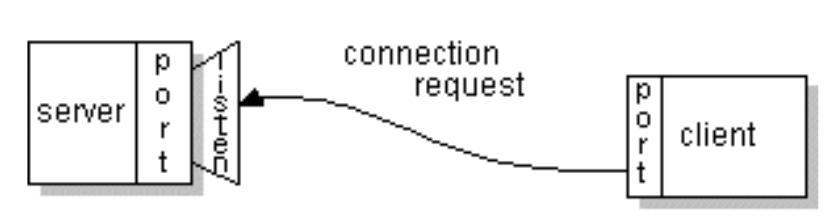

# Socket

[TOC]

## All about sockets

### what is a socket

通常的，一个服务端程序会运行在一台电脑上，并且拥有一个 socket，该 socket 会绑定到一个端口。服务端程序就一直等着，监听 socket，等着客户端来连接。

在客户端，客户端知道服务端的 ip 地址和绑定的端口号。如果想要发起连接的话，客户端会绑定客户端所在电脑的一个端口号，然后向服务端发起连接。客户端绑定的端口号通常由系统分配。

如果一切顺利的话，服务端会接受来自客户端的连接。一旦连接成功，服务端就会获取到一个绑定到本地端口的新 socket，该 socket 的另一端连到了客户端的端口。之所以创建了

### reading from and writting to a socket

### writting the server side of a socket

## JDK

### Socket

This class implements client sockets (also called just "sockets"). A socket is an endpoint for communication between two machines.
The actual work of the socket is performed by an instance of the SocketImpl class. An application, by changing the socket factory that creates the socket implementation, can configure itself to create sockets appropriate to the local firewall.

### ServerSocket

This class implements server sockets. A server socket waits for requests to come in over the network. It performs some operation based on that request, and then possibly returns a result to the requester.
The actual work of the server socket is performed by an instance of the SocketImpl class. An application can change the socket factory that creates the socket implementation to configure itself to create sockets appropriate to the local firewall.

### SocketImpl

The abstract class SocketImpl is a common superclass of all classes that actually implement sockets. It is used to create both client and server sockets.
A "plain" socket implements these methods exactly as described, without attempting to go through a firewall or proxy.