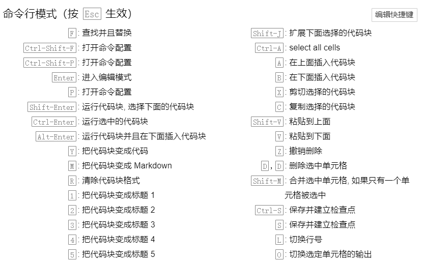

# Jupyter-notebook

[TOC]

Jupyter 首先是一款 Notebook，然后也是一款 Python 的开发工具。

我对 Jupyter 的定位：一款能边学 Python 边做笔记的开发工具。

jupyter 支持多语言扩展，只需要安装多语言的内核即可。

## Install and open

先安装 Python，然后通过 pip 安装

```
pip install notebook
```

更改 notebook 默认打开的路径

1. `jupyter notebook --generate-config`
2. 修改 `jupyter_notebook_config.py` 中的 `c.NotebookApp.notebook_dir` 为我们的默认文件夹
3. 右击 JupyterNotebook 快捷方式，选择【属性】，删除【目标】属性中的【%USERPROFILE%】，点击【应用】–【确定】。

打开 jupyter notebook

```
jupyter notebook
```

## Why

交互性好，环境变量全局保存，适合写 Demo，然后加注释保存，适合写技术文档，避免了一遍在 IDE 上测试，一遍切换到笔记软件机笔记的尴尬。

Jupyter 源文件是纯文本文件，可以直接当成笔记保存下来。

可以转成 markdown 文件直接成为笔记。

## 使用技巧

* [javascript 支持](https://github.com/n-riesco/ijavascript)
* VSCode中使用 jupyter，jupyter 插件，将 jupyter 的使用场景从浏览器迁移到 vscode 中，并且可以自定义笔记本所在的文件夹。

**快捷键**



