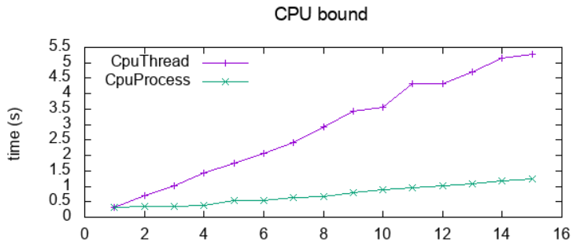
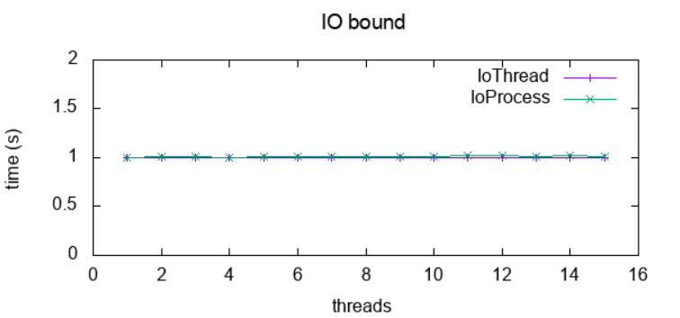

# 多线程和多进程

[TOC]

## 并行的优点

引入并行机制可以充分利用计算机的资源加速计算。

在计算密集型任务上，多进程强于多线程。在 IO 密集型任务上，多线程稍强于多进程。

| 计算密集型                                            | IO密集型                                             |
| ----------------------------------------------------- | ---------------------------------------------------- |
|  |  |


## 多线程

[官方文档](https://docs.python.org/3/library/threading.html#module-threading)


## 多进程

[官方文档](https://docs.python.org/3.4/library/multiprocessing.html?highlight=process)

### 进程池

进程池可以控制进程的个数，从而从一定程度上控制计算机资源的消耗，防止过载。

```python
from multiprocessing import Pool # 进程池

def f(x):
    return x*x

if __name__ == '__main__':
    with Pool(5) as p: # 新建一个 5 个进程的进程池，只限用 5 个进程进行计算
        print(p.map(f, range(1000)))

# [1, 4, 9, ……]
```

