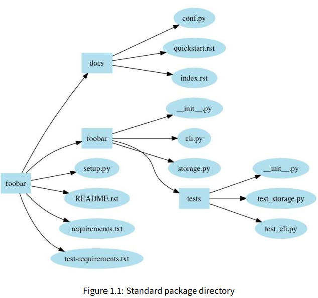

# Python Hacker

[TOC]

## Introduction

300 页的手册，两三天就可以啃完。

一本关于实战的📕。

Julien Danjou, 作者参与了 OpenStack 的开发，进而有丰富的 Python 开发经历。

## Starting your project 

### project layout



Docs 中的文档可以由 Sphinx 生成。

其他可能包含的文件：

```
etc: sample configuration files
tools: shell scripts or related tools
bin: binary scripts you’ve written that will be installed by setup.py
```

Don’t create a directory and just an `__init__.py` file in it.

### PEP8 Coding style 

[[PEP8]](https://www.python.org/dev/peps/pep-0008)

**PEP8 标准已经被封装成一个工具**

```shell
pip install pep8
```

```shell
pep8 hello.py
```

```
pycodestyle ...

  warnings.warn(
method.py:8:1: E302 expected 2 blank lines, found 1
method.py:11:5: E301 expected 1 blank line, found 0
```

其他 Python 静态代码检测工具：pyflakes, pylint  

**代码长度**

一行代码长度：79 chars

**操作符**

```python
# Wrong:
# operators sit far away from their operands
income = (gross_wages +
          taxable_interest +
          (dividends - qualified_dividends) -
          ira_deduction -
          student_loan_interest)

# Correct:
# easy to match operators with operands
income = (gross_wages
          + taxable_interest
          + (dividends - qualified_dividends)
          - ira_deduction
          - student_loan_interest)
```

**import**

Imports should be grouped in the following order:

1. Standard library imports.
2. Related third party imports.
3. Local application/library specific imports.

You should put a blank line between each group of imports.

**模块级 dunder names**

Module level "dunders" (i.e. names with two leading and two trailing underscores) such as `__all__`, `__author__`, `__version__`, etc. should be placed after the module docstring but before any import statements *except* `from __future__` imports. Python mandates that future-imports must appear in the module before any other code except docstrings:

```python
"""This is the example module.

This module does stuff.
"""

from __future__ import barry_as_FLUFL

__all__ = ['a', 'b', 'c']
__version__ = '0.1'
__author__ = 'Cardinal Biggles'

import os
import sys
```

**whitespace 的使用惯例**

```python
# Correct:
foo = (0,)

# Wrong:
bar = (0, )
```

```python
# Correct:
i = i + 1
submitted += 1
x = x*2 - 1
hypot2 = x*x + y*y
c = (a+b) * (a-b)

# Wrong:
i=i+1
submitted +=1
x = x * 2 - 1
hypot2 = x * x + y * y
c = (a + b) * (a - b)
```

```python
# Correct:
def complex(real, imag=0.0):
    return magic(r=real, i=imag)

# Wrong:
def complex(real, imag = 0.0):
    return magic(r = real, i = imag)
```

**逗号的使用**

```python
# Correct:
FILES = [
    'setup.cfg',
    'tox.ini', # 可能在后期进行扩展
    ]
initialize(FILES,
           error=True,
           )
# Wrong:
FILES = ['setup.cfg', 'tox.ini',]
initialize(FILES, error=True,)
```

## Modules and libraries  

### import system

**`import this`**

```python
import this

"""
The Zen of Python, by Tim Peters
Beautiful is better than ugly.
Explicit is better than implicit.
Simple is better than complex.
Complex is better than complicated.
Flat is better than nested.
Sparse is better than dense.
Readability counts.
Special cases aren't special enough to break the rules.
Although practicality beats purity.
Errors should never pass silently.
Unless explicitly silenced.
In the face of ambiguity, refuse the temptation to guess.
There should be one-- and preferably only one --obvious way to do it.
Although that way may not be obvious at first unless you're Dutch.
Now is better than never.
Although never is often better than *right* now.
If the implementation is hard to explain, it's a bad idea.
If the implementation is easy to explain, it may be a good idea.
Namespaces are one honking great idea -- let's do more of those!
"""
```

**sys**

The sys module contains a lot of information about Python’s import system.   

`sys.modules` 变量(dict)中存储了当前已导入的 modules：

```python
sys.modules['os'] # 键是 module 的名字，值是 module 对象
""" <module 'os' from '/usr/lib/python2.7/os.pyc'> """
```

Python 导入 module 依赖很多路径，`sys.path` 变量（sequence）中存储了这些路径，`sys.path` 类似于系统中的环境变量，Python 在导包的时候，会去这些路径下找这些包。手动增加路径：

```python
import sys
sys.path.append('/foo/bar')
```

### Standard libraries  

Python **自带电池，开箱即用**。

需要了解的 Python 内置标准库(我还不熟悉的)

| 标准库          | Desc                                                         |
| --------------- | ------------------------------------------------------------ |
| atexit          | allows ⁴ou to register functions to call when ⁴our program exits |
| argparse        | provides functions for parsing command line arguments        |
| bisect          | provides bisection algorithms for sorting lists              |
| calendar        | provides a number of date-related functions                  |
| codecs          | provides functions for encoding and decoding data            |
| collections     | provides a variet⁴ of useful data structures                 |
| copy            | provides functions for cop⁴ing data                          |
| fnmatch         | provides functions for matching Unix-st⁴le filename patterns |
| glob            | provides functions for matching Unix-st⁴le path patterns     |
| io              | provides functions for handling I/O streams                  |
| multiprocessing | allows ⁴ou to run multiple subprocesses from ⁴our application,<br/>while providing an API that makes them look like threads. |
| operator        | provides functions implementing the basic P⁴thon operators which ⁴ou<br/>can use instead of having to write ⁴our own lambda expressions |
| os              | provides access to basic OS functions                        |
| select          | provides access to the select() and poll() functions for creating event loops |
| shutil          | provides access to high-level file functions                 |
| signal          | provides functions for handling POSIX signals                |
| tempfile        | provides functions for creating temporar⁴ files and directories |
| threading       | provides access to high-level threading functionalit⁴        |
| uuid            | allows ⁴ou to generate UUIDs (Universall⁴ Unique Identifiers) |

**我惊呆了，我竟然有这么多模块还不熟悉！这些标准库都是用 Python 实现的！有问题的时候学会看源码！**

The entire standard library is written in Python, so there’s nothing stopping you from looking at the source code of its modules and functions. When in doubt, crack open the code and see what it does for yourself. Even if the documentation has everything you need to know, there’s always a chance you could learn something useful.  

**谨慎使用第三方库**

sqlalchemy-migrate  就是一个活生生的例子。OpenStack 使用了 sqlalchemy-migrate，database schema 会不断更新的，这就要求 sqlalchemy-migrate  不断更新。如果 sqlalchemy-migrate  断更，那么依赖于 sqlalchemy-migrate  的项目和数据库交互就会产生 bug.

## Documentation

### Sphinx

sphinx 是一个 Python 包：`pip install -U sphinx `

Sphinx is the most commonly used tool for working with this format: it can read reST-formatted content and output documentation in a variety of other formats.

用到了再学，先知道有这回事。

### Doc includes?

Your project documentation should include:
• The problem your project is intended to solve, in one or two sentences.
• The license your project is distributed under. If your sotware is open source, you should also include this information in a header in each code file: just because you’ve uploaded your code to the Internet doesn’t mean that people will know what they’re allowed to do with it.
• A small example of how it works.
• Installation instructions.
• Links to community support, mailing list, IRC, forums, etc.
• A link to your bug tracker system.
• A link to your source code so that developers can download and start delving into it right away.  

### Tools to make Doc

* [[Read the Docs]](https://readthedocs.org/)

  免费提供 Doc 部署的平台。

  Read the Docs simplifies software documentation by automating building, versioning, and hosting of your docs for you.

  * Free docs hosting
  * Webhooks
  * Multiple formats
  * Multiple versions

## Unit testing  

Writing code that is not tested is essentially useless, as there’s no way to conclusively prove that it works. 

### How to

* 创建 tests  module，也就是创建 tests 文件夹(文件夹中有 `__init__.py`)
* 如何我们想测试 `mylib/foobar.py`，那么就创建测试脚本：`mylib/tests/test_foobar.py`。测试脚本，其命名都以 `test_` 开头

* 自动化测试工具：**nose** ，可以帮我们进行自动化测试：`pip install nose` 
* 编写单元测试的方式：`unittest`，已经集成到了 Python 的标准库中

### Demo with assert

It’s usually simpler to use a hierarchy in your test tree that mimics the hierarchy you have in your module tree. This means that the tests covering the code of `mylib/foobar.py` should be inside `mylib/tests/test_foobar.py`; this makes things simpler
when looking for the tests relating to a particular file.
A really simple test in `test_true.py`: 

```python
def test_true():
	assert True
```

This is the most simple unit test that can be written. To run it, you simply need to load the test_true.py file and run the test_true function defined within.
Obviously, following these steps for all of your test files and functions would be a pain. This is where the nose package comes to the rescue – once installed, it providesthe nosetests command, which loads every filewhose name startswith `test_` and then executes all functions within that start with `test_`.
Therefore, withthe test_true.py file in our sourcetree, running nosetests will give us the following output:  

```shell
$ nosetests -v
test_true.test_true ... ok
---------------------------------------------------------
Ran 1 test in 0.003s
OK
```

一个测试出错的Demo：

```python
def test_key():
    a = ['a', 'b']
    b = ['b']
    assert a == b
```

```shell
$ nosetests -v
test_complicated.test_key ... FAIL
==========================================================
FAIL: test_complicated.test_key
Traceback (most recent call last):
File "/usr/lib/python2.7/dist-packages/nose/case.py", line 197, in ←֓
	runTest
	self.test(*self.arg)
File "/home/jd/test_complicated.py", line 4, in test_key
	assert a == b
AssertionError
---------------------------------------------------------
Ran 1 test in 0.001s
FAILED (failures=1)
```

测试结果并没有告诉我们哪里出错了

### Demo with unittest

Python 内置的用于单元测试的标准库，可以给出出错的详细信息，还提供了很多高级测试功能，例如：

skipping tests or executing actions before or ater running every test.

If we rewrite the previous example using unittest, this is what it will look like:  

```python
import unittest

class TestKey(unittest.TestCase):
    def test_key(self):
        a = ['a', 'b']
        b = ['b']
        self.assertEqual(a, b)
```

As you can see, the implementation isn’t much more complicated. All you have to do is create a class that inherits from unittest. TestCase, and write a method that runs a test. Instead of using assert, we rely on a method provided by unittest. TestCase that provides an equality tester. When run, it outputs the following:  

```shell
$ nosetests -v
test_key (test_complicated.TestKey) ... FAIL

=========================================================
FAIL: test_key (test_complicated.TestKey)
Traceback (most recent call last):

File "/home/jd/Source/python-book/test_complicated.py", line 7, in ←֓
	test_key
	self.assertEqual(a, b)
AssertionError: Lists differ: ['a', 'b'] != ['b']

First differing element 0:
a 
b

First list contains 1 additional elements.
First extra element 1:
b

- ['a', 'b']
+ ['b']

---------------------------------------------------------
Ran 1 test in 0.001s

FAILED (failures=1)
```

永远不要用 assert

**others demos with unittest**

```python
class TestSkipped(unittest.TestCase):
    @unittest.skip("Do not run this")
    def test_fail(self):
    	self.fail("This should not be run")
    
    @unittest.skipIf(mylib is None, "mylib is not available")
    def test_mylib(self):
    	self.assertEqual(mylib.foobar(), 42)
    
    def test_skip_at_runtime(self):
        if True:
        	self.skipTest("Finally I don't want to run it")
```

```shell
$ python -m unittest -v test_skip
test_fail (test_skip.TestSkipped) ... skipped 'Do not run this'
test_mylib (test_skip.TestSkipped) ... skipped 'mylib is not available'
test_skip_at_runtime (test_skip.TestSkipped) ... skipped "Finally I don't ←֓
want to run it"
---------------------------------------------------------
Ran 3 tests in 0.000s
OK (skipped=3)
```

```python
import unittest
class TestMe(unittest.TestCase):
    def setUp(self):
    	self.list = [1, 2, 3]
    
    def test_length(self):
    	self.list.append(4)
    	self.assertEqual(len(self.list), 4)
    
    def test_has_one(self):
        self.assertEqual(len(self.list), 3)
        self.assertIn(1, self.list)
```

