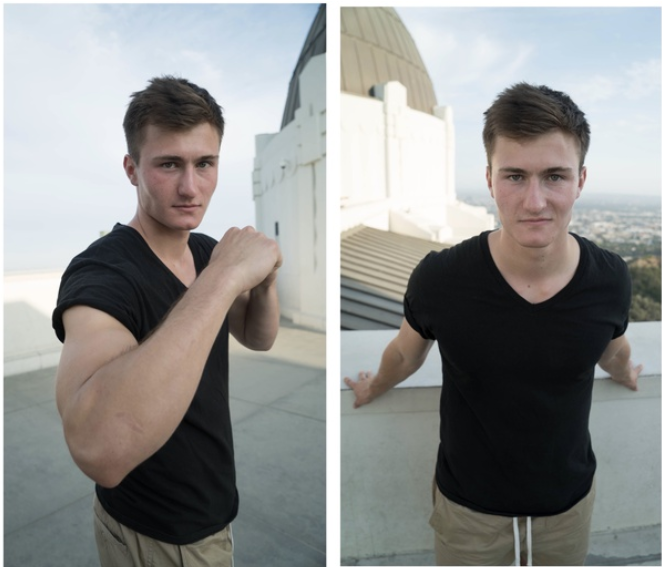

# 如何

[TOC]

## 如何

记录一些小技巧，保持终身学习

## 如何保持终身学习

心态 / 态度

**Stay hungry，Stay foolish.**

* 保持好奇心
* 保持谦虚
* 保持批判性思维

实践

* 提高**主动获取信息**的能力
* 锻炼自己**总结信息**的能力
* 坚持**写作**，提高写作能力

身体是革命的本钱，没有好的身体，充足的精力，何谈学习

## 如何拍照

Closer to the camera = bigger in the photo

越靠近摄像头，越显得大。例如图中男生的胳膊，靠近和远离摄像头，其拍出来的效果完全不一样，制造出景深效果。扬长避短。

拍照技巧

- 与图中的景物保持水平或垂直

## 如何写作

* 养成写作输出的习惯
* 不要为赋新词强说愁，要有所思，有所感
* 像给朋友写信一样，写文章
* 真诚

## 如何演讲 / 报告

* 想象着在和一个好朋友介绍
* 做好充足的准备
* 真诚

[7年新闻主播的眼神管理法，解救双眼无神，演讲不自信！](https://www.bilibili.com/video/BV1Jg411T7AX)

不要回避眼神交流，不要在心理想着把大家当成傻瓜，要真诚地对待听众。

注意眼神留白，不要一直死盯着一个地方。

心理暗示：你并不是在和一大群人讲话，而是“几个人”。确实，只有少数几个人会认真听我们的演讲报告，眼神和他们互动就好了。