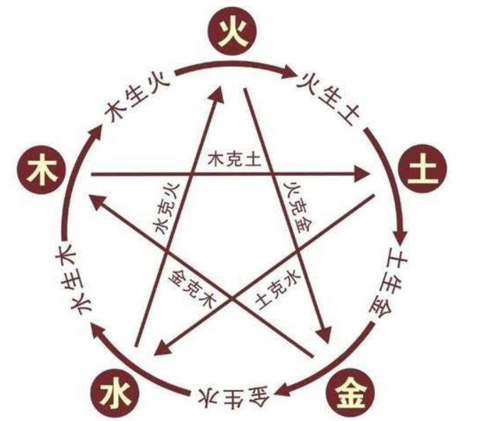

# 命理学

https://www.bilibili.com/video/BV1R54y1D7ic

## 笔记

知止而后能定，定而后能静，静而后能安，安而后能虑，虑而后能得

## 王德峰-中国古代命理学要义

**三本书**：穷通宝鉴 滴天髓 三命通会

信力不信命？

人活着要有意义，follow excellence，success will follow you.

唐山大地震：国运大于个人的命运。

出生的位置不一样，也会影响一个人的命。

八字只能看 60 — 70%，看个大概。

五行学说基础（每一个国人都该会的）：

```
五行：金木水火土
十天干：甲、乙、丙、丁、戊、己、庚、辛、壬、癸
十二地支：子、丑、寅(yín)、卯(mǎo)、辰、巳(sì)、午、未、申、酉、戌、亥

生：水 —— 木 —— 火 —— 土 —— 金 —— 水 
克：水 —— 火 —— 金 —— 木 —— 土 —— 水

天干与五行对应关系：
    甲乙 —— 木
    丙丁 —— 火
    戊己 —— 土
    庚辛 —— 金
    壬癸(gui) —— 水
    
地支与五行对应关系（地支有杂气，这里列举的是本气）：
	子 —— 水
	丑 —— 木
	寅 —— 木
	卯 —— 木
	辰 —— 土
	巳 —— 火
	午 —— 火
	未 —— 土
	申 —— 金
	酉 —— 金
	戌 —— 土
	亥 —— 水

北方属水-水地，南方属火-火地

五行与生活的关系（以土举例）：
	财(日主所克)：土克水(妻子水命最好)
	官(子女)：木克土(孩子木命最好)
	印(母亲)：火生土(母亲火命最好)
	
十神：
	生我者：
		正印：母亲
		偏印：母亲
	我生者：
		伤官：阳土生的阴金，有一定的才华，女命遇到伤官，是儿子
		食神：阳土生的阳金，有一定的才华，好美食，女命遇到食神，是女儿
	我克者：
        正财：阳克阴，阴克阳
        偏财：阳克阳，阴克阴
    克我者：
    	正官：男命的儿子
		偏官：男命的女儿，七煞，女命看到官就是看到丈夫
	同类：
        比肩：同类同性，兄弟姐们同事
        劫财：同类异性
        
六冲，六合，三合：
	六冲：子午(鼠马)相冲、丑未(牛羊)相冲、寅申(虎猴)相冲、卯酉(鸡兔)相冲、辰戌(龙狗)相冲、巳亥(蛇猪)相冲
	太岁：每一年的属相都叫太岁，如果与当前相冲，需要去拜太岁
	本命年要注意的属相：辰酉午亥
	
	三合：申子辰合、亥卯未合、寅午戍(虎马狗)合、已酉丑(蛇鸡牛)合
	六合：子丑(牛鼠)合，卯戌(兔狗)合，巳申(蛇猴)合，寅亥(虎猪)合，辰酉(龙鸡)合，午未(马羊)合 
	
排八字：
	年：
	月：
	日：
	时：

用神：找到让八字平衡的字

有大任的人，通常八字有缺陷

虚岁怎么算？出生算一岁，每过一个春节长一岁。
```

```
八字举例：
	乙巳(年，幼年，祖上) 壬午(月，少年，父母) 壬戌(日，独立成家，自己家庭) 乙巳(时，万年，子女)
	
对应五行：
	木火 水火 水土 木火
	
八字分析：
	水命(八字的第五个)，五行缺金，火旺(土也强，火生土)，缺水
```

了解八字的基本状况，然后趋避。



2021 是辛丑年，是金年

