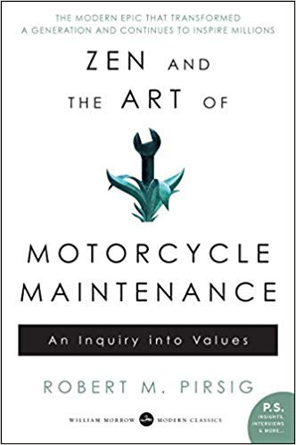

# 禅与摩托车维修艺术

[TOC]

上周读了一本书，感觉挺不错的，在这里 po 一下作者有意思的观点，顺便给每个章节做个总结

## 读书笔记

### 第一章 面对问题

骑摩托车旅游和其他的方式完全不同。坐在汽车里，你只是被局限在一个小空间之内，因为已经习惯了，你意识不到从车窗向外看风景和看电视差不多。你只是个被动的观众，景物只能呆板地从窗外飞驰而过。骑摩托车可就不同了。它没有什么车窗玻璃在面前阻挡你的视野，你会感到自己和大自然紧密地结合在了一起。你就处在景致之中，而不再是观众，你能感受到那种身临其境的震撼。脚下飞驰而过的是实实在在的水泥公路，和你走过的土地没有两样。它结结实实地躺在那儿，虽然因为车速快而显得模糊，但是你可以随时停车，及时感受它的存在，让那份踏实感深深印在你的脑海中。

这些乡间小路和一般的干道迥然不同，就连沿线居住的居民的生活步调和个性也不一样。他们一直都没有离开过本地，所以可以很悠闲地和你寒暄问候、谈天说地，那感觉好极了。反而是那些早就搬到城市里的人和他们的子子孙孙迷失了，忘记了这种情怀。这实在是一个宝贵的发现。我在想，为什么我们这么久之后才对其着迷。我们早已看过却仿佛没有看到，或者说是环境使我们视而不见，蒙骗了我们，让我们以为真正的生活是在大都市里，而这里只不过是落后的穷乡僻壤。

日子就是这样随意，忘掉时间，没有人会催促你，也不会担心浪费时间。

我们常常太忙而没有时间好好聊聊，结果日复一日地过着无聊的生活，单调乏味的日子让人几年后想起来不禁怀疑，究竟自己是怎么过的，而时间已悄悄溜走了。

和科技有关的怪物已吞噬了大片的土地，污染了空气和湖泊，人类既无法打击它们，也无法逃避。

佛陀或是耶稣坐在电脑和变速器的齿轮旁边修行会像坐在山顶和莲花座上一样自在。如果情形不是如此，那无异于亵渎了佛陀——也就是亵渎了你自己。

### 第二章 热爱，活在当下

一边工作一边听音乐是没有办法真正思考的。虽然他们看起来很随和、友善、轻松自在，但是却没有投入工作之中，他们就像旁观者一样，你会觉得他们只是在那儿晃来晃去，然后接过别人递给他们的扳手。他们对自己的工作没有认同感，不会说：“我是师傅。”一旦到了下午五点，八个小时一满，你知道他们会立刻放下手中的工作，即刻离开，然后尽可能地不去想他们的工作。在这一方面，他们与约翰和思薇雅一样，虽然想运用科技的成果，但是却不愿和它发生任何关系。

仓促本身就是 20 世纪最要不得的态度，当你做某件事的时候，一旦想要求快，就表示你再也不关心它，而想去做别的事。

### 第三章 鱼不知水

暴风雨的云层似乎非常厚实，虽然整个草原辽阔无际，但是头上这一片正要袭来的雨云却更教人害怕。现在我们只能看它的脸色行驶。它什么时候下来，我们无法掌握，唯一能做的只是看着它愈来愈近。

就在回旅馆的路上，一整天下来的劳累突然侵袭而来，于是我们停下来休息，浑身酥软无力。坐在汽车旅馆院子里的铁椅上，约翰从冰箱里拿出混着其他饮料的威士忌酒，我们慢慢地啜饮，心旷神怡，白杨树排在道路两旁，晚风轻轻袭来，叶子沙沙作响。

完全科学的态度就是既不相信鬼，也不相信科学，这样你就安全了。然而这样一来，你就没有多少可以相信的了，但是唯有这样才是科学的态度。

对于别人所相信的鬼魂，我们很容易无知而且自负地就进行攻击，但是对于我们自己心中的鬼魂，我们却非常无知而且盲目地信仰着。大家被催眠了，用比较正统的说法是，大家受了教育。

自然的法则是人类发明的，就像鬼的存在一样。逻辑学、数学也都是如此，所有值得赞美的事，也都是人类的发明。这个世界也是人类所想象出来的，整体来说也就是一种灵界的存在。我们之所以能看到这个世界，就是因为鬼神让我们看见，他们是摩西、耶稣基督、释迦牟尼、柏拉图、卢梭、杰弗逊、林肯等等，牛顿是非常好的一位，可算其中最好的一位，所以我们的常识就是由过去成百上千的鬼神所构成的，他们企图在人的生命当中找到他们的地位。

### 第四章 真味只是淡 应无所住而生其心

我喜欢用军人穿的工作服，因为便宜、耐穿而且耐脏。

我关心这副皮手套，我微笑着看它们被风吹拂，因为它们已经在那儿陪伴了我这么多年。它们已经磨损老旧了，但我却在它们身上发现了一种幽默感。整副手套都沾满了油渍、汗水、灰尘，而且还有地方发霉了。现在把它们放在桌上，即使天气不冷，它们也没有办法平平地躺着。它们似乎有属于自己的往事。虽然只值三块美金，而且已经补到无法再补，但是我仍然花了许多时间和精力去清理它们。我不能想象戴一副新手套的感觉。这种想法似乎很不实际，但是手套并不仅仅需要实际，其他事情也是如此。

一旦一辆车陪伴过你许多时光，那么对你来说它就是独一无二的，是别的车子无法取代的。

如果有人不懂心存感激，而你当面告诉他，那么你就等于是在骂他，这样你什么事都解决不了。

风和太阳让你觉得很舒服，让这一切显得很真实。

你看着这样一片风景，然后看看地上的草，一切都妙不可言。但是一旦你用框子框住，美感就都不见了。

我不想拥有这些草原，或是把它们拍下来，我也不想改变它们，甚至也不想停下来，或是继续走下去。我们只是沿着空旷的路继续骑下去。

### 第五章 写代码也是如此

骑在这些过山车道一样的山路上，下坡的时候会突然地向下疾冲，然后又得慢慢地往上爬。这样一来我们就没有办法看得很远，因而变得有些紧张。

我应该偷偷地走到工作台，切下一部分啤酒罐，把上面的印刷除掉，然后回来告诉他，我们很幸运，只剩下一片了，还是由德国进口的。这样就成了。它是由德国巴伦·艾佛德·克鲁普公司制造的，我以特价买到了。这样他就搞不清楚究竟是怎么一回事儿了。

在从事机械方面的工作时，常常会有这种情况出现，一旦遇到瓶颈，你只好停下来，仔细思考一番，看看是否有新的信息，然后出去逛逛，等你再回来时，原先隐而未显的原因就会浮现出来。

我从理智、知识的角度去看修理把手的问题，其中牵涉到金属的所有科学上的特性。而约翰却从直觉和当下的角度去看待它。我是从内涵着手，而他却是从物的表象开始。我看到的是这个铝片的意义，而他看到的却是这个铝片的外观。

我走过去把摩托车骑过来，把头灯打开，这样就可以找到手电筒了。我一样一样地翻，想找到手电筒，过了很长时间我才突然意识到，我不需要手电筒，我需要的是弯刀，而弯刀就在我眼前。

他们对他没有真正的关心，因为不是自己人。事实上现在大部分的时候，这只是一种虚伪的态度，就像第一天上课的老师一样。但是那些不是自己人的人，又怎么会知道友好究竟是怎么一回事儿呢？

我一旦用任何手势或是行动去和他接触，就等于把他给变得实在了。而他并没有实体，但是我认识他，他就是斐德洛。

### 第六章 一一

为了让他明白我的想法，就必须向前追溯，愈向前追溯，你就愈需要继续追溯下去，一直到原先只是沟通上的一个小问题，最后变成哲学上的大问题。

人在思考和感觉的时候往往会偏向于某一种形式，而且会误解和看轻另一种形式。

### 第七章 佛法在世间，不离世间觉

要排除解剖摩托车时心中的佛性，就等于完全排除了佛性。

有一个一直存在的古典问题，就是摩托车的哪一部分、沙堆中的哪一粒沙才是佛陀呢？很明显，问这个问题是找错了方向，因为佛是无所不在的。

马克·吐温在掌握通过密西西比河的方法之后，发现这条河已经失去了它的美丽——总会丢掉一些东西。

他是一个疯子，如果你直接面对疯子，你所了解的就是他疯了，这等于是根本不了解他。

他所探索的就是隐身在一切科技的背后，在所有现代科学、所有西方思想背后的鬼魂——也就是理性本身。

现在我想有愈来愈多的人看见了，或者在人生低潮的时候瞥见了它，它就是所谓的理性。

### 第八章 理性

真正的系统、真实的系统，就是我们当前的系统观，也就是理性自身。如果把整个工厂拆毁了，而架构它的理性仍然存在，那么靠着这个理性很容易就可以建造另一座工厂。如果革命能够摧毁一个政府，但是政府背后的理性仍然完整地保存着，那么很快地又可以再建立同样的政府。

### 第九章 逻辑

在研究科学的时候，一个人必须非常地谨慎，而且严守逻辑的法则。不要在逻辑上面摔跤，否则整个科学结构很快就会垮下来。只要你的推论稍有差错，你就会陷入无底的深渊当中。

### 第十章 理性的缺憾

人类用最适合自己的方式，描绘了一幅最简洁、最容易了解的世界图像。然后试着用经验取代某种层次的世界，然后征服它……他创造了这个宇宙和他感情生活的支柱，这样才能由中找到安宁，而这安宁是无法从个人狭窄的经验当中获得的……最崇高的工作……就是要建立这些宇宙基本的法则，这些法则经过演绎就能创造出现今的世界。而要通往这些法则没有合乎逻辑的路；只有靠着直觉和对经验的体谅才能进入其中……

引起我们目前社会种种危机的原因是理性天生的一种缺憾。我们目前所谓的理性模式并没有把社会带向更美好的世界，反而离它愈来愈远。自从文艺复兴以来，这些模式就一直存在。只要人们主要的需求还在于衣食住行，这些模式就会存在下去，而且还会继续运作。但是对现在大部分的人来说，这些基本的需要不再是主要的问题，因而从古代流传下来的理性结构已经不符合所需，从而显露出它真正的面目——在情感上是空虚的，在美学上没有任何表现，而在灵性上更是一片空白。这就是它的现状，而且它还会持续很长的一段时间。

### 第十一章 真理

来到心灵的高山地带，一个人必须习惯不稳定的稀薄空气，还有大量的问题以及各种假设的答案。这种情形会不断地扩大，一直到这个人几乎无法控制，因而迟疑是否要接近它，因为他害怕很可能会在其中迷失，而且永远找不到出路。

而真理究竟是什么？你怎样知道自己拥有它？我们究竟如何能有真实的认知呢？是由一个我或者是灵魂去认知的吗？或者这个灵魂仅仅等于另外一种感官？现实基本上是在不断地改变吗？或者是永远不变……当你说这个东西就表示这个东西的时候，这又是怎样的意思呢？虽然他们都声称自己的答案是永存的，而且放之四海皆准，然而文化上的差异，使我们对于同样的问题有着截然不同的答案。这些答案在他们自己的体系之内可说是正确的，但即使在同样的文化之内，旧的思想仍然
会被新的思想取代。

不能由感官认知摩托车并不能证明摩托车就不存在。在我们心中有一种直觉能认知摩托车。它在时间和空间上有一种连续性，所以当一个人转头的时候，摩托车的形象也跟着改变，所以它和我们在感官上所接收到的讯息并不冲突。

感官所得到的讯息只能证实它的存在，但是这些讯息并不等于它。我通过直觉所了解到的摩托车，就像我存在银行里面的钱。如果我到银行要求看我的钱，他们一定会很奇怪地看着我。因为我的钱并没放在他们的抽屉里，他们没法拿出来给我看，我的钱其实只是电脑存档里面的一个数字。但是这样就够了，因为我相信如果我需要钱的时候，银行会通过他们的系统让我取到钱。

### 第十二章 主题对客体

他们是我的朋友，并不是书中的人物，就像思薇雅有一次说的，“我不想被当成物体”，所以我知道的许多事情都没有写出来。

由于人类知识的范围太过复杂，结果每一个人都变成专家，然而却造成了彼此之间的疏离感。

## 拓展阅读

[复旦大学王德峰讨论休谟问题](https://www.bilibili.com/video/BV1Qf4y177Ko)

* How to derive ought from is?

  我们如何从「存在」中推出「应当」来

  我们能否从关于世界的客观知识当中，关于世界之存在的知识当中，推出我们应当做，不应当做什么的价值标准呢？理性能否用来论证一种价值，一种唯一真实的价值，理性能否推出「真理」？ought 和应当是通过理性来确立的，理性迄今为止所有的成功只表明一点：理性是工具。理性能够引导自然科学，但是却退不出人类生活的价值标准。

  理性不能担保明天太阳照常升起，太阳照常升起是经验的总结。

