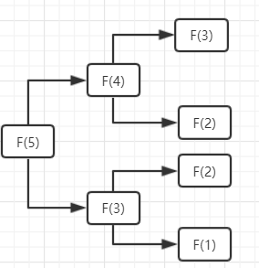

# Introduction

[TOC]

## 本书讨论的内容

为什么要学习数据结构与算法？

写出一个可以工作的算法并不够，我们要保证该算法在数据集扩大后依然适用。

## 递归

### 什么是递归: Fibonacci sequence

$$
f(x) = \begin{cases}
 & 1 \text{ if } x=0,1 \\ 
 & f(x-1) + f(x-2)\text{ if } x > 1 
\end{cases}
$$

### 递归的三个基本法则

* 基准情形(**base case**)：不用递归就可以求解的情形
* 不断推进(**making progress**): 递归的方向，要朝着基准情形推进
* 合成效益法则(**compound interest rule**): 递归切忌做重复的计算

### 递归的弊端

* 可能违背 compound interest rule，导致重复计算，例如 Fibonacci 数列的计算
* 递归层数太深可能导致栈溢出

### Fibonacci 数列的计算优化

Fibonacci 数列递归实现的弊端为重复计算：

 

如何优化？将之前的计算存储，减少重复计算。

```C
int fibonacciNotRecursive(int num){
    if(num <= 2){
        return 1;
    }
    int nums[N] = {1, 1}; // C 语言 int 类型的数组如果不初始化，那么元素默认为 0
    for(int i=2; i<N; i++){
        nums[i] = nums[i-1] + nums[i-2];
        if((i+1) == num){
            return nums[i];
        }
    }
    return 0;
}
```

### 汉诺塔问题


