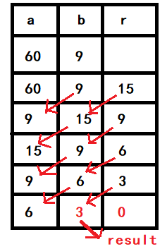

# 算法分析

[TOC]

## 如何判断一个算法的好坏

评价一个算法的好坏，应该**具体问题具体分析**。我们需要考察的因素有：

* **数据量的大小 / 业务需求**

  如果业务的数据量很少，不同复杂度的算法，其运行时间差别不大，那么我们其实不需要花太多时间在算法的设计上，也许设计一个快速实现的算法，完成业务需求，是当务之急；如果数据量很大，并且对算法要求很高的话，就需要多花心思在算法的设计上。要具体问题具体分析。

* **算法的复杂度**

  在条件允许的情况下，算法的复杂度（**时间复杂度/空间复杂度**）肯定是越低越好，最好是 O(n) 的算法

* **算法实现的难度**

  如果一个优秀的算法，实现起来非常难，那么也要考虑现实的条件，是否值得花时间去解决这样一个复杂的问题。

## 最大子序列和问题

**最直觉的解法：对所有的子序列进行遍历**

算法时间复杂度：$O(N^3)​$

用两次遍历确定一个上界和下界，然后再用一次遍历找最大和。

**最直觉算法的优化：如何对所有的子序列进行遍历**

算法时间复杂度：$O(N^2)​$

用两次遍历确定一个上界和下界，然后对上界和下届确定的子序列求和。（两层遍历确定的上下界，能涵盖所有的子序列）

**最优解：Online Algorithm联机算法**

算法时间复杂度：$O(N)​$

```C
// process its input piece-by-piece in a serial fashion，一次遍历就可以得到结果的算法
int maxSequenceSum(int nums[]){
    int index, sum, maxSum;
    maxSum = sum = 0;
    for(index=0; index<N; index++){
        sum += nums[index];
        if(sum < 0){
            sum = 0;
        }else{
            maxSum = sum > maxSum ? sum : maxSum;
        }
    }
    return maxSum;
}
```

## 欧几里得算法（辗转相除法）



```C
int euclideanAlgorithm(int a, int b){
    int result;
    int r = 1; // 余数
    while(r != 0){
        r = a % b;
        a = b;
        b = r;
    }
    return a;
}
```

## 排列组合

排列：
$$
A_{n}^{m} = n * (n-1)*\cdots  * (n-m+1) \\
A_{6}^{2} =  6 * 5
$$
组合：
$$
C_{n}^{m} = \frac{n * (n-1)*\cdots  * (n-m+1)}{m!} \\
C_{6}^{2} = \frac{6 * 5}{2!}
$$

## 任意进制的转换

如何实现不同进制的转换？例如 2 进制，3 进制，4 进制 ？

Demo: 4 进制的转换


循环结束条件：除数结果（2） < 进制数（4）