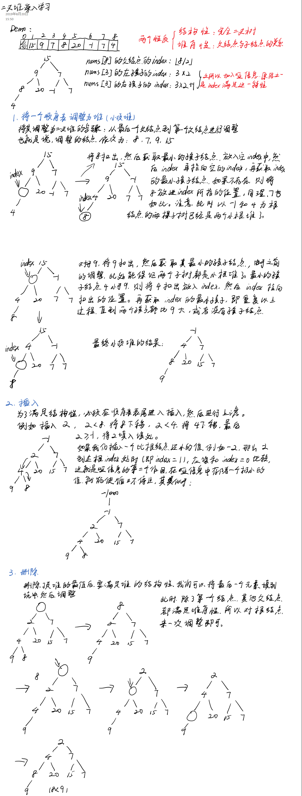

# 优先队列-二叉堆

优先队列 / 二叉堆

注意：二叉堆的一次建堆，只能保证堆的最值位于堆顶，不能保证顺序表整体有序。

## 二叉堆原理

 

## 代码实现

```python


def init_heap(nums):
    """给定一个序列，将其初始化为一个小根堆
    init 过程：从最后一个父节点 (length / 2) 到第一个父节点进行二叉堆的 adjust
    """
    # 首先加入一个哑信息，进而方便计算，类似于链表加入头节点一样
    length = len(nums)
    nums.insert(0, 0)
    index = int(length / 2)
    while index >= 1: # 从最后一个父节点到第一个父节点进行遍历，调整
        adjust_heap(nums, index, length)
        index -= 1
    nums.pop(0)
    pass


def adjust_heap(nums, index, length):
    """调整子堆"""
    nums[0] = nums[index]
    # 找到子节点地最小值，然后与父节点比较
    while True:
        left_chind_index = index * 2
        min_index = left_chind_index
        if min_index > length: # 无孩子
            break
        if left_chind_index < length and nums[left_chind_index + 1] < nums[left_chind_index]:
            min_index = left_chind_index + 1
        if nums[min_index] >= nums[0]: # 两个子节点都比父节点大，已经构成了小根堆
            break
        nums[index] = nums[min_index]
        index = min_index # 向下继续调整，直到出界
    nums[index] = nums[0]


def insert(nums, num):
    """二叉堆插入"""
    nums.append(num)
    length = len(nums)
    nums.insert(0, -10000)
    parent_index = length // 2
    prev_index = length
    while nums[parent_index] > num:
        nums[prev_index] = nums[parent_index]
        prev_index = parent_index
        parent_index = parent_index // 2
    nums[prev_index] = num
    nums.pop(0)


def delete(nums):
    """二叉堆删除"""
    delete_num = nums[0]
    nums[0] = nums.pop()
    length = len(nums)
    nums.insert(0, -10000)
    adjust_heap(nums, 1, length)
    nums.pop(0)
    return delete_num


if __name__ == "__main__":
    lst = [15, 9, 7, 8, 20, -1, 7, 4] # result: -1, 4, 7, 8, 20, 15, 7, 9
    init_heap(lst)
    print(lst)
    insert(lst, -2)
    print(lst)
    delete(lst)
    print(lst)
```

