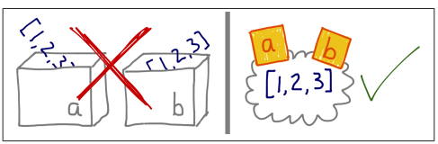
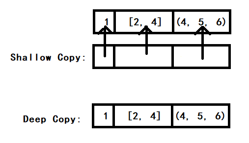

# Chapter8 Object Reference, Multability, and Recycling

从第八章开始，开始学习 Python 的面向对象特性。

[TOC]

## Variable Are not Boxes

Demo:

```Python
a = [1, 2, 3]
b = a
```

Description:



## Identity, Equality, Aliases

### id() 和 is

在 CPython 解释器中，`id()` 返回的是对象的内存地址(unique)，在其他 Python 解释器中，不一定。

### == vs is

is 比较的是对象的 id。`a == b` 本质上是一个语法糖，其会被解释成 `a.__eq__(b)`， 不同的对象，其 `__eq__()`方法会进行不同的重写，例如字符串会将其重写成对每个字符进行比较，list 会将其重写成对每个元素进行比较。**由于 `==` 被不同的 built-in types 进行了不同的重写，所以其执行速度往往要慢于 is，is 只是通过 id() 获取内存地址，然后比较，是非常快的**。

## Shallow Copy vs Deep Copy

### Shallow Copy

Demo: 

```Python
from copy import copy
l1 = [1, [2, 3], (4, 5, 6)]
# list 浅拷贝的三种方式
l2 = list(l1)
l3 = l1[:]
l4 = copy(l1)

l1 == l2 == l3
True
l1 is l2
False
l1 is l3
False

l1[1] is l2[1]
l2[1] is l3[1]
True

l1[1].append(7)
l2[1]
[2, 3, 7] # 引用指向的地址空间相同，变了

l1[2] += (8,9)
l2[2]
(4, 5, 6) # 没变，+= on tuple 会创建一个新的 tuple
```

**之所以 l1 is l2 结果为 False，是因为浅拷贝只是拷贝了容器，容器内的元素只是拷贝了其引用，这样可以节省内存**。

浅拷贝只是拷贝了一个空壳，其内容都是引用：




### Deep Copy

```Python
from copy import deepcopy
```


## 浅拷贝应用举例

**避免将 mutable objects 作为函数参数的默认值**

Demo:

```Python
class HauntedBus:

    def __init__(self, passengers=[]): # 设置默认值为 mutable object
        self.passengers = passengers

    def pick(self, name):
        self.passengers.append(name)

    def drop(self, name):
        self.passengers.remove(name)


bus1 = HauntedBus([1,2])
print(bus1.passengers) # [1, 2]

bus2 = HauntedBus() # 启动默认值
bus2.pick(12) 
print(bus2.passengers) # [12]

bus3 = HauntedBus() 
print(bus3.passengers) # [12]，初始化后默认有了参数

bus4 = HauntedBus([1,2,3,4])
print(bus4.passengers) # [1, 2, 3, 4]

bus5 = HauntedBus()
bus5.pick(14)
print(bus5.passengers) # [12, 14]，不断增加

```

上面的做法，**实际上 self.passengers 指向了外部的 list，导致类封装失败**。

正确的做法，用浅拷贝将传入的参数进行封装，使得 Bus 拥有了自己的属性，我们对于 passenger 的操作，不会影响到初始化时传入的引用对应的内存地址，我们操作的只是其引用：

```Python
class HauntedBus:
    def __init__(self, passengers=None): # 设置为 None
        if passengers is None:
            self.passenger = []
        else:
            self.passenger = list(passenger) # 用浅拷贝将传入的参数进行封装

    def pick(self, name):
        self.passengers.append(name)

    def drop(self, name):
        self.passengers.remove(name)
```

## del 和 Python 垃圾回收机制

### del

del 命令只会删除引用，并不会删除对象，也就是说，并不会回收地址空间。del 命令本质上也是一个语法糖，其会被 Python 解释器 CPython 解释成魔法方法: `__del__()`

### Garbage Collection (GC)

Python 的垃圾回收算法主要为：reference counting(引用计数)，当一个对象对应的引用数为 0 时，也就是说，没有引用指向该内存空间时，则回收该对象的内存空间。每 del 一个 reference，引用数 - 1。

## Interning 驻留

Interning 现象是 Python 解释器的优化导致的，其目的应该是为了**节约内存**。

驻留现象告诉我们，对于 Python 的字符串和数值型类型的比较，应该用 ==，不能用 is 来比较。

### 字符串驻留

```Python
name1 = "wansho"
name2 = "wansho"

name1 is name2 # true，实际上这应该是两个完全不同的对象
```

### 整型值驻留

```Python
num1 = 1
num2 = 1

id(num1) == id(num2) # true

num1 = 100
num2 = 100

id(num1) == id(num2) # true

num1 = 1000
num2 = 1000

id(num1) == id(num2) # false
```


