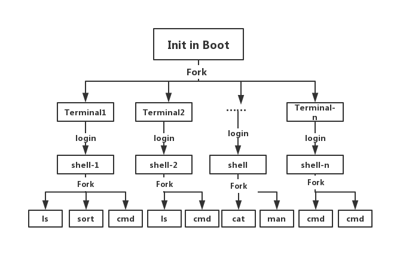
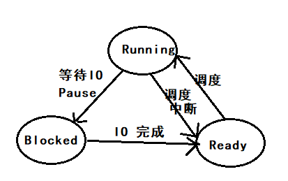
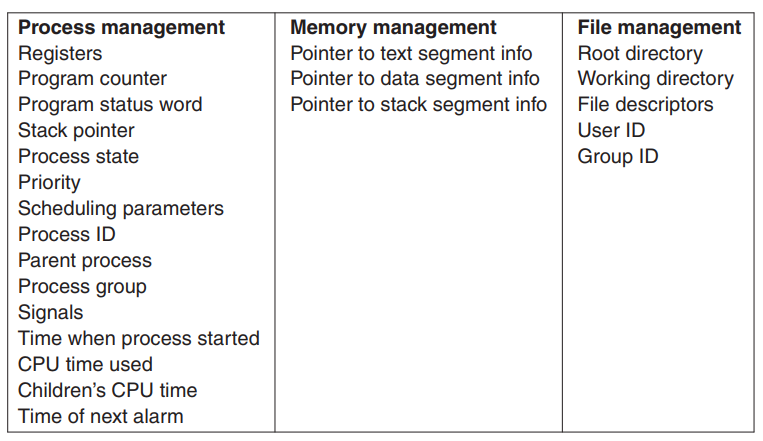
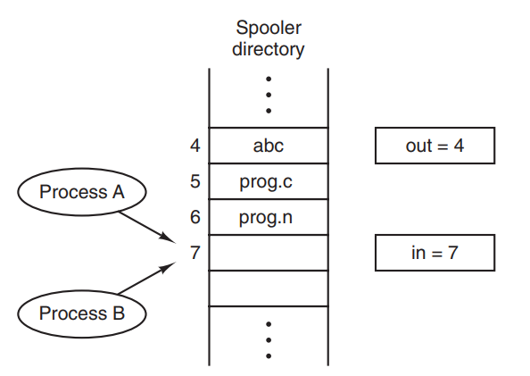

# 第二章：进程与线程

[TOC]

## 引入进程的重要性

进程概念的引入，使得多个任务可以在一个 CPU 上并发执行，**实现了 CPU 的虚拟化**，提高了 CPU 的利用率。

## 进程：Processes

**Pseudoparallelism  伪并行**

在一个单核的操作系统中，任何一个时刻，CPU 都只在做一件事情，CPU 通过在多个任务之前来回切换，来实现进程的并发。

注意：pseudoparallelism 和 hardware parallelism of multiprocessor systems 有本质的区别，后者是真正的在多个 CPU 上进行并行计算。

### 进程的定义: Process Model 进程模型

**进程就是运行在计算机上的任务**。所有在计算机上执行的**任务**，包括**操作系统**，都被看做一个进程。In process model, each has its own virtual cpu.

**Program and Process 的区别**

Program 是静态的，而 process 是动态的。**进程是运行着的程序**。

### 进程的创建：Process Creation

#### 操作系统中创建进程的几个场景

从创建进程的发起者角度，可以分为三个场景：

| 发起者   | short-desc                                       | desc                                                         |
| -------- | ------------------------------------------------ | ------------------------------------------------------------ |
| 操作系统 | 系统初始化创建大量进程                           | 系统在初始化的时候，会创建大量的进程，有很多都是常驻后台的守护进程 |
| 进程     | 进程发起 process-creation 的系统调用，创建子进程 | 如果一个任务可以由多个进程协作，并且高效的完成时，进程就可以通过系统调用创建多个子进程，用于工作协同，加快效率 |
| 用户     | 用户请求创建一个进程                             | 在类 Unix 系统中，用户可以通过在 shell 中输入命令，创建子进程；在 Windows 系统中，用户可以通过操作鼠标键盘，打开软件（创建进程） |

实际上，上述所有的进程创建，都是父进程通过**发起创建进程的系统调用**，由操作系统创建的子进程。区别在于，进程创建的发起者不同，是操作系统，还是正在运行的进程，还是用户。What that process does is execute a system call to create the new process.  

#### 进程的分类

1. **Background Process** 

   后台进程，后台进程中有一类特殊的进程，类似邮件服务/Web服务/打印服务等任务叫做  **daemons**  （守护进程），Linux 中通过在 cmd 后面加上 `&` 来实现后台进程，例如：`sleep 100&`

2. **Foreground Process**

   前台进程，与用户交互，Linux 中的 shell 就是一个前台进程，用于和用户进行交互

#### 创建进程的系统调用

* In Unix： **fork**

  在 Unix 系统中，只有唯一的一个系统调用：fork，用于创建进程

  fork 会对发起系统调用的进程，创建一个**完全一样的副本**（相同的内存镜像，相同的环境变量），也就是 fork 一个子进程。例如用户在 shell 中输入 sort 命令，shell 进程就会 fork 一个子进程，然后执行 sort 命令。

* In Windows: **win32 function call: CreateProcess**

  CreateProcess 用于创建进程，加载 program。该系统调用有 10 个参数。除了 CreateProcess，Windows 系统还提供了 100+ 个 function 用于管理进程。

注意：子进程一旦创建，其地址空间（address space）相对于父进程就独立了，没有任何一块可写空间是共享的。**Again, no writable memory is shared**.  这也解释了，Linux 中 子 shell 对 父 shell 变量只读的机制。

### 进程的终止：Process Termination 

#### 进程终止的两种情况

1. **自然终止**：正常终止，异常终止 **exit**
2. **非自然终止**：致命错误导致的终止，被其他程序终止 **kill**

#### 进程终止的 system call

|         | 自然终止的 system call | 被其他程序终止的 system call |
| ------- | ---------------------- | ---------------------------- |
| Unix    | exit                   | kill                         |
| Windows | ExitProcess            | TerminateProcess             |

### 进程的层次结构：Process Hierarchies 

#### Linux 进程层级

Linux 的进程都是单继承(Fork from 父进程)



Windows 没有进程层次的说法，所有的进程都是平等的。

### 进程的状态：Process States

进程的三大状态：**Running/Ready/Blocked**



### 进程的实现：Implementation of Processes 

#### Process Control Block (PCB)

进程控制块，其数据结构为 array。



注意：

* 一个进程在执行的过程中，可能会遇到上千个中断，关键在于，每次中断过后，进程能否精确恢复到中断之前的状态。（中断发生时，所有信息入栈，进入 Ready 状态，中断结束后，信息出栈，恢复 Runable 状态）
* CPU 在运行时，也就是 process 在运行时，有大量的时间是花费在了 IO 上，举例来说，交互式进程 bash 的大多数时间就是被 IO 所阻塞(等待输入)

## 线程：Threads

### 进程与线程的区别：Thread Usage

#### 从计算机角度（冯诺伊曼架构的三个角度）

* **存储**：内存地址空间的差别

  进程的**地址空间**的**相互隔离**的，而线程间的地址空间是**共享**的，这导致了进程之间**切换**和**通信**的代价远远大于线程直接的调度和通信，进程是拥有资源的基本单位，线程是 CPU 调度的基本单位。

* **计算**：并行计算 / 调度代价

  1. 线程可以充分利用多核 CPU 进行并行计算
  2. CPU 对于线程**调度**的代价也远远小于进程，线程更加轻量，更加 Lite，易于**创建**和**销毁**。在很多系统中，线程的速度，是进程的 10—100 倍

* **输入输出设备**

  输入输出设备常常伴随着大量的 IO，有 IO 就会有阻塞，线程的出现解决了**进程内 IO 阻塞**导致主进程无法推进的问题

#### 从程序员角度

线程的出现，使得程序员可以方便的对**很多不同种类的业务逻辑进行解耦**，以下不同的业务，都可以用线程解决，从而使得主进程不受影响：

* IO 型业务：键盘监听，文本读写
* 后台服务型业务：自动纠错，自动保存等

### 线程使用场景举例

#### WPS 

new a thread for 定时保存用户编辑的内容

new a thread for 监听用户键入的快捷键命令并相应

new a thread for 自动格式化用户刚输入的文本

……

#### Web 服务端

服务端每接收到一个新的请求，就 new 一个 thread，如果服务端软件是单线程的，那么只会导致阻塞。

### 线程介绍

线程和进程一样，也有运行，就绪，阻塞几种状态。每一个线程都有自己的**栈**，

### 多线程介绍

多线程的执行和多进程的执行在单核 CPU 上比较相似，都是 CPU 在频繁的切换，造成并行的假象。多线程共用的是所属进程的资源，而多进程共享的是计算机硬件的资源。多线程之间**共享**其所属进程的**所有资源**，包括打开的文件，进程变量，子进程，信号量。举例来说，**如果一个线程打开了一个文件，那么其他线程也可以进行文件内容的读写**。

资源共享也带来一个问题，如何进行多线程之间的协同？

## 进程间通信：InterProcess Communication (IPC)

IPC 方式：信号量、管道、消息队列、共享存储

**进程间通信包括进程间的同步和互斥**：

1. 多个进程间传递信息 
2.  多个进程间如何进行同步协作 （生产者消费者）
3. 多个进程间如何进行互斥（互斥访问临界区）

另外，进程间的通信的三种问题，同样适用于线程。

### Race Condition （竞争）

进程间共享存储会导致 race condition 的问题，当多个进程同时读写同一块共享空间时（例如往打印机的 spooler 中写入待打印的内容），可能会因为中断等原因导致 race condition 问题，尤其在并发率非常高的情况下，race condition 问题尤为严重。



### Critical Region（临界区）

一个进程在运行内部计算，没有访问共享资源的时候，并不会产生竞争，只有进程访问共享资源的那部分代码才会产生竞争，我们将访问共享资源的代码块叫做 Critical Region，中文叫做临界区。

### 如何避免 Race Condition

* 在进入临界区后，关掉中断 （从根本上解决中断带来了 Race Condition）
* 变量锁 （同样会导致 Race Condition）
* Peterson’s solution 

以上这些措施，都会因为进程陷入忙等（CPU循环测试）而浪费 CPU 的时间。正确的方法是，在进程无法进入临界区的时候，应该让进程进入阻塞状态。最简单的方法是，用操作系统提供的系统调用：**Sleep** 和 **Wakeup**。

**Sleep**：使进程进入阻塞状态，挂起

**Wakeup**：唤醒进程，使进程进入就绪状态

### 生产者消费者问题

生产者消费者问题，本质上就是一个进程间通信的问题，生产者进程和消费者进程之间共享了一块存储空间。

生产者消费者问题的一个错误实现：

```C
#define N 100 /* number of slots in the buffer */
int count = 0; /* number of items in the buffer */
void producer(void){
    int item;
    while (TRUE) { /* repeat forever */
        item = produce item( ); 	/* generate next item */
        if (count == N) sleep( ); 	/* if buffer is full, go to sleep */
        insert_item(item);	 	/* put item in buffer */
        count = count + 1; 		/* increment count of items in buffer */
        if (count == 1) wakeup(consumer); /* was buffer empty? */
    }
}

// 在实践中，生产者和消费者实际上是两个进程
void consumer(void){
    int item;
    while (TRUE) { /* repeat forever */
        if (count == 0) sleep( ); /* if buffer is empty, got to sleep */
        item = remove_item( ); /* take item out of buffer */
        count = count − 1; /* decrement count of items in buffer */
        if (count == N − 1) wakeup(producer); /* was buffer full? */
        consume item(item); /* print item */
    }
}
```

上面这个例子中，假设 buffer 为空，此时消费者已经读取了 count 的值，用来判断 buffer 是否为空，但是此时操作系统进行了一次调度，将执行权交给了生产者。生产者生产产品后放入 buffer 并唤醒消费者，但是，当执行权切换到消费者时，由于其已经读取了 count 的值（为0），所以仍然会进入 sleep。生产者由于无法唤醒消费者，当 buffer 放满了商品后，也会进入睡眠，这就违反了空闲让进的原则。

### semaphore 信号量

**原子操作**

一批指令，要么在没有遇到中断的情况下全部执行完，如果中途遇到中断了，则全部不执行，已经执行的撤销。

**Semaphore**

信号量是一种**变量类型**，这种变量只能通过 P，V 进行减少获增加，而且 P，V 操作是**原子操作**，防止在执行过程中出现中断导致 Race Condition。

P：判断信号量是否为 0，如果不为 0，则信号量减一，如果为 0，则使得进程进入 sleep 状态

V：判断信号量是否为 N，如果不为 N，则信号量加一，如果为 N，则使进程进入 sleep 状态

```C
#define N 100 /* number of slots in the buffer */
typedef int semaphore; /* semaphores are a special kind of int */
semaphore mutex = 1; /* controls access to critical region */
semaphore empty = N; /* counts empty buffer slots */
semaphore full = 0; /* counts full buffer slots */
void producer(void){
    int item;
    while (TRUE) { /* TRUE is the constant 1 */
        item = produce item( ); /* generate something to put in buffer */
        down(&empty); /* decrement empty count */
        down(&mutex); /* enter critical region */
        inser t item(item); /* put new item in buffer */
        up(&mutex); /* leave critical region */
        up(&full); /* increment count of full slots */
    }
}
void consumer(void){
    int item;
    while (TRUE) { /* infinite loop */
        down(&full); /* decrement full count */
        down(&mutex); /* enter critical region */
        item = remove item( ); /* take item from buffer */
        up(&mutex); /* leave critical region */
        up(&empty); /* increment count of empty slots */
        consume item(item); /* do something with the item */
    }
}
```


