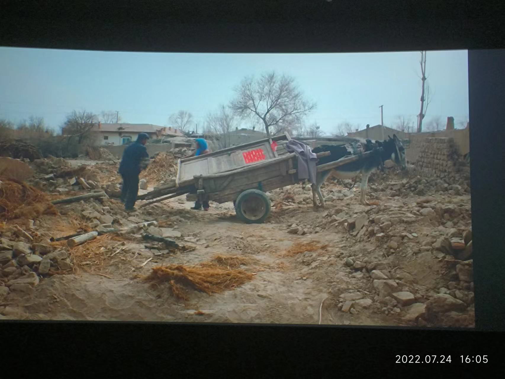
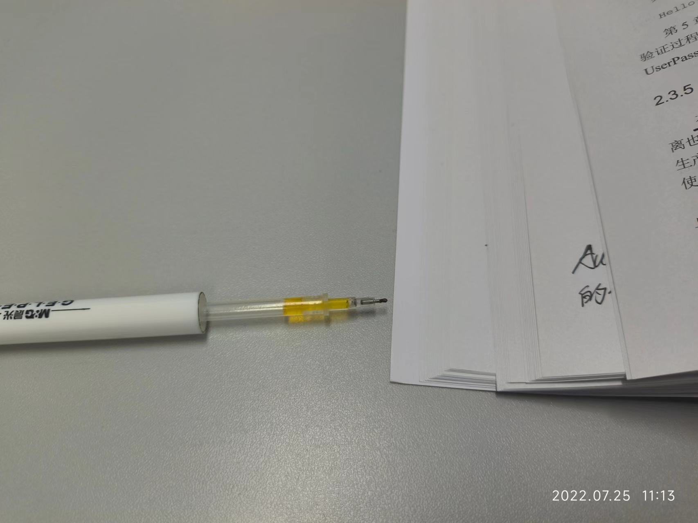
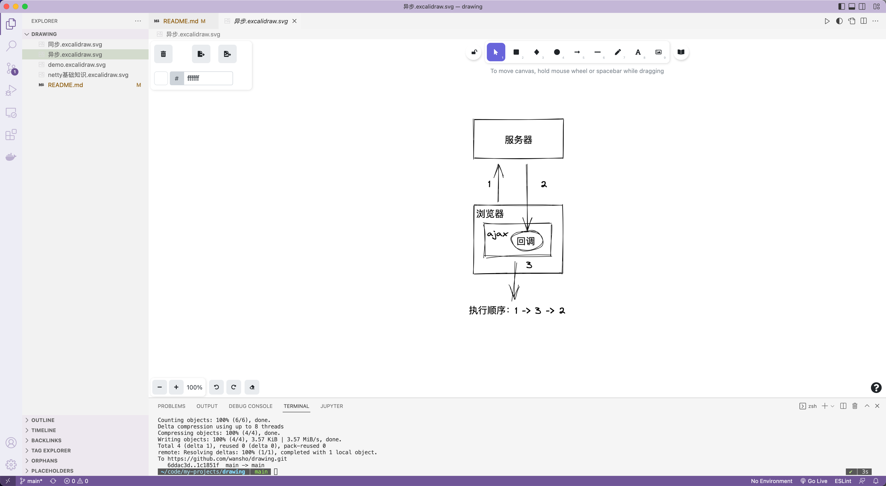
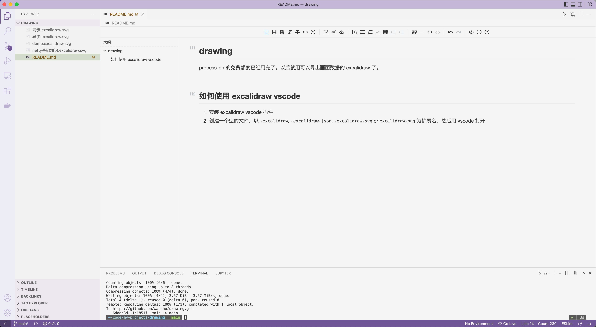
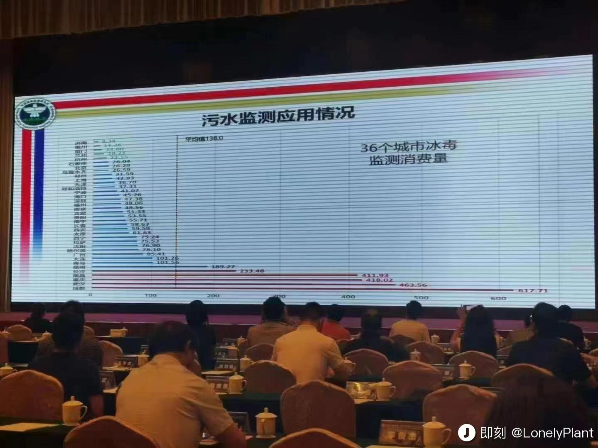
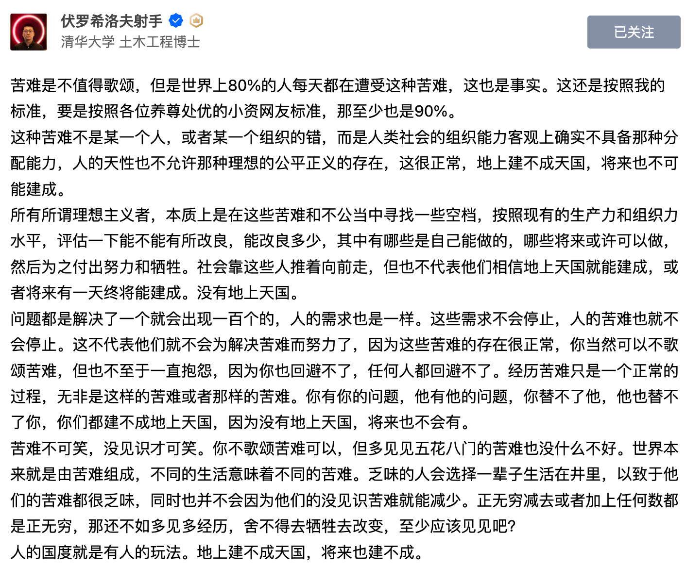

# week - 30

[TOC]

## 一个观点

钱这个东西，对有些人是为糊口，对有些人是为了享乐，对有些人是为了证明价值。

如果用短短的一生，只为了钱活着，反而成了奴隶，这个东西，毕竟生不带来，死不带走。


## 一部电影「隐入尘烟」

讲述西北农民的故事，全片除了女主海清，其他演员全是农民。

真实、残酷，又浪漫。

主流媒体对农村的态度，就像房间里的🐘：沉默，失声，选择性失明。





## 相信未来，不要离开


## 空笔芯

一支笔芯用了两年才写完，想起考研结束的时候，光是空笔芯，就攒了一盒。

你最近的一支笔芯用了多久？




## vscode 两个插件

* [excalidraw vscode](https://marketplace.visualstudio.com/items?itemName=pomdtr.excalidraw-editor)

  在 vscode 中画图，画图源文件还能保存到本地。完美解决了 excalidraw 需要付费的问题。

  

* [typora vscode](https://marketplace.visualstudio.com/items?itemName=cweijan.vscode-typora)

  在 vscode 中集成 typora，markdown 所见即所得。也完美解决了 typora 的付费问题。

  


我会使用一段时间 typora vscode，如果没有问题，那么 vscode 将覆盖我平时工作学习中几乎所有的使用场景。


## 光荣在于平淡 艰巨在于漫长


## 污水监测的一种应用

消费量越高的城市，夜生活也相对越丰富。




## 人与自然


## 只争朝夕

最近冲浪发现一个观点，人生不过短短几万天，当成一场旅途就行了。

才几万天，某乎人均年薪都百万了，人只能活短短几万天，真的太短了。

想起主席的一首词：

```
满江红

小小寰球，有几个苍蝇碰壁。
嗡嗡叫，几声凄厉，几声抽泣。
蚂蚁缘槐夸大国，蚍蜉撼树谈何易。
正西风落叶下长安，飞鸣镝。
多少事，从来急；
天地转，光阴迫。
一万年太久，只争朝夕。
四海翻腾云水怒，五洲震荡风雷激。
要扫除一切害人虫，全无敌。
```


## 二舅火了

我，二舅，打钱！


这是我这几天来看到的一个唯一正常的观点。大佐明白人。视频本就是传达一种积极向上的人生态度，知乎上却一边倒的从苦难着笔，非蠢即坏。



