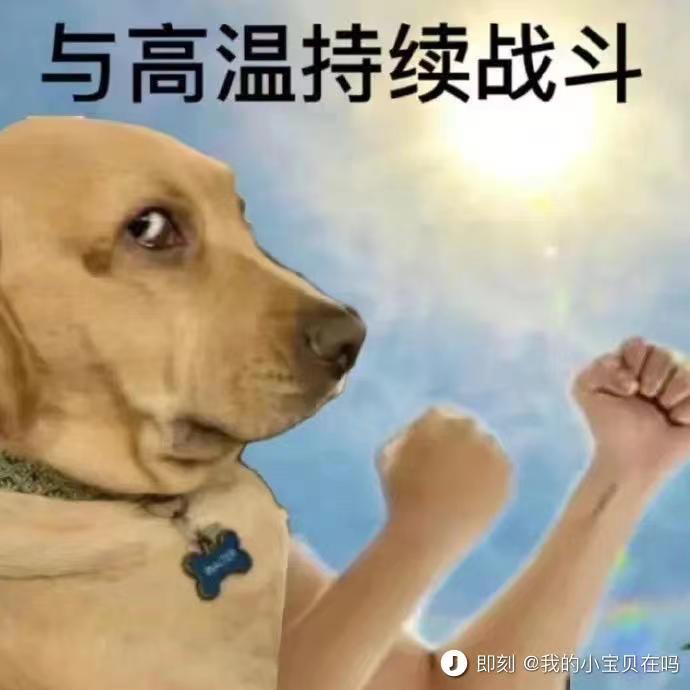
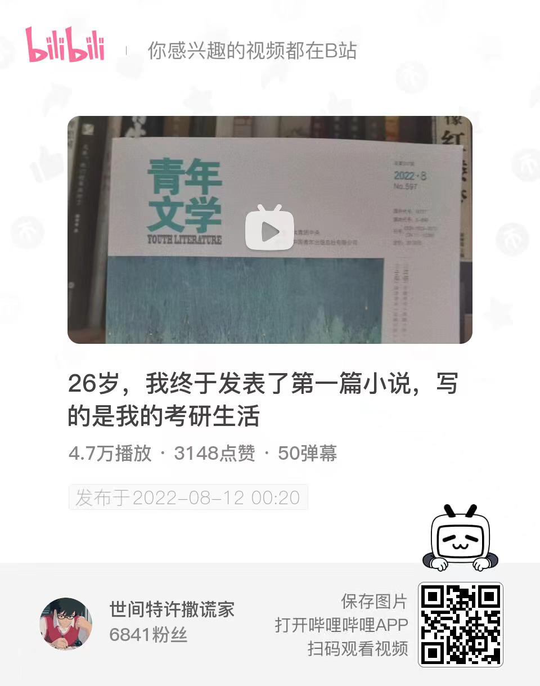

# week-33

[TOC]


## 带逛知乎


### 关于中金交易员被老婆坑

几十年来我最少认识上百对夫妻，即便有的夫妻表面看起来差异很大，比如相貌，比如年龄，比如学历，比如收入，比如家境，但有个深层次的东西差异不大，就是对欲望的认知和把控。 说个最极端的例子，一个漂亮女孩因为钱嫁给比她大的多的有钱男人，一个是对钱的欲望，一个是对色的欲望，这两个欲望是对等的，甚至量级都是一样的。 所以我从来不认为一个糟糕的老婆会有一个完美的老公，如果她老公以完美的姿态出现，那我一定会非常小心的防范，因为他身上一定笼罩着厚实的谎言。 因为这个原因，我特别喜欢认识夫妻两个人，认识一个后尽量认识他的伴侣，两个人同时保守一个谎言的难度很大，我就能更好的认清他们。 婚姻伊始的匹配非常重要，也非常有趣，它最后一定是鱼找鱼虾找虾，即便外人看上去有可能差异巨大。 

**找到一个好的伴侣，办法只有一个，就是自己也是个好的伴侣。**

中金交易员被老婆坑了 还会用什么样的心态面对他老婆呢？ - 请勿关注的回答 - 知乎 https://www.zhihu.com/question/546113007/answer/2602995471


### 体制内与体制外

中国人民大学博士教授储殷直播表示年轻人想留在大城市体制内五六千就够，体制外起码得一万五，你怎么看？ - 老杨叔聊志愿填报的回答 - 知乎 https://www.zhihu.com/question/548217862/answer/2627496782

储殷汇率：1公务员币＝3牛马币。


### 哪一刻你意识到，阅读这件事依然无可替代？

作者：吹面不寒
链接：https://www.zhihu.com/question/528045763/answer/2625076704
来源：知乎
著作权归作者所有。商业转载请联系作者获得授权，非商业转载请注明出处。


有太多时刻，都让我意识到，阅读依然无可替代。

比如说，填补想象力缺口这件事。

在这个世界上，我们绝大多数人的轨迹其实是相同的，然而阅读却能让普通人，拥有更多人生厚度的可能。

在阅读中，我们可以短暂地摆脱自己枯燥的生活，在作者为我们建构的宏大世界中，去探险，去体验，去感知一千种不一样的人生。

原来还有那么多的绝妙故事，有那么多的厚重历史。还存在着这样一种生活方式，如此风姿，如此洒脱。

那些你一辈子可能不曾踏足的场景，都能在文字中被一一呈现。

很多人说读完一本书或是一篇长文，总是很快就忘了。就像是拿着竹篮去打水，无论打多少次，都是空手而归。

因而，阅读是没有意义的。

但是我想告诉你的是，一个人长期阅读，即便可能不会记住什么，但在潜意识里总会明白什么是对，什么是错。

读书最重要的是，教会我们独立思考的能力，不会成为乌合之众。

即便不随从众人，也不会惴惴不安。

有时候，我们和文化层次低的人聊天十分困难，岁数越大越是。不是他们不知道对错，而是他们不愿意，变通熟知了几十年的观点。

在阅读中，你可以去体察人性，去感知世间的罪恶，去找寻心中的污秽，然后理清自身的情绪及种种关系的本质。

阅读给予我们的，不是鄙视他人的傲气，而是直面现实的勇气。

以前，读书对我而言，是件虚荣心的事。曾以为阅读的数量多了，自己就博学了，时光就不虚度了。

后来了解到，读书并不是为了炫耀什么，赢得别人的认同，而是与作者的思维碰撞，或是说情感共鸣。

其实，哪怕我们一年只读一本书，但只要这本书里，有能够影响到你的内容，就足够了。

读书，不会使你光鲜亮丽，也未必能让你取得成功，甚至无法在为你找工作时，提供任何便利。

但当你被生活打回原形，陷入泥潭时，文字总能给你一些内在的力量，让你消解自身的苦难。

即便深陷谷底，也能抬头仰望星空。

仰望星空，让你内心笃定，在寻常中丰满却不自满。

若你心境澄澈，你将永远热爱生活。

书读多了，思维开阔，自然有了一种隐然的气场，这是一种自信。

但这不是书本的作用，而是思考；又或者说不是思考的作用，而是主见。

胸中有丘壑的人，总是格外清楚知道，自己该做什么。

在如今这个浮躁的时代，充斥着短视频、自媒体情绪热文，能够静下心来在知乎，长文阅读已是十分难得。

那些喜爱阅读的人，往往都是耐心，富有同理心的人。他们有着清醒的认知，对世间万物保持着悲悯。

即便长期独处，也能够内心安宁详实。

年少的时候，我最渴望的事就是，能有许多的书。这个自小养成的习惯，即便在我最难以糊口的岁月，也没中断。

可悲的是现在，当我有了稳定而体面的生活之后，却难再有一次酣畅淋漓的阅读体验了。书多了，时间却没了。

长大后，我接触到了太多优秀的人，逐渐迷失了自我，变得容易浮躁、焦虑，感受到了许多说不清的压力。

于是，我的认知变成了，我要跟上他们的步伐，我不能浪费我的时间，我要挣很多的钱……

所以时至今日，我依旧羡慕那些，能够耐下心来纯粹阅读的人。我的读书岁月，早已随着我的成长渐行渐远了，而我也已没了当初的快乐。

我记得小时候，我总喜欢搬个小板凳，翘着二郎腿坐在巷子门前，手里捧着书，脚下睡着大黄狗。

风从远处稻田里吹来，带来成熟的谷物气息。红彤彤的太阳即将落山，在那一排排挤密的庄稼地里，我听见了林野里，各种鸟雀儿咕嘎咕嘎的叫。

文字能把人牵得很远，仿佛置身于广袤的原野。

后来，直到月亮升起，姥爷前来喊我，我还沉浸在文字的世界里……那种身心俱迷的情景尤在眼前，宛如那个不曾流转的夏天。

我拍了拍衣服上的尘土，屁股一扭一扭的回家了。

真他妈怀恋啊。


### 计算机硕士

既然计算机硕士大部分都干开发那硕士白读了吗？工作比当科研奴隶收益大？ 

The Alpha的回答 - 知乎 https://www.zhihu.com/question/520418301/answer/2598574802

哈哈哈有些人装什么外宾呢。去读研有多少人是真的想搞科研的？去读了又有什么真科研能给你个小瘪三做？还不是因为本科能干的活卷到不要本科生，倒逼学生去读研？你往前推7-10年，客户端点击就送，后端无八股，前端无框架。你就算是培训班手攥着PHP入行，撑到19年完整吃下整波红利也该是3w一个月了。那个时代你让大家去读研？读什么研，外面有金子有银子我不去捞你让我读书？你疯了还是我疯了。经济一下滑研究生就开始扩招，考研率开始蹭蹭涨，也不带这么凑巧的吧？我不否认大学学者的价值，但你要说每年招100w个研究生去搞科研，抱歉我觉得这太扯了。


### 知道得越多，距离真相越远

因为我经常写一些三四十年前的事，六七十岁的人，写的时候没觉得怎样，但写的多了，得到的评论多了之后，我发现一个问题，或者说一个现象。

就是最近这四十年因为教育和信息获取的便捷，大量这四十年里出生的人知识非常丰富，知道的东西非常多。

但是可能有一些小问题，就是这四十年跟之前断层的过于严重，导致有相当一部分人，因为知识丰富反而导致了认知局限。

我觉得是两个问题，一是以现在的认知理解以前的人和事，以自己的经验去揣摩以前的人和事。

二是用被总结的或被归总的知识去解读问题，判断情况。

这里还包括地域上的认知局限，比如一说北京的房价绝大多数人知道的都是商品房的价格，而不知道商品房只是北京众多产权类型中的一种，因为产权清晰才被广泛认知，而数量庞大的其他产权形式的房没人知道价值和可交易情况，北京有太多房子是无法正常交易或无法用商品房价格交易的房子。

知乎上和很多平台上都有大量回到以前会怎么样的问题，把太多人的认知扭曲了，变成了所谓的爽文，很少有回答是考虑当时人的认知水平和环境的，这对真正了解当时的历史是很大的伤害。

所以远离爽文，不要用爽文的视角认知过去的人和事，才能真正了解历史，当然更不用爽文的角度去生活，那是对自己的伤害。

来自知乎答主：请勿关注


### 认清现实，放弃幻想

今晚散步的时候，跟我儿子探讨了一个问题，就是中国在古代世界的地理位置，中国人自己的看法，还有其他文明的看法。

其实这是个没有标准答案的问题，中国人从古至今都是坚定的认为中国是居世界之中的，甚至名字都叫中央之国的中国，但在我看来，中国一直都在古代文明大陆的边缘，中心应该是土耳其到中东一代。

因为海洋和高山，荒漠，我们跟其他文明之间是很疏远的，相互很陌生的，最多就是互相有一些使节，离全面了解差的很远。

要命的是中国自古以来的生存压力不大，跟其他文明相比都小的多，没有任何进步的压力，也没有探索更大时间的迫切。

相比来说欧洲及周边才是修罗场，毁灭级别的碰撞太多了，生存压力太大了，逼的他们不得不进步，不得不产生工业革命。

我们去过很多博物馆都看到过一个大事的记录，就是马戛尔尼见乾隆，我们对这个事既重视又不太重视，因为在我看来那是世界在几千年来第一次认清中国，是可以从世界史角度给中国历史分期的标志，那一刻，中国真正成为了世界的一员，即便我们不愿意，也不自知。

之所以今天说这些，就是之前看过大量博物馆实物，但串不到一起，还是要多去，多讲。

作者：请勿关注
链接：
来源：知乎
著作权归作者所有。商业转载请联系作者获得授权，非商业转载请注明出处。


### 穷极一生追求的是什么

许三多：好好活就是做有意义的事，有意义的事就是好好活。

我们穷极一生，究竟追寻的是什么？ - 知乎 https://www.zhihu.com/question/384441334/answer/2596104794


## 马斯克：早晨醒来就看手机是个坏习惯

[早晨醒来就看手机是个坏习惯，我希望先去锻炼](https://www.ithome.com/0/634/991.htm)

马一龙终于说了一句实话。


## 能力被动型人才

有些人一切以“**我当前所掌握技术和能力为标准**“来判断事情难度。 我管这类人叫“能力被动型员工“。被动型人水平也有高有低。较高水平的这类人很可能在之前某个人生阶段（比如聪明，大学被逼，年轻心态开放情况下）习得的知识和技术。但因为是被动型，非发展性人格，所以到了30之后会逐步走下坡路。

合格技术管理者和员工针对一个技术问题的沟通中，很容易发现“能力被动型员工”。这时候管理者心里会默默给你一个标签。以后只会选择你能力之内的工作给你。合理的使用你，只让你辛苦，不让你那么痛苦。由于你一直困在“当前这一秒我会的东西是最高难度“，也接触不到更多更新更难的事情。接触了也无心无力奋争解决。 能力也不会提高。 所以你和一个原地拉磨的驴子很像。体力耗光，也就卸磨杀驴了。

技术人都有发展自身能力和技术的倾向。主观上，如果你不是做一天和尚撞天钟，你肯定不认可自己是能力被动型。 但有种学习的障碍，自己被自己知道的东西困住了。你认为的极限真的就是你自己的极限，和这个技术问题的极限吗？据我十几年的观察，多数情况下并不是。 另外，工程实际是解决问题，不是用完美或者自认为满意的方法解决问题。这需要特别灵活的头脑。工程思维，和钻研理论与技术，用的是不同的思路。这种思维转换对很多技术人员有困难。久而久之，自己被自己耽误了。丧失了很多机会去突破自己的极限。

这种思维习惯不限于技术人员。一切靠一项技能吃饭的人，都会存在。如果这类人目光还短，只盯着眼前鸡毛蒜皮的小利，想不到5年到15年以后自己长期利益。那下场就更惨。这个和看工资待遇不矛盾。你既要看现在的待遇，也要看当前其他公司的更好待遇机会。更要去想5年或者15年以后的工资待遇。

软件技术人员的瓶颈，为35岁之后做准备 - 姚勇的文章 - 知乎 https://zhuanlan.zhihu.com/p/498762187


## 今日长缨在手，何时缚住苍龙？

清平乐·六盘山

天高云淡，
望断南飞雁。
不到长城非好汉，
屈指行程二万。
六盘山上高峰，
红旗漫卷西风。
今日长缨在手，
何时缚住苍龙？

— 毛泽东


## 强大的哔哩哔哩增强脚本

[Bilibili-Evolved](https://github.com/the1812/Bilibili-Evolved)


## 股票的一个观点

回看一下股票账户，如果波动过大，即盈利或者亏损以月为单位统计震动幅度比较大，一定意义上来说 还是在靠运气参与投资，和赌博的性质差不多。

目标是要减少账户的大范围波动，一定程度上来说大幅波动比稳定亏钱更严重，而后者对于自己复盘，形成交易逻辑是非常有帮助的。


## 凝望深渊

最近对「你在凝望深渊时，深渊也在凝视你」有了更深的体会。

社会越来越割裂，网络充斥着戾气。通过鄙视链获得优越感的人，也终将在被人瞧不起时，体会到痛苦。


## 不说话的嘉陵江

这里没有大海，只有一条不说话的嘉陵江。


## 根据名字判定性别

github: [NGender](https://github.com/observerss/ngender) 用朴素贝叶斯公式解决问题的一个很有趣的例子。

```shell
$ ng 赵本山 宋丹丹
name: 赵本山 => gender: male, probability: 0.9836229687547046
name: 宋丹丹 => gender: female, probability: 0.9759486128949907
```

贝叶斯公式: `P(Y|X) = P(X|Y) * P(Y) / P(X)`

当X条件独立时, `P(X|Y) = P(X1|Y) * P(X2|Y) * ...`

应用到猜名字上

```
P(gender=男|name=本山) 
= P(name=本山|gender=男) * P(gender=男) / P(name=本山)
= P(name has 本|gender=男) * P(name has 山|gender=男) * P(gender=男) / P(name=本山)
```


## Vimium 像 vim 一样操作浏览器

[Vimium](https://github.com/philc/vimium)，一款 Chrome 插件 [download](https://chrome.google.com/webstore/detail/vimium/dbepggeogbaibhgnhhndojpepiihcmeb)，用 vim 的方式操控浏览器（不用鼠标）。

[让你用 Chrome 上网快到想哭：Vimium](https://sspai.com/post/27723)


## 高温表情包




## 一位 up 的考研生活




## 雷军 2022 年度演讲

[雷军2022年度最新演讲：熬过绝望低谷，你便无人能敌 ](https://www.sohu.com/a/576060273_358836)

> 那一年，我26岁。我是北京金山的总经理，第一次面临这样的情况，有点束手无策，尤其是每个月发工资的那几天，都觉得特别难熬。
>
> 最惨的一个月，账上只有十几万人民币。连发下个月的工资都非常困难，那段时间我经常失眠，经常一宿一宿的睡不着。
>
> 我还记得有好多个晚上，我独自坐在沙发上，看着对面的楼里的灯光，一盏一盏的熄灭，再看到天色一点一点的亮起来，其实这种痛苦只有经历过的人才能很深的明白吧。

> 我觉得自己懂技术，特别想把技术给客户讲清楚，如果人家有不同意见，我还跟人家抬杠，总之“我一定要说服你，不买产品都没关系，这道理咱们一定得给说明白了”，就特别较真。
>
> 我后来在想，我看他卖的时候不是这么做的，他拿一个软件的包装，拿一张宣传页，几句话就把用户说明白了，实在不行，还有电脑给你演示一下就搞定了。
>
> 其实，我们做销售的目的，不是为了给用户把道理讲明白，关键要让用户能够很舒服地的接受。 这个金牌销售，他跟用户交流就特别轻松自如。

> 1996年，电脑刚刚开始普及。我在店里的时候， 每天都有几个用户来问我，有没有电脑入门的软件。
>
> 我就想不通了，学电脑买本书就学了，为什么还要买个软件来教？我总是不厌其烦的劝阻用户，说真的没有这样的软件，要不你出门左转有个书店，你去买一本书照着学就行了。我还 非常耐心地告诉他们。
>
> 直到被问了无数次以后，我突然恍然大悟： 做一个（教程软件）不就得了吗？
>
> 说实话，这一类的软件跟盘古比起来，没啥技术含量。于是，我就立刻组织团队马上开发了一个软件，就叫《电脑入门》，快速推向市场，连广告都没做。
>
> 一推出以后马上就畅销，立刻上了畅销软件排行榜。
>
> 这个故事给这个过程真的给了我巨大的震撼，再让我重新思考，并重新理解了一个非常浅显的道理：
>
> 做产品，一定要做用户需要的产品，不要做那些看起来高大上的产品。只要这个产品是用户哭着喊着要的，销售就不是问题，特别容易卖。好的产品，它会自己长脚的。
>
> 有了这样的理解以后，不瞒大家说，再做产品就不难了。
>
> 后来我们出了一系列的爆品，有金山词霸、金山毒霸等等 （一二十个），所以很快金山找到了活下去的路。
>
> 我们再回顾看盘古的问题，其实很简单，就是脱离群众，闭门造车，就这么一个问题。

> 我当时就跟同学们分享了我的观点。我说我是一个程序员，在软件过程里学到的最重要的道理是什么呢？
>
> 1. 软件工程没有银弹
> 2. 可能出错的地方，一定会出错

> 最后用一句话来总结我今天的演讲，**你经历的所有的挫折和失败，甚至那些看似毫无意义消磨时间的事情，都将成为你最重要的、最宝贵的财富。**
>
> 人生很长，无论如何，让我们保持信念：永远相信美好的事情即将发生。


## 音视频重构

一个有趣的观点：**未来几乎所有行业都需要用音视频的方式重构一遍**

这是知乎的一个回答：

说法很高端，但事就是那么个事。制造业里都推广很多年了，很多产业，尤其是重体力，重危险，重精度的产业都在转向视频反馈，机械操作，流水线生产。我一哥们是在汽车厂生产大货车配件的，每天的工作就是在视频上看着一堆机器人（其实叫机械臂更贴切）操作，而他则根据不同的需求对设备进行调试，这就是去所谓的音视频构建呗，他现在做的工作跟十几年前零件生产线上的师傅，虽然都出同一种产品，但是干的工作完全不一样。

现在，这种趋势在向其他领域蔓延，以前人工还有成本优势，疫情时代则增加了封闭的风险，大大促进了无人少人操作的发展吧感觉。

作者：红护
链接：https://www.zhihu.com/question/548076856/answer/2622918348
来源：知乎
著作权归作者所有。商业转载请联系作者获得授权，非商业转载请注明出处。


## 一剪梅·红藕香残玉簟秋

红藕香残玉簟秋。轻解罗裳，独上兰舟。云中谁寄锦书来，雁字回时，月满西楼。

花自飘零水自流。一种相思，两处闲愁。此情无计可消除，才下眉头，却上心头。


## 高手在民间（逃


## 你和谁在一起最轻松


## github 贡献墙 svg 动画

[在线生成](https://contribution.catsjuice.com/)


