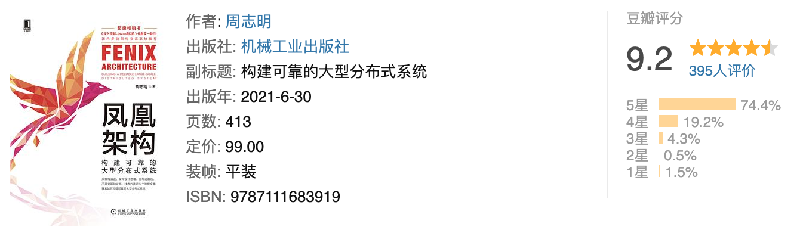
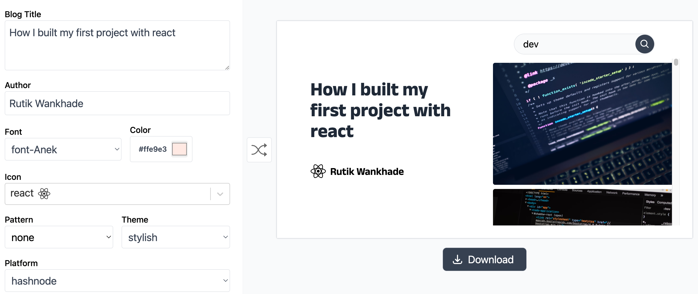
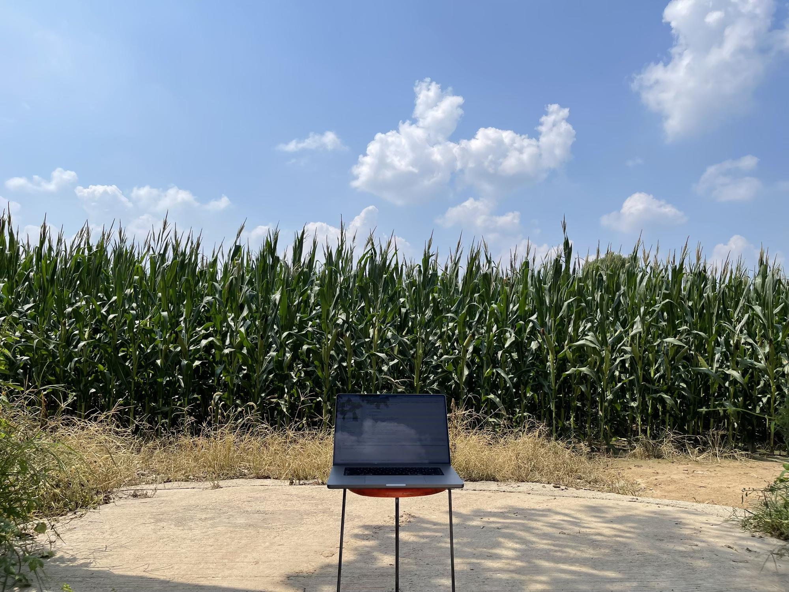
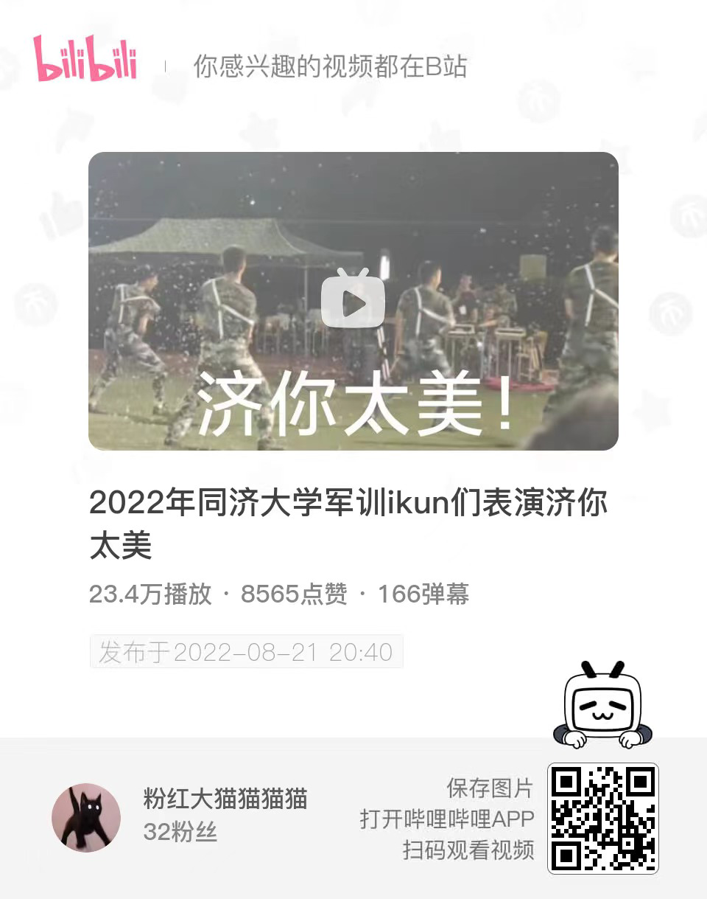
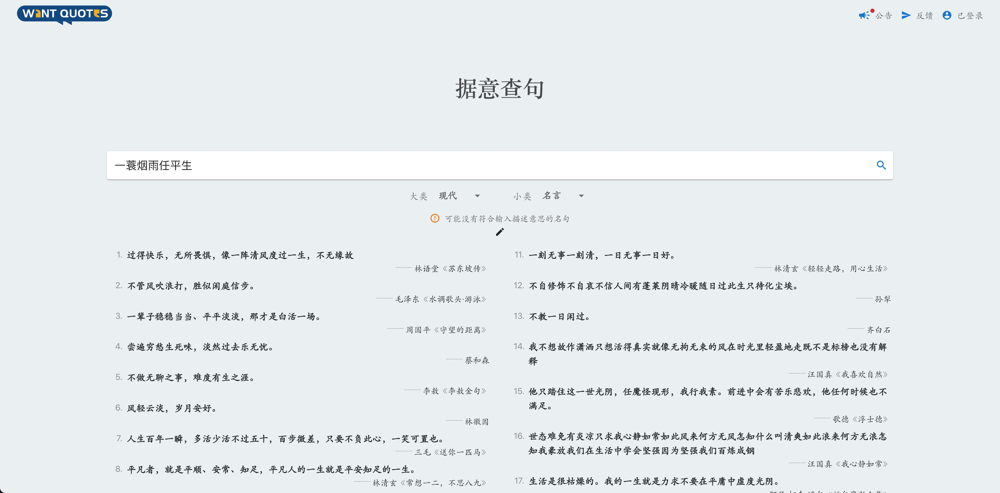
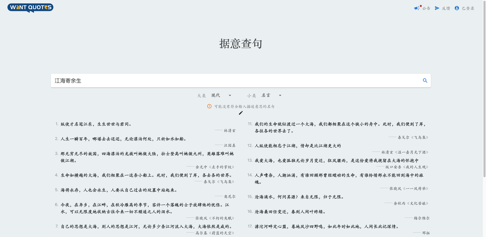
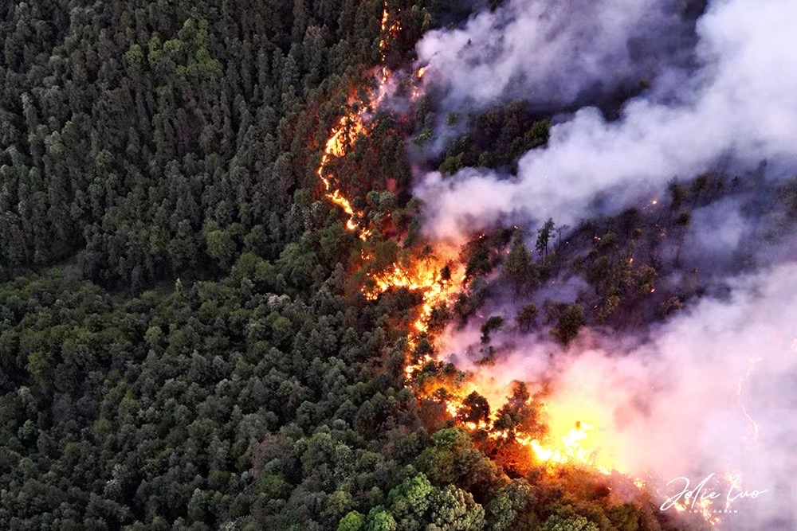

# week-34

[TOC]

## 为何许多男士痴迷于练肌肉

因为身体是你能掌控的唯一东西，也是你练就能给你正向回馈的东西。[为何许多男士痴迷于练肌肉？ - 谭四瞳的回答 - 知乎]( https://www.zhihu.com/question/23850556/answer/2633571157)

器械再冷也比人心要暖。 [为何许多男士痴迷于练肌肉？ - vermouthsa的回答 - 知乎](https://www.zhihu.com/question/23850556/answer/581229935)


## 火爆全网的 Evil.js 源码解读

[火爆全网的 Evil.js 源码解读](https://juejin.cn/post/7133134875426553886)

```
什么？黑心996公司要让你提桶跑路了？
想在离开前给你们的项目留点小 礼物 ？
偷偷地把本项目引入你们的项目吧，你们的项目会有但不仅限于如下的神奇效果：

当数组长度可以被7整除时，Array.includes 永远返回false。
当周日时，Array.map 方法的结果总是会丢失最后一个元素。
Array.filter 的结果有2%的概率丢失最后一个元素。
setTimeout 总是会比预期时间慢1秒才触发。
Promise.then 在周日时有10%不会注册。
JSON.stringify 会把I(大写字母I)变成l(小写字母L)。
Date.getTime() 的结果总是会慢一个小时。
localStorage.getItem 有5%几率返回空字符串。
```


## 一个好的产品经理

一个好的领导（或者产品经理），应该具备五项技能：SQL、Excel、简洁写作、讲故事、区分优先级。[《前5位的产品和管理技能》](https://www.craigkerstiens.com/2021/04/27/top-5-product-and-management-skills-sql-excel-clear-communication-story-prioritization/)


## 五彩斑斓的蓝

冲浪遇到两种颜色，群青和克莱因蓝，很安静，很喜欢的颜色。

### 群青


### 克莱因蓝

rgb(0, 47, 167)：


## 关于原生家庭

不管你原生家庭好，还是不好，其实都会有缺失。如果你原生家庭不好，那么你就缺少爱。如果你原生家庭好，你就缺少历练。你在原生家庭里没有上到的课，终究还是要出去上。

——杨幂


## 凤凰架构

一本好书

[凤凰架构，构建可靠的大型分布式系统](https://icyfenix.cn/)   [pdf download](https://raw.githubusercontent.com/fenixsoft/awesome-fenix/gh-pages/pdf/the-fenix-project.pdf)




## 为技术文章在线生成海报

[CoverView](https://coverview.vercel.app/editor) 




## 庄稼地旁写代码




## 济你太美

同济大学军训 2021,2022 表演节目。




## 软件本地优先

[本地优先软件 Local-first software](https://zhuanlan.zhihu.com/p/557353347)

翻译了 Local-first software。原文是深度好文，一作是 DDIA 的作者，文中指出了目前云应用普遍存在的问题「用户不再拥有自己的数据的控制权」，并指出了如何在不损失用户体验的情况下重新「让用户掌握自己数据所属权」的可行路线。


## 跨平台框架 Electron 和 Tauri 比较

[Tauri VS. Electron - Real world application](https://www.levminer.com/blog/tauri-vs-electron)

结论：

Electron is being replaced? Yes, Tauri is way better, but it still misses a lot. In a couple of years I'm sure the Tauri team will catch app to Electron. The things I'm excited for: Deno as the backend, better auto update and iOS/Android support.


## 据意查句

清华大学出的一款垂直搜索引擎，可以据意查句，很有意思，前端设计也很有美感。






## 重庆山火



