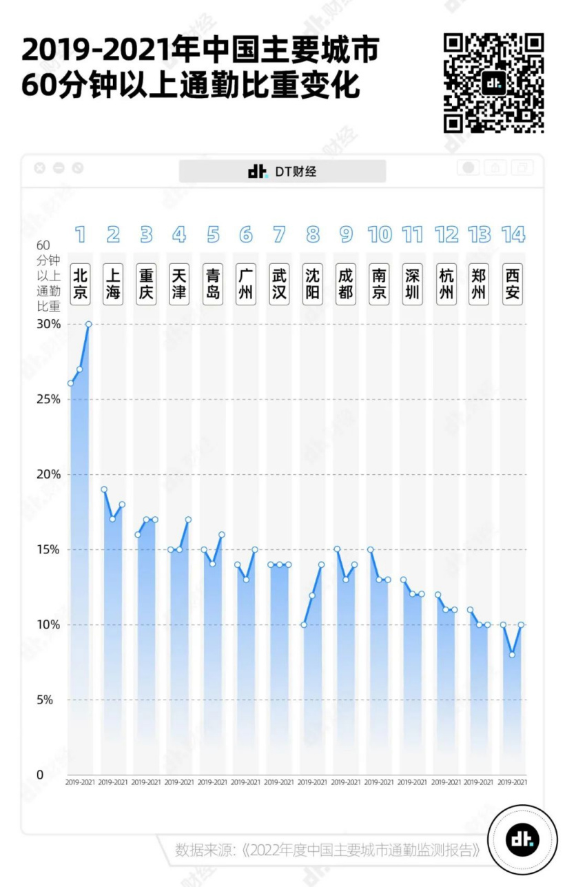
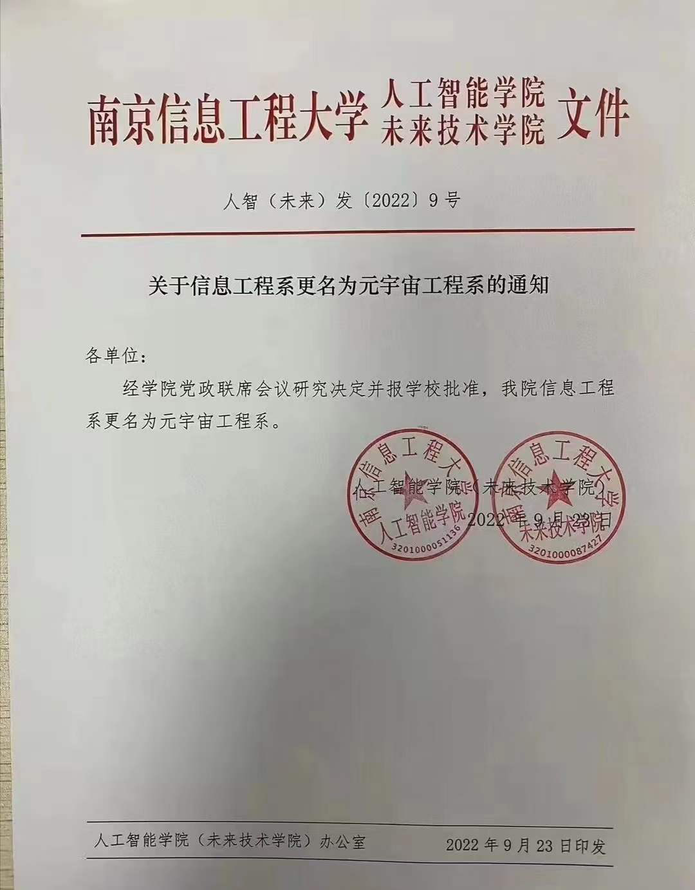
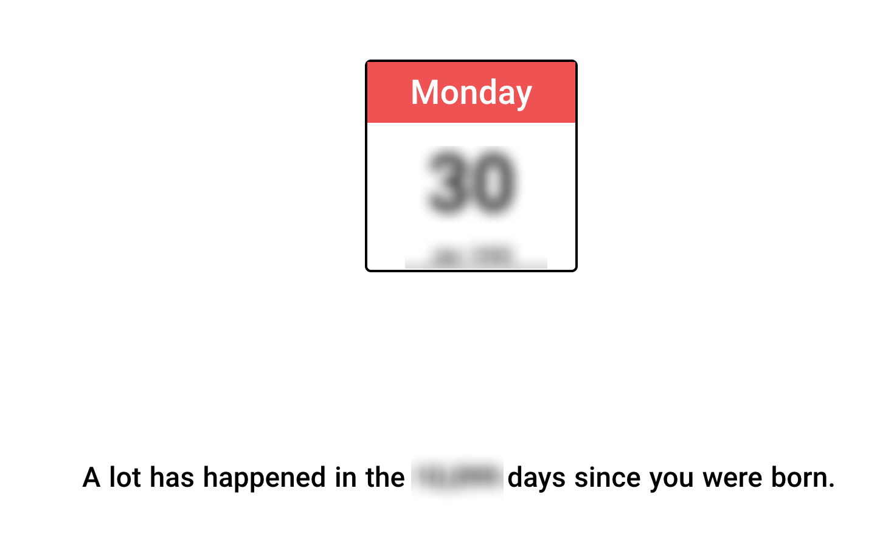

# week-38

[TOC]

## git ui in cmd

命令行中的 git ui [gitui](https://github.com/extrawurst/gitui)，只需要在终端中输入 gitui，即可打开图形化界面。

## 全球各大洲制造业生产总值地图

## 通勤

## 笑傲江湖

上个星期看完了 2001 李亚鹏版本的笑傲江湖，有几句台词我挺喜欢的。

## 元宇宙工程系

## 北京的环境

最近在北京出差，住在离天安门不到两公里的地方。

虽然现在北京的空气好多了，但是街道卫生还是差太多了，天安门附近的胡同里还是太脏了，得低着头时刻提防着踩到狗屎。

## 人生统计

[人生统计](https://neal.fun/life-stats/)

输入出生年月日，这个网站会告诉我们已经活了多少天了。

时间不等人，对于我来说，一万天已经过去了。

