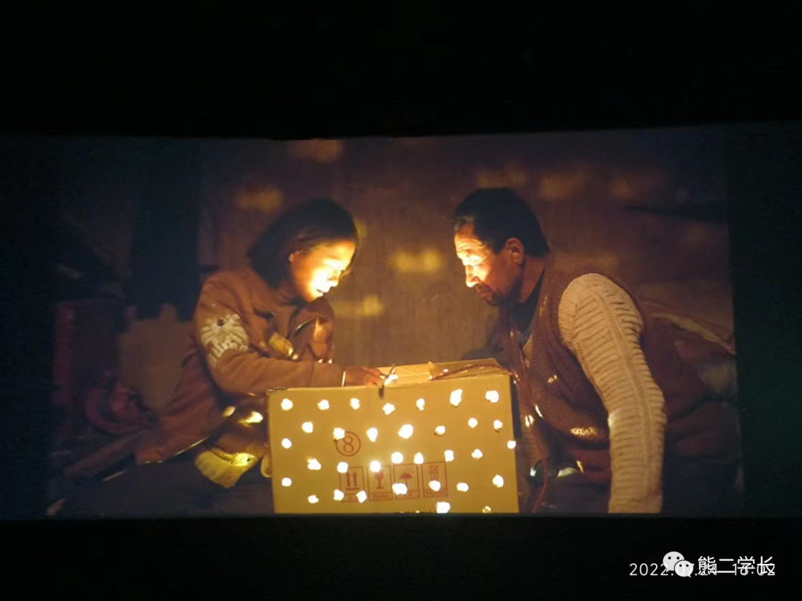
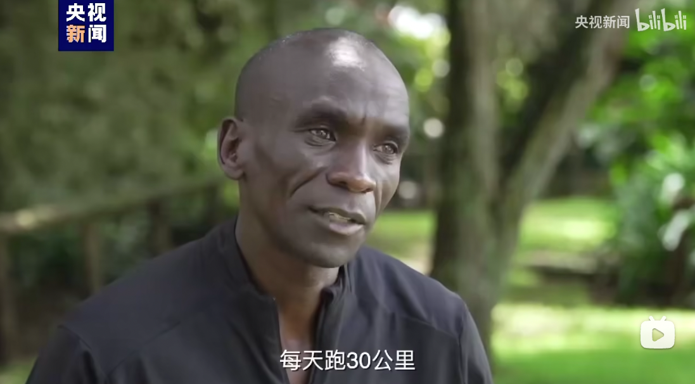
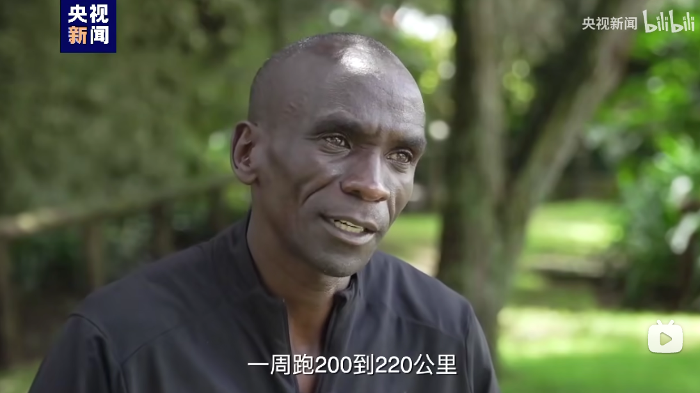
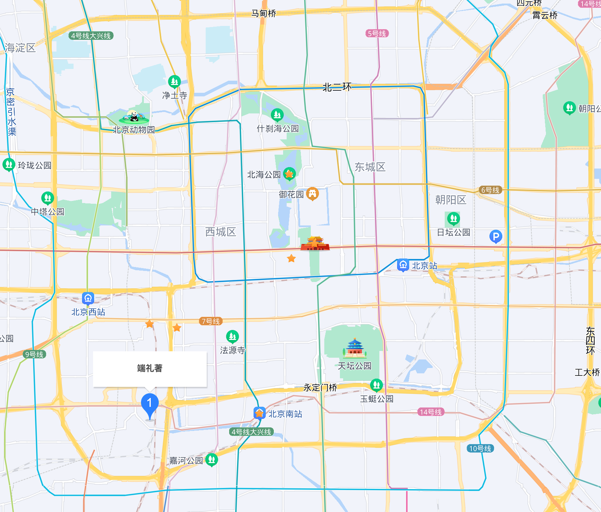
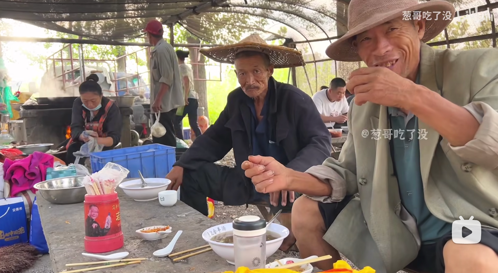

# week - 39

[TOC]

## 《隐入尘烟》全网下架

这样一部描述农村的写实影片，硬是被全网下架了…… 果真老爷心善，见不得穷人。

## 马拉松世界纪录保持者

[再破世界纪录！总台独家专访马拉松名将基普乔格](https://www.bilibili.com/video/BV1yV4y1T7eY/?vd_source=a353c03d59050e32df0db7cd77b16f6e)

每天跑两次，每天跑 30 公里，一周跑 200 到 220 公里。

太强了……我一年也就跑 300 公里，还在沾沾自喜……

而且基普乔格已经 37 岁了……

## 5G 带来的最大改变

看到一个段子：5G 迄今为止带来的最大改变，就是 4G 变慢了……

最近在北京出差，深有体会。按说京城的 4G 应该是全覆盖的，结果办公地点 4G 卡成了 3G，必须打开 5G，才能勉强达到 4G 的速度。

## 一汽大众汽车导航时弹出广告

现在的电动车都是用做手机的思维做出来了……

## 北京 2.7 环的新房房价

在北京二环看到的广告牌，一直对大城市的房价没有切身的体会，今天看到的这个新盘，单价 11 万，总价 1500 万。

北上广核心地段的新盘，一般都是限价倒挂的，说明这个端礼著一套市场价应该不止 1500 万……

## 山东大集

俺也算半个山东人了，小时候也赶过集，看到这样的视频，格外亲切。

另外我注意到，这个视频的播放量有 100 多万，说明大家还是喜欢看接地气的素材的，毕竟 B 站后浪只是少数，大多数人还是出身农村或者小县城的。

这也解释了为什么《二舅》能火起来，因为农村出来的娃，都能从二舅上看到自己熟悉人的影子。

