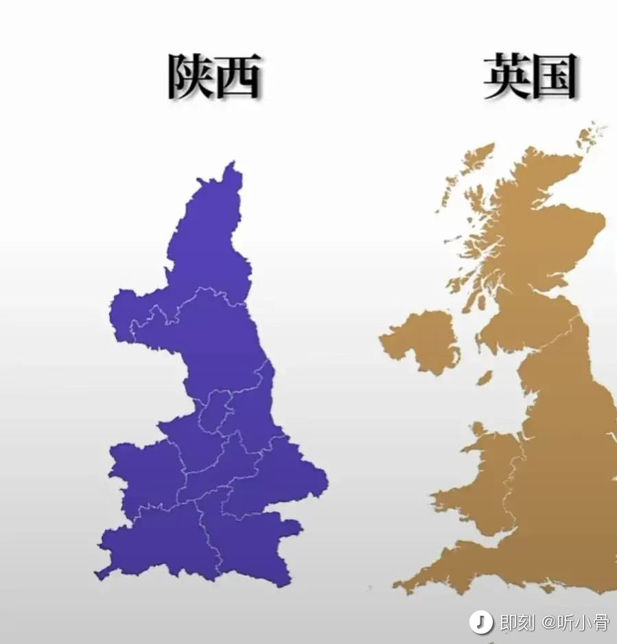

# week-40

[TOC]

## 技术管理者的要求

我以前要求自己做到的是，我手下两层以下的人，他们每个人的工作我都能做。这样整个公司里，没有人敢欺骗你、忽悠你。这个非常重要，大部分企业中层都在忽悠高层，资源其实是浪费掉的。

—— 陆奇

## 逛知乎

### 无题

穷人孩子的耳朵边很少听到“自由、艺术、快乐、幸福、享受、平等、爱”这种字眼。从小到大听到的都是“平安，看得起，看不起，努力，听话，老实，忍耐，吃得苦中苦方为人上人”。

### 你们是怎么察觉一个人喜不喜欢你？

你就观察你和对方在一起的时候，你喜不喜欢自己，如果对方总能激发出你乐观自信开朗善良的一面，并让你经常觉得对未来有希望，你的情绪总是稳定在一个舒服安全的状态，大概率，对方是喜欢你的。相反． 如果一个人总是能让你怀疑自己，让你时常有嫉妒伤心痛苦不堪忍受的心理体验，即使他也会有让你快乐的体验，但那些消极的影响就像潮涨潮落样，永不会缺席，喜欢你的人怎么可能对你做道事呢？人的身体比灵魂诚实的多。

### 你是什么时候释怀的

有一天偶然读到了庆山作者的一段话：如果足够勇敢，应该继续扛起问题往前走。直到因果成熟自动脱落，人对问题的解决方式。不是试图找到答案，而是背负到可以解决的那一天突然有种幡然醒悟的释怀之感，如果一直想着怎么摆脱它，会陷入纠结无限里，不如带着如影随行的它一起上路，历尽干帆之后，也许所有的问题都不再是问题了。

## 陕不列颠

## 送东阳马生序

融入不了上海的小资生活，应该怎么办？ - 知乎 https://www.zhihu.com/question/552899106/answer/2686353153

在知乎上看到这篇文章，评论区有人说是现代版的「送东阳马生序」，中学的时候看到这篇文章没什么感觉，工作后打拼几年，才体会到个中滋味。以中有足乐者，不知口体之奉不若人也。

余幼时即嗜学。家贫，无从致书以观，每假借于藏书之家，手自笔录，计日以还。天大寒，砚冰坚，手指不可屈伸，弗之怠。录毕，走送之，不敢稍逾约。以是人多以书假余，余因得遍观群书。既加冠，益慕圣贤之道 ，又患无硕师、名人与游，尝趋百里外，从乡之先达执经叩问。先达德隆望尊，门人弟子填其室，未尝稍降辞色。余立侍左右，援疑质理，俯身倾耳以请；或遇其叱咄，色愈恭，礼愈至，不敢出一言以复；俟其欣悦，则又请焉。故余虽愚，卒获有所闻。当余之从师也，负箧曳屣行深山巨谷中，穷冬烈风，大雪深数尺，足肤皲裂而不知。至舍，四支僵劲不能动，媵人持汤沃灌，以衾拥覆，久而乃和。寓逆旅，主人日再食，无鲜肥滋味之享。同舍生皆被绮绣，戴朱缨宝饰之帽，腰白玉之环，左佩刀，右备容臭，烨然若神人；余则缊袍敝衣处其间，略无慕艳意。*以中有足乐者，不知口体之奉不若人也*。盖余之勤且艰若此。今虽耄老，未有所成，犹幸预君子之列，而承天子之宠光，缀公卿之后，日侍坐备顾问，四海亦谬称其氏名，况才之过于余者乎？今诸生学于太学，县官日有廪稍之供，父母岁有裘葛之遗，无冻馁之患矣；坐大厦之下而诵诗书，无奔走之劳矣；有司业、博士为之师，未有问而不告，求而不得者也；凡所宜有之书，皆集于此，不必若余之手录，假诸人而后见也。其业有不精，德有不成者，非天质之卑，则心不若余之专耳，岂他人之过哉！东阳马生君则，在太学已二年，流辈甚称其贤。余朝京师，生以乡人子谒余，撰长书以为贽，辞甚畅达，与之论辨，言和而色夷。自谓少时用心于学甚劳，是可谓善学者矣！其将归见其亲也，余故道为学之难以告之。谓余勉乡人以学者，余之志也；诋我夸际遇之盛而骄乡人者，岂知予者哉？

## 两首曲子

### 小茉莉

### 武林外传 - 茉莉花

