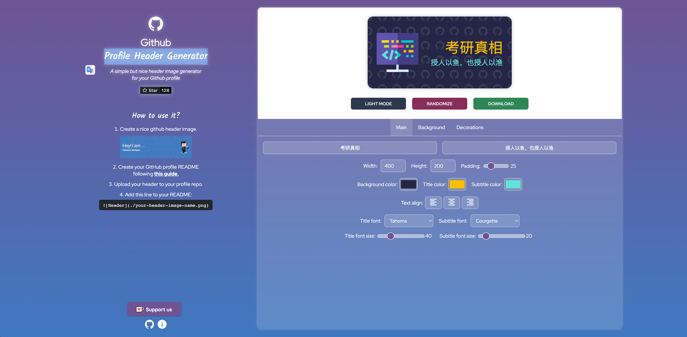
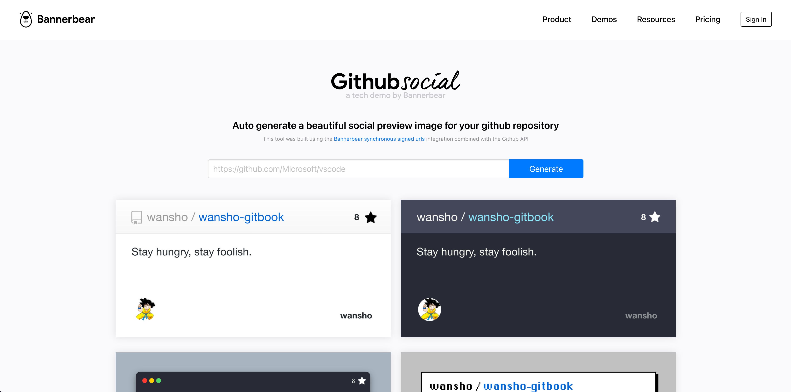

# week-27


### 主题图片生成器

自媒体在互联网上创作，最头疼的是莫过于文章的配图了。每次我写完一篇文章，都不知道该找一张什么样的图片来契合文章的主题。

有时候我会配上自己平时拍的一些照片，虽然文不对题，但是总比没有好。

所以我干脆找了一批可以自定义生成图片的网站。

[Profile Header Generator](https://agreeable-pond-087f7a90f.1.azurestaticapps.net/) | [github](https://github.com/leviarista/github-profile-header-generator) 自定义生成 profile 图片




[capsule-render](https://github.com/kyechan99/capsule-render) |[github](https://github.com/kyechan99/capsule-render) 根据 url 参数自动生成 svg 图片链接

```
https://capsule-render.vercel.app/api?color=gradient&height=300&section=header&text=授人以鱼，也授人以渔&fontSize=40&type=waving
```


[github social](https://www.bannerbear.com/demos/github-social-preview-generator-tool) 输入 GitHub 仓库，自动生成图片




### rust 静态网站生成

分享一套 rust 静态网站生成的技术栈：

* [Zola](https://github.com/getzola/zola) A fast static site generator in a single binary with everything built-in.
* [adidoks](https://github.com/aaranxu/adidoks) AdiDoks is a mordern documentation theme, which is a port of the Hugo theme Doks for Zola.


## bug 的波粒二象性


## 平原上的夏洛克

乡土浪漫

