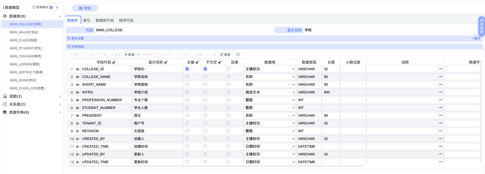
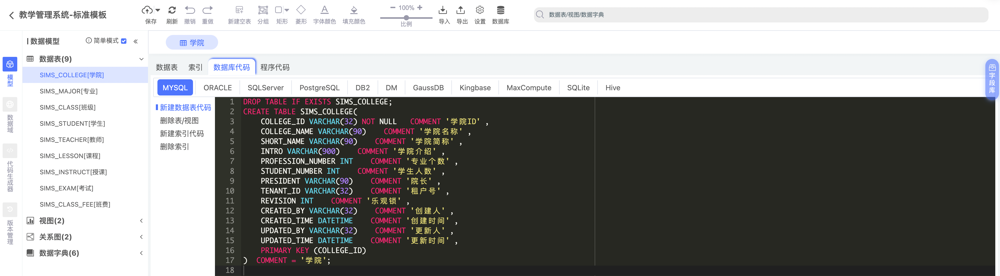

# week-28


## 快乐秘籍

1. 少关注别人的人生（少上网）
2. 珍视自己（多投资自己，多关注自己）
3. 多多搞钱


## 代码格式化并在前端高亮展示

代码格式化：[sql-formatter](https://github.com/sql-formatter-org/sql-formatter)

前端高亮展示：[highlight.js](https://highlightjs.org/)

在 react 中引入 highlight.js：[在各种环境中使用 hightlight.js](https://juejin.cn/post/6969131238493782046)

react 中使用 highlight.js 会有如下警告，目前尚未解决：

```
One of your code blocks includes unescaped HTML. This is a potentially serious security risk.
```


## 寒门学子

曾经的农村留守儿童，考研上岸国防科大，和种田的爷爷奶奶一起拆录取通知书。

泪目。

寒门出贵子，越来越难了。


## 我看老师你是完全不懂哦


## 操作系统

尚硅谷刚发布的一个很接地气的操作系统教学系列，属实业界良心。


## 3D 打印建筑

用 3D 打印，一两天就能打印出一栋楼，牛批。


## 早起

上个月经常早上 6 点多就醒了，一开始我以为自己睡眠质量不好，醒的这么早。为了休息好，我醒来后就赖在床上，等 7 点的闹钟响了再起来。

但是从醒来到等闹钟的这段时间里，我觉得重新进入睡眠，反而有时候等得很煎熬，白天的效率也不高。

直到最近我才发现，我 6 点多醒来的时候，其实就是自然醒了，没必要赖床了。

然后感觉就打开了新世界。早起一个小时能干很多事情，跑步，写文章，学习，心情也好，而且效率特别高。

follow your heart.


## 设计先行

最近接触到了 apifox 和 pdman，深刻意识到设计先行、文档先行、思考先行的重要性。

其实也就是，不管做什么事情，想好再做。

开发接口，那么先设计好接口，想好算法实现的步骤，再开发，别上来就 `new class ...`；

增加数据库表，那么先想好再创建，别上来就 `create table ...`；

写论文，那么先把框架打出来，想好每一章写什么，有哪几个创新点，别上来就 `摘要：...`；

考研复习专业课，先想好怎么复习，看看这一个章节都考过哪些知识点，别上来就 `王道...`；

事实上，现在已经有很多计算机领域的开发工具，只要设计好了，就可以自动帮我们按照设计做接下来的事情。

例如，

在 apifox 上设计好接口后，apifox 可以自动帮我们根据设计自动生成 Java 代码；

在 pdman 上设计好数据库表后，pdman 会帮我们自动生成其对应的建表语句（这也是设计先行带来的好处，进行抽象设计，工具会帮我们去实现具体的细节），甚至会帮我们自动生成 Bean。




