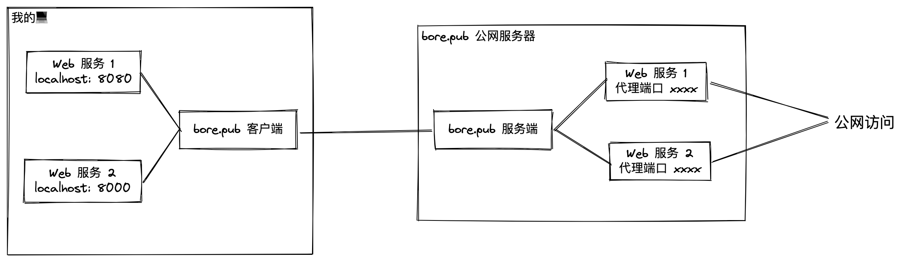

# week-29

[TOC]


## 高考填志愿的趋势

今年家里的弟弟高考，我也花了很多的心思，在高考填报志愿上。

江苏省从 2021 年开始，使用全国卷，总分 750 分，并且改用专业组为单位进行录取，而不是以往的以高校为单位进行录取。

专业组，简单来说，就是将一个学校的专业，打包成多个组，每个组都是一个志愿。假设南京大学将所有专业分成 A，B，C 三个组，那么考生一志愿可以报南大 A 组，二志愿可以报南大 B 组，三志愿可以报南大 C 组。专业组强化了专业的重要性，弱化了学校的影响。

从江苏各大高校 2022 的专业组投档线可以看出以下几个趋势：

* 双一流（非211）高校包含双一流专业的专业组，投档线都非常高
* 专业越来越重要
* 大家都想学好专业，导致包含好专业的专业组，竞争非常激烈

投档线最高的专业组，南邮达到了 595，南信大达到了 603，南林达到了 568，均比去年要高很多。说明考生和家长越来越重视双一流这个品牌。但是南信大最高组的投档分是 603 我是没想到的，苏州大学最高的专业组投档线也才 608，南信大竟然直逼苏大，真是太疯狂了，南信大是不是今年宣传做得特别好？

这三所学校不同专业组投档分分差也很大，南信大投档线最高的专业组分数是 603，投档线最低的专业组分数是 543，差了整整 60 分！南邮还好，差了 35 分，南林差了 23 分。虽然国家重点发展双一流，以上三所都有双一流学科，但是很明显南信大的水分太大了。


## 一个段子

经济，不是地上的卡车，而是天上的飞机。你踩一脚刹车，它不是停下来，是掉下来，你想重新起飞，不是踩一脚油门，而是需要跑道和很长的爬升。


## github city

[Create](https://honzaap.github.io/GithubCity/) a 3D city from your GitHub contributions.


## 滴滴被罚 80.26 亿

干得漂亮！


## 美团王兴观点


## 世界地图


| 比例失调的世界地图                                           | 真实比例的世界地图                                           |
| ------------------------------------------------------------ | ------------------------------------------------------------ |
|  |  |


## 两个段子

1. 跑步的多巴胺仅次于谈恋爱 三公里专治各种不爽，五公里专治各种内伤，十公里跑完内心全是坦荡和善良
2. 


## 一个免费的内网穿透工具

[bore.pub](https://github.com/ekzhang/bore) 一个命令行工具，将本地端口映射到远程服务器上的端口。很好用，但是速度很慢。


```shell
# 将本地的 8000 端口暴露到公网，命令
bore local 8000 --to bore.pub

# 得到一个 bore.pub 指定的访问端口
# 2022-07-22T09:18:57.311562Z  INFO bore_cli::client: connected to server remote_port=38611
# 2022-07-22T09:18:57.311591Z  INFO bore_cli::client: listening at bore.pub:38611
# 访问 bore.pub:38611 即可访问本地 8000 端口
```


原理如下：


