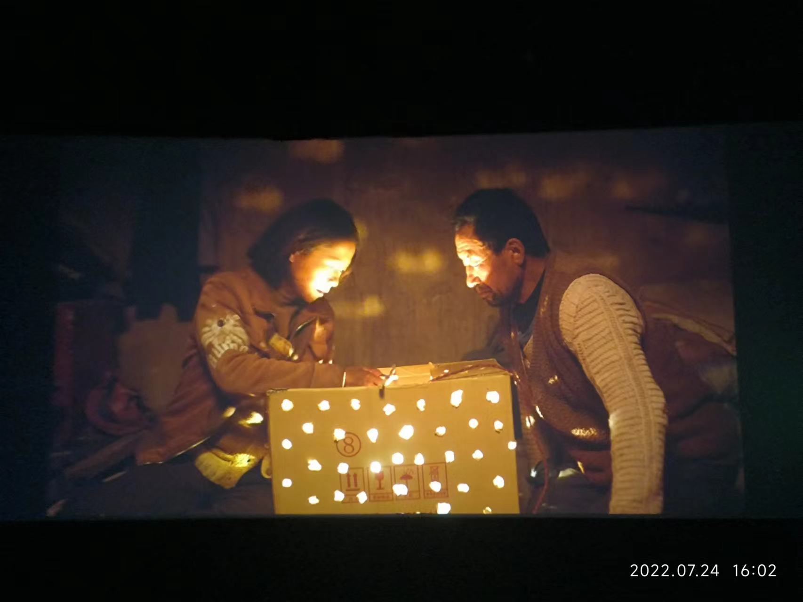

# week - 30

## 一个观点

钱这个东西，对有些人是为糊口，对有些人是为了享乐，对有些人是为了证明价值。

如果用短短的一生，只为了钱活着，反而成了奴隶，这个东西，毕竟生不带来，死不带走。

## 一部电影「隐入尘烟」

讲述西北农民的故事，全片除了女主海清，其他演员全是农民。

真实、残酷，又浪漫。

主流媒体对农村的态度，就像房间里的🐘：沉默，失声，选择性失明。

## 相信未来，不要离开

## 空笔芯

一支笔芯用了两年才写完，想起考研结束的时候，光是空笔芯，就攒了一盒。

你最近的一支笔芯用了多久？

