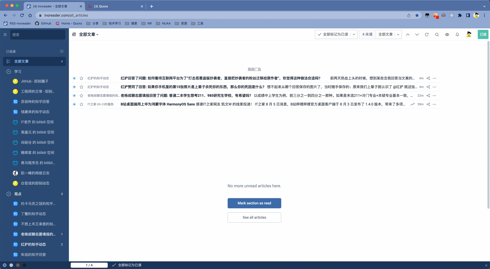

# week-31

[TOC]

## 凝望深渊

**唐山烧烤店打人事件对你内心的冲击有多大？**

过去十年系统性的互联网舆论审查，带来了一个连审查者自己都没想到的结果：

**民众心态的婴儿化和圣人化。**

从一些题材不能提及到连血液都要改成绿色，审查为几亿人构建了一个几乎完全洁白无瑕的世界。但他们大概没想到：**当他们用圣人标准要求民众时，民众也会反过来用圣人标准要求他们。**你的新闻里几乎没有恶性犯罪，那我就要你的治下连一起打架斗殴案都不能有；你的影视题材里警察都是好人，那我就相信你现实中的警察人人夏洛克人人任长霞。

这些在互联网时代成长起来的一代人，他们不知道 90 年代的车匪路霸打死有奖时代，他们没经历过广东部分交警持枪上街和飞车党真人 GTA，他们不知道下夜班女工被奸杀在那些年就值晚报上一个豆腐块意味着什么。

为什么？因为没人告诉他们，因为审查不高兴提过去那段历史；

好，你不提，那我就相信你说的太平盛世是自古以来就这样。

那现在，年轻女孩在大排档被混混打了，你怎么说？

当圣人的形象瞬间崩塌时，破防的小年轻们很自然就倒向另一个方向：

原来我们的治安没那么好——那我们的治安一定全球最烂；

别不信，那两天我真见过有小姑娘在朋友圈说准备润美国，美国治安差都是政治宣传 balabala……

审查希望一代人生活在一个他们营造出来的天国里；

但这个天国本来就是「不正常」的；

当「不正常」在现实面前暴露出一丁点「正常」时；

那些温室里的小年轻就集体破防了。

所以这其实是个好事。对双方都是。

审查应该趁早认识到打造地上天国是不可能的；

而小年轻也开始踏出真正了解这个国家的第一步了。

可喜可贺，可喜可贺。

作者：匿名用户
链接：https://www.zhihu.com/question/537174003/answer/2576392923
来源：知乎
著作权归作者所有。商业转载请联系作者获得授权，非商业转载请注明出处。

## 苏联笑话生成器

[苏联笑话生成器](https://disksing.com/sao-gen-gen/3)

原来笑话也是有模板，可以批量生成的😎

## 玻璃晴朗 橘子辉煌

北岛

毒蛇炫耀口中的钉子
大地有著毒蛇
吞吃鸟蛋的寂静
所有钟表
停止在无梦的时刻
丰收聚敛着
田野死后的笑容
从水银的镜子出发
影像成双的人们
乘家庭的轮子
去集市
一位本地英雄
在废弃的停车场上
唱歌
玻璃晴朗
桔子辉煌

## 山东临沂大爷

熊二是连云港赣榆人，风俗习惯靠近山东，看到这道菜格外亲切。

## 好代码的比喻

好的代码应该像一颗洋葱，外面看起来是一个整体，但是内部层次分明，每一层都能被轻轻剥离。

当你写一个类，一个方法，甚至是一段语句的时候，要时刻问自己，现在你在哪一层，自己即将新增的代码，是不是正好符合这一层的行为和特征，不多，不少。

## SQLite 背后的故事

[SQLite 背后的故事](https://liyafu.com/2022-07-31-sqlite-untold-story/)

SQLite 诞生的契机就是典型的程序员开发的故事剧本。作者 Richard 最开始在一艘军舰上做 contractor（就是我们说的外包）。他们程序跑在军舰安装的电脑上，电脑上装的是 informix。Richard 的工作就是把 informix 的数据拿出来进行计算然后展示到电脑屏幕上（这和我们今天的 CRUD 工作类似）。比较令人恼火的是 informix 很不稳定，经常崩溃连不上。部队里的铁拳长官可不懂啥 TCP/IP 或者数据库系统知识。他们只看到软件的报错 dialog（对话框） 经常弹出来，而这个 dialog 又是 SQLite 的作者 Richard 写的软件画出来的，锅自然从天而降。于是 Richard 决定自己从头写一个无需外部连接的数据库来解决这个问题。

当时恰逢布什政府消减政府预算， Richard 作为外包商没法获得订单，不得不暂停在军舰上的开发。这让 Richard 有了几个月的时间去构思并从头实现 SQLite。那时时间是 2000 年初，软件开发没有现在这么多参考资料，没有维基百科，google 还没完全起来， 美国只有 1% 家庭有宽带。 而 Richard 也没有数据库开发经验，只有编译器开发经验。他最初的构想非常简单，把每条 sql 语句看成一个独立的执行程序。于是他首先实现了 bytecode 执行器，然后把 sql 语句转化成 bytecode 执行。一开始 SQLite 并没有替换掉他们在军舰上的 informix，尽管他们每个开发者都恨透了 informix，但客户指定要用又不得不继续使用（好熟悉的场景）。就这样 SQLite 一直做为 Richard 的 side project 在开发。

。。。

Richard 提到了他是如何在完全不懂数据库的情况下把 SQLite 做出来的。他提到这是第一性原理(first principle)的应用。简单来说就是按照事物本来的样子去设计。他说做数据库的人和组织非常多，但最后的结果大家都殊途同归。用不同的做事方式最后都达到同样的结果。还有些趣事是他也不懂 B 树，需要用到的时候还得去翻看 The Art of Computer Programming（计算机程序设计艺术）。并且 Knuth 的书连 B 树的 delete 删除的算法都没提供，被做为练习题让读者自己去实现。

## 太阳能协议

摘自[科技爱好者周刊（第 217 期）](https://www.ruanyifeng.com/blog/2022/08/weekly-issue-217.html)

[太阳能协议](http://solarprotocol.net/index.html)

数据中心的耗电巨大，很多国家正在设法采用太阳能为机房供电，但有一个难题：夜间的网络使用量最高，偏偏这个时候没有太阳能。

一组美国的研究人员提出了"太阳能协议"：网站同时部署在世界各地的服务器上，这些服务器都由太阳能供电，流量总是自动切换到白天时区的服务器，这样就能保证一天24小时的太阳能供电。

它的技术实现很简单，就是让 DNS 总返回一个太阳能供电的 IP 地址。

## 中文互联网 -> 粪坑

打开微博，知乎，微信群，满屏都是消极和负面消息，让我很焦虑。

最近开始尝试开始戒网了，不知道能不能成功。

有以下尝试：

* 卸载微博，知乎，有猎奇心理，就上 Quora，需要看新闻，算了，现在也没啥值得看的新闻，前两天刚被耍猴

  国外论坛的环境，还是相对比较和谐的，没那么焦虑

  

* 用 RSS + Inoreader 来订阅自己关注的大V和观点

  

* 关闭朋友圈，不看朋友圈，也不发朋友圈

  专注自己的生活。

不立太多 flag，先坚持这么多吧。

## 哪些城市在裸泳

## 关于社恐的一个观点

据我观察所谓社恐的人，个顶个都是脑子里只有人上人思维的家伙。

只要和他人接触，默认就是要比，比不过就难受。又因为这种思维方式是全方位占据大脑的，导致他们每次接触人都是输。

比如看到一个街溜子，刚来点自信，发现街溜子女朋友们非常好看，立刻就萎了。又比如看到一个纯撸瑟，正自信爆棚要嘲讽几句，却发现卢瑟比他开心一百倍，马上就怒不可遏。

别人有钱他羡慕，别人帅他嫉妒，别人开心他愤怒。

父母教育有很大关系，那些整天你看这个你比那个的家长只能教出这种扭曲的恶心怪胎，内卷严重的地区这种怪胎比例就大。

作者：手撕狗肉
链接：https://www.zhihu.com/question/359104641/answer/2617029360
来源：知乎
著作权归作者所有。商业转载请联系作者获得授权，非商业转载请注明出处。

## 三十年河东 三十年河西

以前软件吃香，现在硬件吃香，可惜软件能速成，硬件可速成不了。

