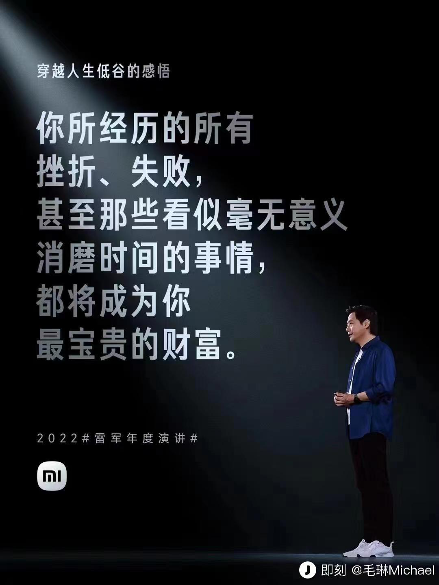
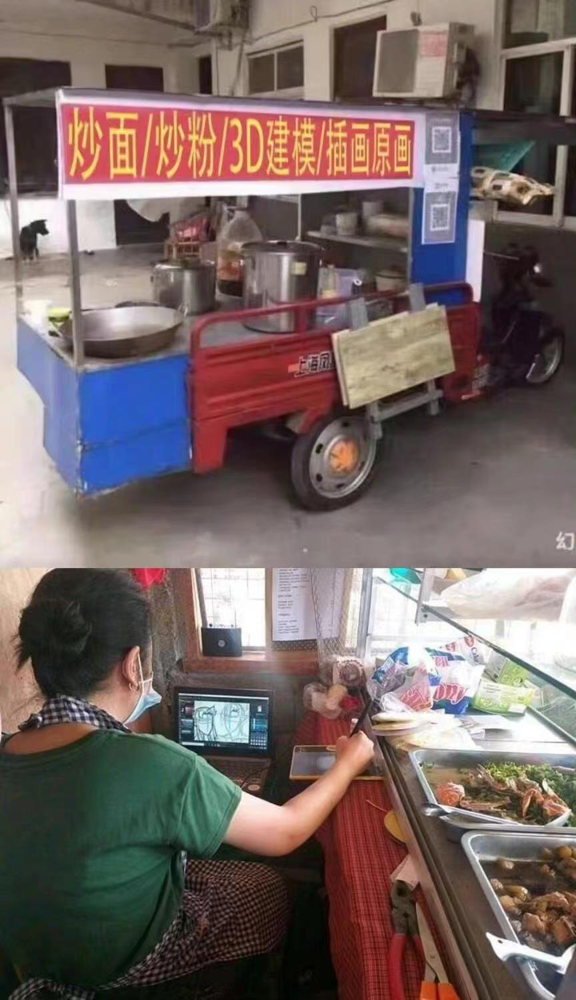
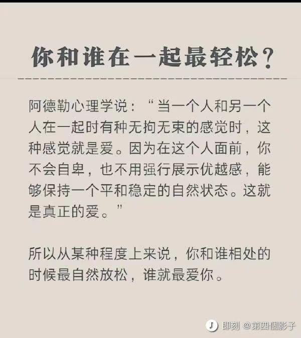

# week-32

[Toc]

## 雷军 2022 年度演讲

[雷军2022年度最新演讲：熬过绝望低谷，你便无人能敌 ](https://www.sohu.com/a/576060273_358836)

> 那一年，我26岁。我是北京金山的总经理，第一次面临这样的情况，有点束手无策，尤其是每个月发工资的那几天，都觉得特别难熬。
>
> 最惨的一个月，账上只有十几万人民币。连发下个月的工资都非常困难，那段时间我经常失眠，经常一宿一宿的睡不着。
>
> 我还记得有好多个晚上，我独自坐在沙发上，看着对面的楼里的灯光，一盏一盏的熄灭，再看到天色一点一点的亮起来，其实这种痛苦只有经历过的人才能很深的明白吧。

> 我觉得自己懂技术，特别想把技术给客户讲清楚，如果人家有不同意见，我还跟人家抬杠，总之“我一定要说服你，不买产品都没关系，这道理咱们一定得给说明白了”，就特别较真。
>
> 我后来在想，我看他卖的时候不是这么做的，他拿一个软件的包装，拿一张宣传页，几句话就把用户说明白了，实在不行，还有电脑给你演示一下就搞定了。
>
> 其实，我们做销售的目的，不是为了给用户把道理讲明白，关键要让用户能够很舒服地的接受。 这个金牌销售，他跟用户交流就特别轻松自如。

> 1996年，电脑刚刚开始普及。我在店里的时候， 每天都有几个用户来问我，有没有电脑入门的软件。
>
> 我就想不通了，学电脑买本书就学了，为什么还要买个软件来教？我总是不厌其烦的劝阻用户，说真的没有这样的软件，要不你出门左转有个书店，你去买一本书照着学就行了。我还 非常耐心地告诉他们。
>
> 直到被问了无数次以后，我突然恍然大悟： 做一个（教程软件）不就得了吗？
>
> 说实话，这一类的软件跟盘古比起来，没啥技术含量。于是，我就立刻组织团队马上开发了一个软件，就叫《电脑入门》，快速推向市场，连广告都没做。
>
> 一推出以后马上就畅销，立刻上了畅销软件排行榜。
>
> 这个故事给这个过程真的给了我巨大的震撼，再让我重新思考，并重新理解了一个非常浅显的道理：
>
> 做产品，一定要做用户需要的产品，不要做那些看起来高大上的产品。只要这个产品是用户哭着喊着要的，销售就不是问题，特别容易卖。好的产品，它会自己长脚的。
>
> 有了这样的理解以后，不瞒大家说，再做产品就不难了。
>
> 后来我们出了一系列的爆品，有金山词霸、金山毒霸等等 （一二十个），所以很快金山找到了活下去的路。
>
> 我们再回顾看盘古的问题，其实很简单，就是脱离群众，闭门造车，就这么一个问题。

> 我当时就跟同学们分享了我的观点。我说我是一个程序员，在软件过程里学到的最重要的道理是什么呢？
>
> 1. 软件工程没有银弹
> 2. 可能出错的地方，一定会出错

> 最后用一句话来总结我今天的演讲，**你经历的所有的挫折和失败，甚至那些看似毫无意义消磨时间的事情，都将成为你最重要的、最宝贵的财富。**
>
> 人生很长，无论如何，让我们保持信念：永远相信美好的事情即将发生。

## 音视频重构

一个有趣的观点：**未来几乎所有行业都需要用音视频的方式重构一遍**

这是知乎的一个回答：

说法很高端，但事就是那么个事。制造业里都推广很多年了，很多产业，尤其是重体力，重危险，重精度的产业都在转向视频反馈，机械操作，流水线生产。我一哥们是在汽车厂生产大货车配件的，每天的工作就是在视频上看着一堆机器人（其实叫机械臂更贴切）操作，而他则根据不同的需求对设备进行调试，这就是去所谓的音视频构建呗，他现在做的工作跟十几年前零件生产线上的师傅，虽然都出同一种产品，但是干的工作完全不一样。

现在，这种趋势在向其他领域蔓延，以前人工还有成本优势，疫情时代则增加了封闭的风险，大大促进了无人少人操作的发展吧感觉。

作者：红护
链接：https://www.zhihu.com/question/548076856/answer/2622918348
来源：知乎
著作权归作者所有。商业转载请联系作者获得授权，非商业转载请注明出处。

## 一剪梅·红藕香残玉簟秋

红藕香残玉簟秋。轻解罗裳，独上兰舟。云中谁寄锦书来，雁字回时，月满西楼。

花自飘零水自流。一种相思，两处闲愁。此情无计可消除，才下眉头，却上心头。

## 高手在民间

## 你和谁在一起最轻松

## 蒸汽波图片在线制作

[蒸 気 機](https://magiconch.com/vaporwave/?from=github)

## github 贡献墙 svg 动画

[在线生成](https://contribution.catsjuice.com/)

