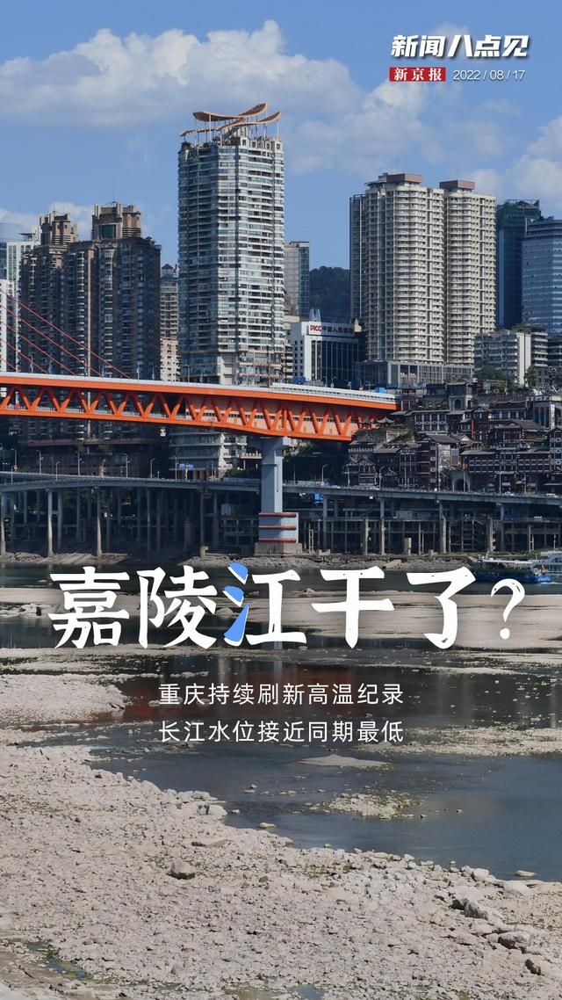

# week-33

[TOC]

## 带逛知乎

### 关于中金交易员被老婆坑

几十年来我最少认识上百对夫妻，即便有的夫妻表面看起来差异很大，比如相貌，比如年龄，比如学历，比如收入，比如家境，但有个深层次的东西差异不大，就是对欲望的认知和把控。 说个最极端的例子，一个漂亮女孩因为钱嫁给比她大的多的有钱男人，一个是对钱的欲望，一个是对色的欲望，这两个欲望是对等的，甚至量级都是一样的。 所以我从来不认为一个糟糕的老婆会有一个完美的老公，如果她老公以完美的姿态出现，那我一定会非常小心的防范，因为他身上一定笼罩着厚实的谎言。 因为这个原因，我特别喜欢认识夫妻两个人，认识一个后尽量认识他的伴侣，两个人同时保守一个谎言的难度很大，我就能更好的认清他们。 婚姻伊始的匹配非常重要，也非常有趣，它最后一定是鱼找鱼虾找虾，即便外人看上去有可能差异巨大。 

**找到一个好的伴侣，办法只有一个，就是自己也是个好的伴侣。**

中金交易员被老婆坑了 还会用什么样的心态面对他老婆呢？ - 请勿关注的回答 - 知乎 https://www.zhihu.com/question/546113007/answer/2602995471

### 体制内与体制外

中国人民大学博士教授储殷直播表示年轻人想留在大城市体制内五六千就够，体制外起码得一万五，你怎么看？ - 老杨叔聊志愿填报的回答 - 知乎 https://www.zhihu.com/question/548217862/answer/2627496782

储殷汇率：1公务员币＝3牛马币。

### 哪一刻你意识到，阅读这件事依然无可替代？

作者：吹面不寒
链接：https://www.zhihu.com/question/528045763/answer/2625076704
来源：知乎
著作权归作者所有。商业转载请联系作者获得授权，非商业转载请注明出处。

有太多时刻，都让我意识到，阅读依然无可替代。

比如说，填补想象力缺口这件事。

在这个世界上，我们绝大多数人的轨迹其实是相同的，然而阅读却能让普通人，拥有更多人生厚度的可能。

在阅读中，我们可以短暂地摆脱自己枯燥的生活，在作者为我们建构的宏大世界中，去探险，去体验，去感知一千种不一样的人生。

原来还有那么多的绝妙故事，有那么多的厚重历史。还存在着这样一种生活方式，如此风姿，如此洒脱。

那些你一辈子可能不曾踏足的场景，都能在文字中被一一呈现。

很多人说读完一本书或是一篇长文，总是很快就忘了。就像是拿着竹篮去打水，无论打多少次，都是空手而归。

因而，阅读是没有意义的。

但是我想告诉你的是，一个人长期阅读，即便可能不会记住什么，但在潜意识里总会明白什么是对，什么是错。

读书最重要的是，教会我们独立思考的能力，不会成为乌合之众。

即便不随从众人，也不会惴惴不安。

有时候，我们和文化层次低的人聊天十分困难，岁数越大越是。不是他们不知道对错，而是他们不愿意，变通熟知了几十年的观点。

在阅读中，你可以去体察人性，去感知世间的罪恶，去找寻心中的污秽，然后理清自身的情绪及种种关系的本质。

阅读给予我们的，不是鄙视他人的傲气，而是直面现实的勇气。

以前，读书对我而言，是件虚荣心的事。曾以为阅读的数量多了，自己就博学了，时光就不虚度了。

后来了解到，读书并不是为了炫耀什么，赢得别人的认同，而是与作者的思维碰撞，或是说情感共鸣。

其实，哪怕我们一年只读一本书，但只要这本书里，有能够影响到你的内容，就足够了。

读书，不会使你光鲜亮丽，也未必能让你取得成功，甚至无法在为你找工作时，提供任何便利。

但当你被生活打回原形，陷入泥潭时，文字总能给你一些内在的力量，让你消解自身的苦难。

即便深陷谷底，也能抬头仰望星空。

仰望星空，让你内心笃定，在寻常中丰满却不自满。

若你心境澄澈，你将永远热爱生活。

书读多了，思维开阔，自然有了一种隐然的气场，这是一种自信。

但这不是书本的作用，而是思考；又或者说不是思考的作用，而是主见。

胸中有丘壑的人，总是格外清楚知道，自己该做什么。

在如今这个浮躁的时代，充斥着短视频、自媒体情绪热文，能够静下心来在知乎，长文阅读已是十分难得。

那些喜爱阅读的人，往往都是耐心，富有同理心的人。他们有着清醒的认知，对世间万物保持着悲悯。

即便长期独处，也能够内心安宁详实。

年少的时候，我最渴望的事就是，能有许多的书。这个自小养成的习惯，即便在我最难以糊口的岁月，也没中断。

可悲的是现在，当我有了稳定而体面的生活之后，却难再有一次酣畅淋漓的阅读体验了。书多了，时间却没了。

长大后，我接触到了太多优秀的人，逐渐迷失了自我，变得容易浮躁、焦虑，感受到了许多说不清的压力。

于是，我的认知变成了，我要跟上他们的步伐，我不能浪费我的时间，我要挣很多的钱……

所以时至今日，我依旧羡慕那些，能够耐下心来纯粹阅读的人。我的读书岁月，早已随着我的成长渐行渐远了，而我也已没了当初的快乐。

我记得小时候，我总喜欢搬个小板凳，翘着二郎腿坐在巷子门前，手里捧着书，脚下睡着大黄狗。

风从远处稻田里吹来，带来成熟的谷物气息。红彤彤的太阳即将落山，在那一排排挤密的庄稼地里，我听见了林野里，各种鸟雀儿咕嘎咕嘎的叫。

文字能把人牵得很远，仿佛置身于广袤的原野。

后来，直到月亮升起，姥爷前来喊我，我还沉浸在文字的世界里……那种身心俱迷的情景尤在眼前，宛如那个不曾流转的夏天。

我拍了拍衣服上的尘土，屁股一扭一扭的回家了。

真他妈怀恋啊。

### 计算机硕士

既然计算机硕士大部分都干开发那硕士白读了吗？工作比当科研奴隶收益大？ 

The Alpha的回答 - 知乎 https://www.zhihu.com/question/520418301/answer/2598574802

哈哈哈有些人装什么外宾呢。去读研有多少人是真的想搞科研的？去读了又有什么真科研能给你个小瘪三做？还不是因为本科能干的活卷到不要本科生，倒逼学生去读研？你往前推7-10年，客户端点击就送，后端无八股，前端无框架。你就算是培训班手攥着PHP入行，撑到19年完整吃下整波红利也该是3w一个月了。那个时代你让大家去读研？读什么研，外面有金子有银子我不去捞你让我读书？你疯了还是我疯了。经济一下滑研究生就开始扩招，考研率开始蹭蹭涨，也不带这么凑巧的吧？我不否认大学学者的价值，但你要说每年招100w个研究生去搞科研，抱歉我觉得这太扯了。

### 知道得越多，距离真相越远

因为我经常写一些三四十年前的事，六七十岁的人，写的时候没觉得怎样，但写的多了，得到的评论多了之后，我发现一个问题，或者说一个现象。

就是最近这四十年因为教育和信息获取的便捷，大量这四十年里出生的人知识非常丰富，知道的东西非常多。

但是可能有一些小问题，就是这四十年跟之前断层的过于严重，导致有相当一部分人，因为知识丰富反而导致了认知局限。

我觉得是两个问题，一是以现在的认知理解以前的人和事，以自己的经验去揣摩以前的人和事。

二是用被总结的或被归总的知识去解读问题，判断情况。

这里还包括地域上的认知局限，比如一说北京的房价绝大多数人知道的都是商品房的价格，而不知道商品房只是北京众多产权类型中的一种，因为产权清晰才被广泛认知，而数量庞大的其他产权形式的房没人知道价值和可交易情况，北京有太多房子是无法正常交易或无法用商品房价格交易的房子。

知乎上和很多平台上都有大量回到以前会怎么样的问题，把太多人的认知扭曲了，变成了所谓的爽文，很少有回答是考虑当时人的认知水平和环境的，这对真正了解当时的历史是很大的伤害。

所以远离爽文，不要用爽文的视角认知过去的人和事，才能真正了解历史，当然更不用爽文的角度去生活，那是对自己的伤害。

来自知乎答主：请勿关注

### 认清现实，放弃幻想

今晚散步的时候，跟我儿子探讨了一个问题，就是中国在古代世界的地理位置，中国人自己的看法，还有其他文明的看法。

其实这是个没有标准答案的问题，中国人从古至今都是坚定的认为中国是居世界之中的，甚至名字都叫中央之国的中国，但在我看来，中国一直都在古代文明大陆的边缘，中心应该是土耳其到中东一代。

因为海洋和高山，荒漠，我们跟其他文明之间是很疏远的，相互很陌生的，最多就是互相有一些使节，离全面了解差的很远。

要命的是中国自古以来的生存压力不大，跟其他文明相比都小的多，没有任何进步的压力，也没有探索更大时间的迫切。

相比来说欧洲及周边才是修罗场，毁灭级别的碰撞太多了，生存压力太大了，逼的他们不得不进步，不得不产生工业革命。

我们去过很多博物馆都看到过一个大事的记录，就是马戛尔尼见乾隆，我们对这个事既重视又不太重视，因为在我看来那是世界在几千年来第一次认清中国，是可以从世界史角度给中国历史分期的标志，那一刻，中国真正成为了世界的一员，即便我们不愿意，也不自知。

之所以今天说这些，就是之前看过大量博物馆实物，但串不到一起，还是要多去，多讲。

作者：请勿关注
链接：
来源：知乎
著作权归作者所有。商业转载请联系作者获得授权，非商业转载请注明出处。

## 马斯克：早晨醒来就看手机是个坏习惯

[早晨醒来就看手机是个坏习惯，我希望先去锻炼](https://www.ithome.com/0/634/991.htm)

马一龙终于说了一句实话。

## 能力被动型人才

有些人一切以“**我当前所掌握技术和能力为标准**“来判断事情难度。 我管这类人叫“能力被动型员工“。被动型人水平也有高有低。较高水平的这类人很可能在之前某个人生阶段（比如聪明，大学被逼，年轻心态开放情况下）习得的知识和技术。但因为是被动型，非发展性人格，所以到了30之后会逐步走下坡路。

合格技术管理者和员工针对一个技术问题的沟通中，很容易发现“能力被动型员工”。这时候管理者心里会默默给你一个标签。以后只会选择你能力之内的工作给你。合理的使用你，只让你辛苦，不让你那么痛苦。由于你一直困在“当前这一秒我会的东西是最高难度“，也接触不到更多更新更难的事情。接触了也无心无力奋争解决。 能力也不会提高。 所以你和一个原地拉磨的驴子很像。体力耗光，也就卸磨杀驴了。

技术人都有发展自身能力和技术的倾向。主观上，如果你不是做一天和尚撞天钟，你肯定不认可自己是能力被动型。 但有种学习的障碍，自己被自己知道的东西困住了。你认为的极限真的就是你自己的极限，和这个技术问题的极限吗？据我十几年的观察，多数情况下并不是。 另外，工程实际是解决问题，不是用完美或者自认为满意的方法解决问题。这需要特别灵活的头脑。工程思维，和钻研理论与技术，用的是不同的思路。这种思维转换对很多技术人员有困难。久而久之，自己被自己耽误了。丧失了很多机会去突破自己的极限。

这种思维习惯不限于技术人员。一切靠一项技能吃饭的人，都会存在。如果这类人目光还短，只盯着眼前鸡毛蒜皮的小利，想不到5年到15年以后自己长期利益。那下场就更惨。这个和看工资待遇不矛盾。你既要看现在的待遇，也要看当前其他公司的更好待遇机会。更要去想5年或者15年以后的工资待遇。

软件技术人员的瓶颈，为35岁之后做准备 - 姚勇的文章 - 知乎 https://zhuanlan.zhihu.com/p/498762187

## 今日长缨在手，何时缚住苍龙？

清平乐·六盘山

天高云淡，
望断南飞雁。
不到长城非好汉，
屈指行程二万。
六盘山上高峰，
红旗漫卷西风。
今日长缨在手，
何时缚住苍龙？

— 毛泽东

## 强大的哔哩哔哩增强脚本

[Bilibili-Evolved](https://github.com/the1812/Bilibili-Evolved)

## 股票的一个观点

回看一下股票账户，如果波动过大，即盈利或者亏损以月为单位统计震动幅度比较大，一定意义上来说 还是在靠运气参与投资，和赌博的性质差不多。

目标是要减少账户的大范围波动，一定程度上来说大幅波动比稳定亏钱更严重，而后者对于自己复盘，形成交易逻辑是非常有帮助的。

## 凝望深渊

最近对「你在凝望深渊时，深渊也在凝视你」有了更深的体会。

社会越来越割裂，网络充斥着戾气。通过鄙视链获得优越感的人，也终将在被人瞧不起时，体会到痛苦。

## 不说话的嘉陵江

这里没有大海，只有一条不说话的嘉陵江。

