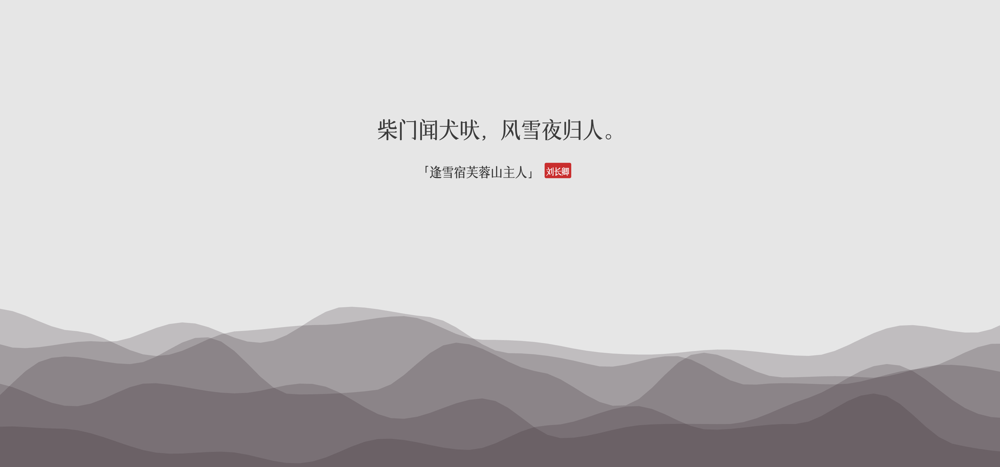

# week-35

[TOC]

## Paper2GUI

[paper2gui](https://github.com/Baiyuetribe/paper2gui)

Paper2GUI: 一款面向普通人的AI桌面APP工具箱，免安装即开即用，已支持18+AI模型，内容涵盖语音合成、视频补帧、视频超分、目标检测、图片风格化、OCR识别等领域。支持Windows、Mac、Linux系统，未来还将适配安卓和苹果设备，另外还有小程序。

下载地址：[Download](https://download.fastgit.org/Baiyuetribe/paper2gui/releases/download/Published/XiaoBaituAI_windows.zip)

## 明日风回更好，今宵露宿何妨

西江月·阻风山峰下

[张孝祥 ](https://hanyu.baidu.com/s?wd=张孝祥)

满载一船秋色，平铺十里湖光。波神留我看斜阳。放起鳞鳞细浪。
明日风回更好，今宵露宿何妨。水晶宫里奏霓裳。准拟岳阳楼上。

## 带逛知乎

### 上山下乡

[请勿关注的想法 - 知乎](https://www.zhihu.com/pin/1547634029448564736)

刚才送孩子去打羽毛球，路上跟他讨论了北京。

我说北京其实是座奇怪的城市，它是一座城市，但又不属于任何一个省，而且除了北京以外还叫首都。

这个城市巨大无比，人口众多，在全世界来说都是超级城市。这个城市里的人口大多数都不是世代住在这里的，真正的老居民占比并不多，不断的有新移民来。

所以在这个出生长大的孩子有个先天的缺陷，就是不了解真正的中国。

就像了解一座楼，最好的办法就是从一楼一层一层的走到顶层，可是一出生就在顶层的人如果不刻意到一楼走一遍，是无法了解这栋楼的。

有些北京和老家两地住的孩子就比只在北京常住的孩子更了解中国，所以最闭塞的一定是不流动的土著，而真正的精英一定是流动的，一旦精英变成土著，那优势就会消失，这就是北京土著大多沉沦的根本原因。

我跟我儿子说，以后一定要多走，多看，多听，多参与，走出去，到各地扎实的走，远远的走，那样才能真正看清中国，看清世界。

### 关于电动车的观点

[关于电动车的观点](https://www.zhihu.com/pin/1547409818713010176)

我发现电动车吹最恶心的一点。
他们畅想未来的时候，不去讲“将来电池技术突破，零下三十度也能一秒启动，比油车方便”。
不去讲“将来换电站大规模推广，没电了随便找一个开进去两分钟换完，可以和油车一样无限续航”。
他们讲啥呢，讲“将来给汽油课重税，让油车的成本你们承受不了”，讲“将来把加油站修配厂都取缔了让你们加不上油修不起车”。
所以技术进步的意义是什么？是为了让你的使用者生活更美好，还是强迫不使用你的人生活变得更差？

### 对希特勒的评价

[在中国，喜欢希特勒的人，脑子是不是有问题啊？ - 大熊喵的回答 - 知乎 ](https://www.zhihu.com/question/528090588/answer/2550683112)

喜欢希特勒的确实脑子有点问题，但是对他深恶痛绝那也大可不必。

在我看来，希特勒最大的罪恶是 他居然把过去几百年来欧洲白人在亚非拉世界对付其它民族的手段，拿来对付其他欧洲人！

 欧洲人恨他是合理的，但是亚非拉各民族大可不必自作多情。 毕竟现在西方人提起南京大屠杀一样无动于衷。 你说你上赶着贴什么脸呢？

### 这短暂的一生有何意义

[这短暂的一生如何算有意义呢？ - 易水寒的回答 - 知乎](https://www.zhihu.com/question/306468598/answer/2635293262)

找个狗屁的人生意义。

我们传统文化里本来就有理性过度的弊病，过多的克己，修身，礼教。剩下这点可怜的感性精神，还要断绝它，扬弃它。

你翻遍所有的哲学典籍，都告诉你这花是假的，这树是假的，这山也是假的，这美女是红粉骷髅，这一切有形之物都是速朽的梦幻泡影，所以，让我们去追寻这虚幻之后的本质吧，去追寻那恒长不变的唯一真理。

咄！

还是去找个女朋友吧，去爱她，不要用你的思想去爱她，用你的肉身去爱她，去拥抱她，触碰她，去感受异性青春的肉体毫不合乎理性的炽热，鲜活，颤栗。

像拥抱女人一样去拥抱生活，拥抱她，融入她，不要做生活的冷眼旁观者，不要老是想我我我我我，没有我，这活的一切，人生的一切，都是我。

未经反省的人生是不值得过的，而过度反省的人生是活不下去的。

你去追问人生的终极意义，走过虚无主义，走过存在主义，走过尼采，走过康德，翻山越岭登舟渡河，追寻生活意义的人，在行色匆匆中错过真实的生活。

几万年前我们的老祖宗从树林子里窜出来，摘野果，撵兔子，饿了吃，困了睡，看见漂亮的女裸猿就心生欢喜，晚上手拉着手围着火堆跳舞，他要什么人生意义？

意义才是人造的虚幻之物，高悬天外的海市蜃楼——意义是为了让人更好的活着，人活着绝不仅仅是为了追求一个什么意义。

看见花开，你就微笑，这花就得到了尊重，人的生命也得到了尊重。

## 柴门闻犬吠, 风雪夜归人

## 写一个开源的 macOS 项目可以赚多少钱

[写一个开源的 macOS 项目可以赚多少钱](https://zihua.li/2020/04/open-source-app-earn)

作者在 2015 年国庆节写的一个开源项目，挂在 MacOS 苹果商店上，可以免费下载，也可以花 30 元支持。短短不到五年，净收入超过 20W。

相当于每天赚 160 元！

好 羡 慕

## 月薪 36000 日均写 7 行代码被开除

中科尚易健康科技（北京）有限公司与李彦昌劳动争议二审民事判决书公布。

中科尚易指出，自聘用合同生效后，李某某并未按照合同中约定的内容以及公司安排完成相应的工作事项。李某某作为视觉算法工程师，在职 72 天，只完成了深度学习识别算法 422 行代码的编写，3D 点云算法和多摄像头联合算法代码编写均为 0 行，其间除去约 9 天的样本训练和拍摄，也就是 63 天里每天只写 7 行代码。而作为该职位相同工资水平的员工，同行业同级别每天的正常代码工作量 100-200 行。

## 五菱宏光 MINIEV 敞篷版

9 月 1 日开抢。cute

