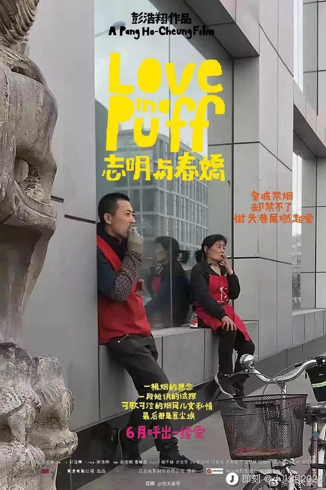
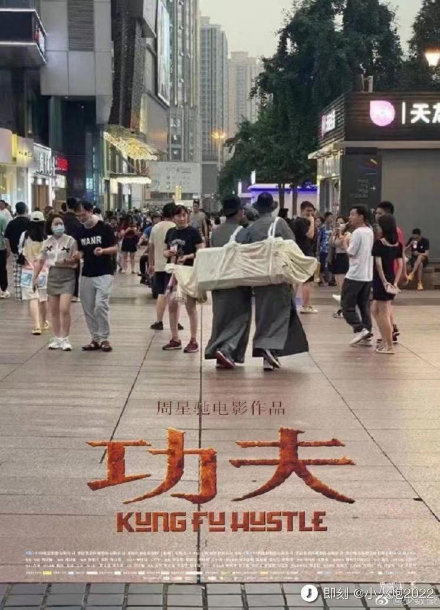
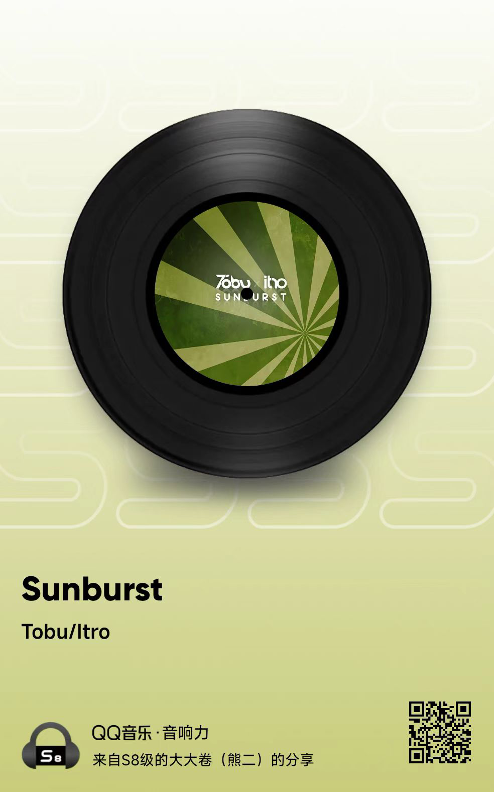
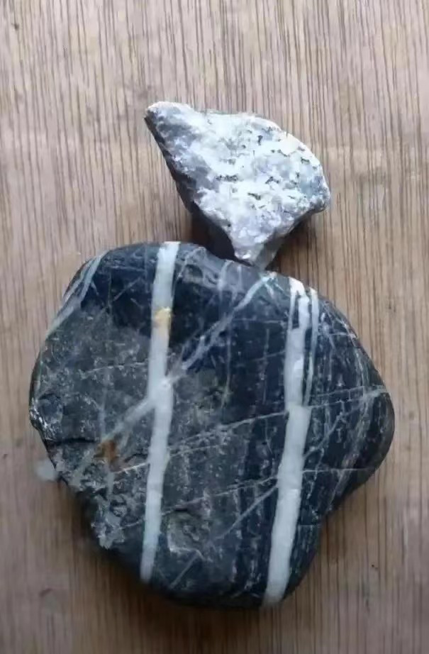
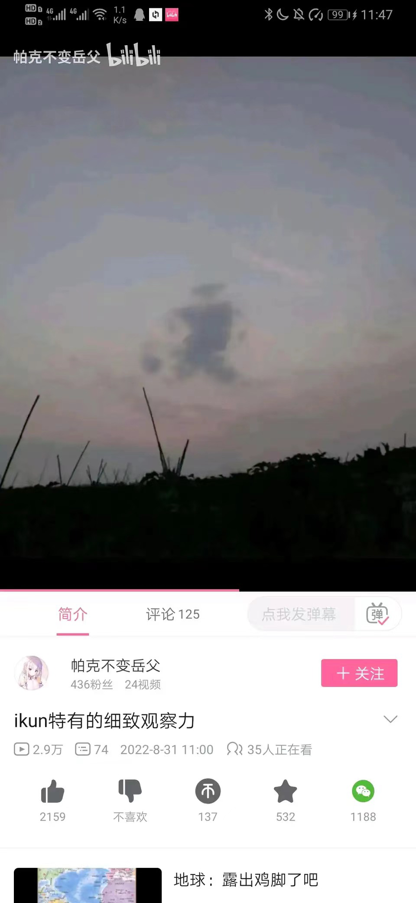

# week - 36

[TOC]

## 带逛知乎

### 关于户籍的观点

[美国堪萨斯的一个农民能不能在纽约定居成为市民？ - 倚阑看日暮的回答 - 知乎](https://www.zhihu.com/question/522158678/answer/2421593405)

户籍这玩意儿，不就是变相的国籍吗？

户籍制度把国内分成了大大小小的王国，安徽人可以免签到上海打工，但是不被视作当地人，不能买房安家，孩子上不了好的学校，老了也不能享受上海的养老待遇。学历高工资高的工作几年可以拿到上海户口，这不就是技术移民吗？

欧盟内的西班牙人要移民到柏林生活，移民难度不一定比一个安徽人要定居上海大吧？所以对个人来说，这个户籍政策，不就相当于国籍么。

### 关于美国分裂的观点

[如何看待《经济学人》最新封面标语「美国成了『美利坚，分众国』」？美国在哪些问题上存在分裂？ - 飞跃本屯的回答 - 知乎]( https://www.zhihu.com/question/551938613/answer/2662105345)

一个山寨只要能持续不断的抢夺财货，花都花不完，那所有的分裂都不是大事，因为抢下面村子要比和同伙火并安全的多。 如果山寨发现下面的村子不是修了炮楼就是穷的光屁股，那坏了，就算是大寨主与二寨主养的狗子互咬，都可能引发山寨的解体。 所以对美国而言，问题不是内部分裂，而是外部的抢劫环境如何了。 目前看还能抢劫到东西，但原来拿出枪晃悠下就能抢到，现在需要扫射一梭子才行。可山寨不产子弹，打一发少一发呀。

## 沙雕海报

一曲肝肠断，天涯何处觅知音

## 一篇散文

作者：吹面不寒
链接：https://www.zhihu.com/question/538335062/answer/2661195589
来源：知乎
著作权归作者所有。商业转载请联系作者获得授权，非商业转载请注明出处。

前几天，有个好久不联系的朋友问我，“这些年，你过得还好吗？”

哈哈哈，当然过得很好呀。

因为在绝大多数情况下，我过得不好，也没有勇气说出来。

上个月一个平常的日子，我像往年一样，潦草的过完了自己今年的生日。

可能是我没有过生日的习惯吧，从小到大，都没有一个人记得过我的生日。

那天，我只是像往常一样，出去逛了逛，但给自己买了一推平时舍不得吃的零食。

晚上一个人漫步在晚风里，月光落在身前，夜幕下的路灯和飞虫都显得落寞。

过了生日，我今年就已经二十五岁了。

这个年纪，身边的人好像都在往前走。毕业工作，买车买房，甚至是结婚生子，似乎只有自己留在了原地。

我以为二十五岁的我，会像个大人一样，在风里雨里奔跑，却没想到喜怒哀乐仍在脸上。

走在路上被小朋友叫叔叔了，会不开心。妈妈没有给我买答应的东西，还会闹小情绪。

常常在路边和偶遇的猫咪对叫，看见漂亮的大胸妹子就想回头。望着天空漂浮的云朵，发呆、思考，想着一些不切实际的事情。

只是有时候，想找人出去散散步时，却发现好像已经没了，可以约出来的朋友了。

恍惚间发现，原来自己真的不是个孩子了。尤其是看着身边的同学、朋友陆续结婚生子，会莫名地感到心慌。

爸妈，好像也已没了当初的活力，自己却还不能好好地照顾自己。时间只是让我成长了年岁，却还没让我成为一个合格的大人。

以前，我不能理解年轻人的丧。在我的认知里，从小到大的教育就在告诉我，要用自己热爱的方式过这一生。

后来，我才明白，这只是一个理想的状态。

我们绝大多数的人，最终都会回到世俗的生活里，为家长里短，为柴米油盐烦恼着。

不知从哪一天开始，只是简单熬一下夜，第二天起来做事，就会浑身没劲。我知道那个曾经炙热的少年，就已经与我渐行渐远了。

可能成长，就是在不断地放下着东西。

后来，我渐渐学会了收起自己的锋芒，把委屈藏在心中，说话做事都有所顾虑。在处理问题时，早没了当初初生牛犊不怕虎的干劲……

隐忍妥协，但有时候又会庆幸自己，依旧有着世俗无法改变的东西。

比如说学不会抽烟喝酒，学不会逢迎欺骗，也有着自己的清高与小傲娇，还是那样喜欢沉浸在自己的世界里。

还是会有孩子的心性，比如说贪玩懒惰。

看着别人事业有成的时候，又会陷入焦虑，觉得自己这个样子不思进取，但却没了耐心和心思去学习。

其实，自己并不是个不喜欢分享的人。只是在大多数情况下，没人愿意聆听我的琐碎。

所以，我很沉默，一直都沉默。

就像是前几天，在微博上看见的热搜，朋友圈已经没了生活的痕迹。

是啊，看了看，自己好像已有大半年，没发过朋友圈了。

身边的绝大多数人，好像都选择了三天可见。

我觉得挺好的，因为现实里很少有人会真正关心你。大部分的人，根本不会多看一眼你的动态。

我们这一生，注定会被很多人路过，也会路过很多人。

可能只有等到哪天，真正遇见同频共振的那个人，才会像只刺猬样敞开心扉，让彼此看看内心深处，不为人知的优雅。

或许相遇的那天，我会因为历经孤独，而格外懂得珍惜。

以前我总以为，人生最美好的是相遇。后来才明白，其实最美好的可能是重逢。

因为人生里的很多告别，都是毫无征兆的。那些悄无声息的离开，或许是永久的沉默和不回头。

后来的我们，不再去追问心知肚明的答案，也不再轻易地将自己的情绪表露出来，开始尝试去做一个不动声色的大人。

那些曾以为生命之不能承受的事，就像是散落在风中的银杏叶，随着成长亦被岁月带走。

那些曾以为刻骨铭心的经历，或是痛苦难捱的日子。后来提及，两个字就足以概括。

从前，从前。

其实，自己这些年来，也并不是过得一点都不快乐。

比如说在路上遇见的快乐小狗，久违的文章动态还有人给我点赞，这些就足够让我快乐。

但又好像不算是真的快乐，只是在一阵短暂的欢愉后，就没了动静。再也没了那种小时候，可以为一件事期待好久好久，就算是得到了还会一直回味的感觉。

小时候的我无忧无虑，却总想着长大。长大后，却又开始怀恋小时候，或许是我还未做好准备，接纳成年人这个身份罢了。

我记得小时候，姥姥家的院子里，种着一颗大银杏树。每年春夏，枝头总是挂着一片绿意。等秋天一到，金灿灿的叶子就在风中招摇。

风将落叶带去远方，天空飘着的云很是明亮。

我只是安静地看着，邻居家那只爱趴在我家屋檐上，呼呼大睡的肥猫，就能虚度一下午的时光。

不知那时候，我们在树下一起追逐玩闹的孩子们。现在，你们怎么样了？这些年来，过得还好吗？

当我在写这篇文章时，正在为生活上的一地鸡毛而烦恼着。不知你们会不会也像我一样，在过去或未来的某个时刻，也在怀念着那个无忧的年代。

落叶随着风一阵摆动，家乡的银杏树一直都在，可是我已经回不去了。

## 一段旋律

## 一眼 ikun

