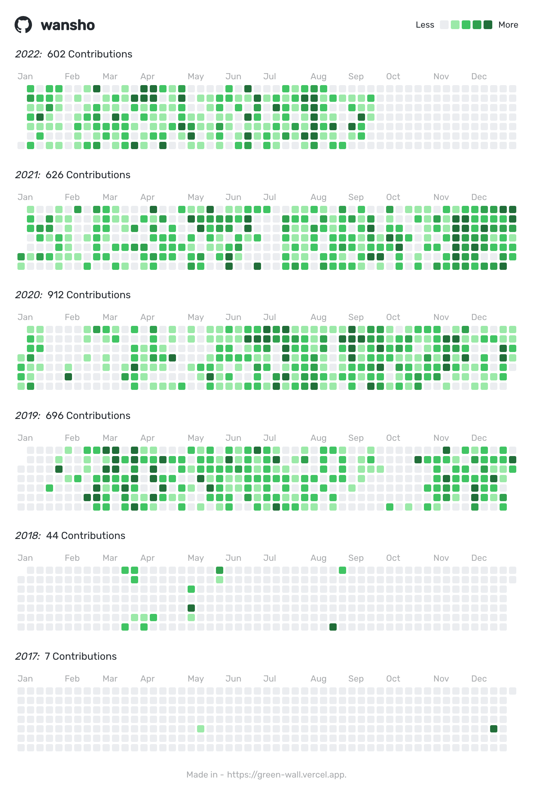

# week-37

## 带逛知乎 & 贴吧

### 成年人的心动

[成年人的心动是什么样的？ - lalala的回答 - 知乎 ](https://www.zhihu.com/question/393800893/answer/2480735977)

## 盲水印

[知乎水印事件](https://mp.weixin.qq.com/s/EykLVZA6MQ3kgKvZFKfR9g)

知乎页面的截图，竟然会注入盲水印，用来追踪截图的用户，真是用心险恶。

## 乔布斯档案

[乔布斯档案](https://stevejobsarchive.com/)，乔布斯家人建立的网站。

又想起了乔布斯在斯坦福大学的演讲。

You can't connect the dots looking forword, you can only connect them looking backwards, wo you have to trust the dots will somehow connect in your future. You have to trust in something, you gut, destiny, life, karma, whatever. Because believing the dots will connect down the road will give you the confidence to follow your heart, even when it lead you off the well-worn path.

The heaviness of being successful was replaced by the lightness of being a beginner again. It free me to enter one of the most creative periods of my life.

It was awful tasting medicine, but I guess the patient needed it. Sometimes life hits you in the head with a brick. Don't lose faith, I'm convinced that the only thing that kept me going was that I loved what I did. You've got to find what you love, and that is as ture for your work as it is for your lovers.

Remembering that you are going to die, is the best way I know to avoid the trap of thinking you have something to lose. You are already naked. There is no reason not to follow your heart.

Keep looking, don't settle.

跟随好奇心和直觉所做的事情，后来都被证明是无价之宝。

走过的每一步都算数。

## green-wall

[green-wall](https://green-wall.vercel.app) 一个可以在线制作 GitHub 历年贡献图表的网站。

## 图书馆占座

## 孙笑川吧

最近发现网络净土：[孙笑川吧](https://tieba.baidu.com/f?kw=%E5%AD%99%E7%AC%91%E5%B7%9D&ie=utf-8)，以后可能要转战贴吧了。

不开玩笑，真的贼解压。

