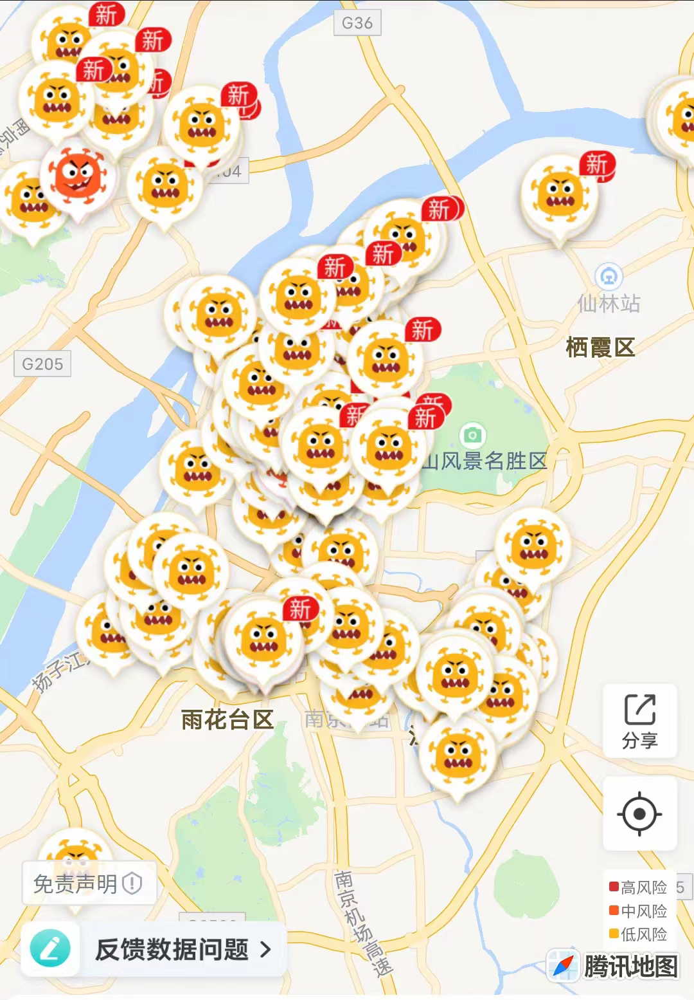
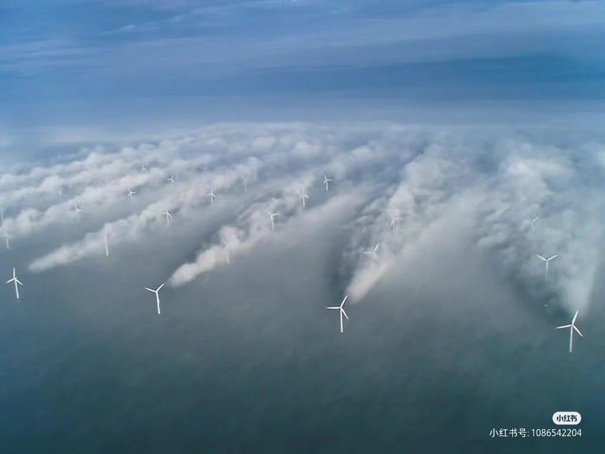

# week - 41/42

[TOC]

## 小红书

最近开始用小红书，发现小红书真的是一本生活百科全书，以前我有问题会问知乎，现在知乎变成了 B 乎，还是小红书更接地气，生活上什么问题都能找到答案。

## 封校下的男寝 - 维密

## 人生又不是只有钱而已

## 科目三

都是我喜欢的梗，太密集，太快乐了。

## jetbrain 下一代 IDE

jetbrain 下一代 IDE：[Fleet](https://www.jetbrains.com/fleet/) 已经进行开发尾声，可以下载预览版使用了！

按照 Jetbrain 的说法是，这款轻量级 IDE 能够支持各种主流语言的开发，这样以后用 Fleet 一款 IDE 即可。

我简单试用了一下，感觉 Fleet 的定位和 VSCode 有些相似，目前是能开发 Java maven 项目的。

注意一点，一定要开启智能模式，智能识别当前项目的技术栈，否则就是一个编辑器而已。

## 椰树牌椰汁

## Google 也在吃老底

今天看[科技爱好者周刊](https://www.ruanyifeng.com/blog/2022/10/weekly-issue-226.html)，发现 Google 近十年无创新性产品，原来 Google 也变得平庸了。让我想起吴军博士在浪潮之巅上提到的那些曾经辉煌过的公司：

贝尔实验室，AT&T，思科，摩托罗拉……

## 布客新知

最近发现一个好玩的 github 仓库 [布客新知](https://github.com/ixinzhi)，里面真的是什么 diao 书都有。

## 制县等级

在 GitHub 上发现两个好玩的仓库，在中国地图上标记去过哪里，然后生成一张标记过的地图。

[制县等级中国版](https://github.com/miklcct/zhixian-dengji-zhongguo-ban)

[「中国制霸生成器」中国三十四省份制霸标记工具](https://github.com/itorr/china-ex)

## 南京疫情地图

2022-10-17

## 风电气流

没想到风电能产生这样规模的气流。

## 带逛知乎

### 世界上真的有人会幸福一生吗？

[世界上真的有人会幸福一生吗？ - 请勿关注的回答 - 知乎]( https://www.zhihu.com/question/559662124/answer/2718139211)

幸福的人生只在于无知与有知，而二者之间皆是痛苦。 无知的人理解不了痛苦，有知的人有能力化解痛苦。 所以希望孩子幸福一生的父母有两个选择，一个是从根上就让孩子无知，不让他思考，只保留TA的本能。 一个是从根上就有目的的教育TA，让TA真正理解这个世界，可以从非凡的角度看待问题，从而化解烦恼。 除此之外皆是痛苦，有求而不可得，有思而不得解，有想而不能成，都是人间至苦，怎么可能幸福。

### 男生当教师有前途吗？

[男生当教师有前途吗？](https://www.zhihu.com/question/37052830/answer/2717646484)

大部分人人到中年才明白：一份旱涝保收的工资，一个收入中规中矩的岗位，一个压力不大不小的职业，就是实实在在的前途。它是一个家庭稳定的基础，是你还房贷的底气，是保证一家人基本生活的物质来源。

世俗中的前途，百里挑一都乐观了，跟职业没有关系，知乎最好的职业，公务员，大部分人也谈不上什么前途，一份普通的职业，一个普通的人生而已。

### 你能把遗憾写到什么程度？

[你能把遗憾写到什么程度？ - 息相吹的回答 - 知乎](https://www.zhihu.com/question/540642172/answer/2720582857)

很久以前，他和她住在各自的地方，互不相识。桃花开，月儿圆。 

很久以后，他和她都有了各自的家，不再往来。花依然开，月依然圆。

### 为什么买小孩买老婆不判死刑？

[为什么买小孩买老婆不判死刑？ - Freeman的回答 - 知乎](https://www.zhihu.com/question/31922877/answer/2719377806)

说句大实话，可能有些刺耳，就是需要买小孩买老婆的人，他们对社会稳定的威胁，远大于被买的小孩女人及其家庭，而且数量众多。

学一学法理学就明白，法律是统治阶级维护其统治的工具，法律创造一个稳定的环境以便于统治，说白了，法律是维稳的。

我没学法律之前一直不明白一件事，不知道你们有没有想到过，就是为什么要设计一大堆毒品犯罪，什么贩毒，制毒，运毒，容留吸毒等等，直接把吸毒算作犯罪不就行了？不行，因为和买老婆的一个性质，人数多，而且不稳。

### 为什么东亚学生上课时通常不甚活跃，不爱发言？

[为什么东亚学生上课时通常不甚活跃，不爱发言？ - 谢流远的回答 - 知乎](https://www.zhihu.com/question/19769575/answer/2721711644)

自信和靠谱是一对矛盾，美国文化更严厉惩罚不自信，中国文化更严厉惩罚不靠谱。

在中国，说60分做60分叫说到做到，说50分做80分叫讷于言而敏于行，说80分做50分叫夸夸其谈，让人觉得不靠谱，不靠谱的人是被严重鄙视的。

在美国，说100分做60分叫自信、精神可嘉，说60分做60分叫没有梦想，说50分做60分叫不自信。不自信的人即使靠谱也得不到机会，自信但不靠谱的人会得到更多容忍。

印度人到美国卡了美国文化的bug，说120分做30分，且多数时候不会被批评，这就是为什么在美国华人拼不过印度人。。。

## 南歌子·再用前韵

带酒冲山雨，和衣睡晚晴。不知钟鼓报天明，梦里栩然蝴蝶、一身轻。
老去才都尽，归来计未成。求田问舍笑豪英，自爱湖边沙路、免泥行。

##  心不安定

## 恋恋风尘

