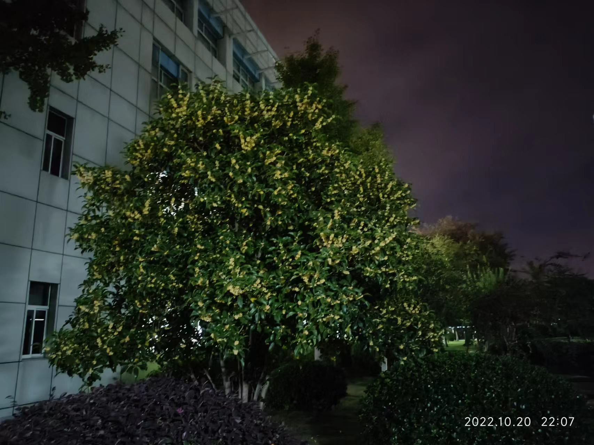
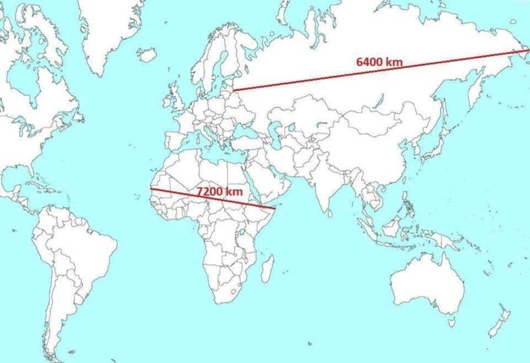
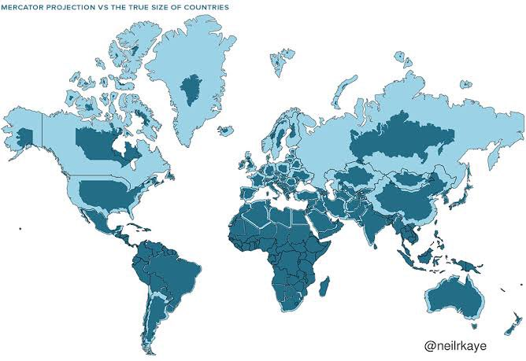
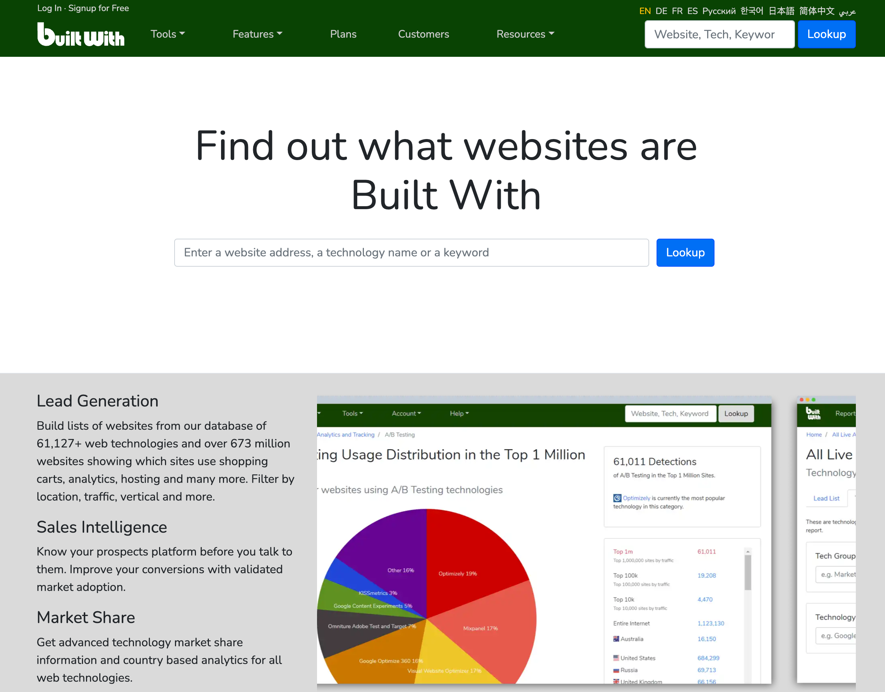

# week-43

[TOC]

## 安徽崛起

[全球 10% 的笔记本电脑在安徽生产，合肥成全球最大 PC 生产制造和研发基地](https://www.ithome.com/0/647/768.htm)

安徽实现了从“科教大省”向“科技创新策源地”的跨越发展。首批综合性国家科学中心、首个国家实验室落子安徽，12 个大科学装置布局建设，量子通信、新型显示、超薄玻璃等领域实现了并跑领跑。

这十年，安徽实现了从“传统农业大省”向“新兴产业集聚地”的跨越发展。**全球 10% 的笔记本电脑、20% 的液晶显示屏在安徽生产，全国每 3 台冰箱、每 4 台洗衣机、每 5 台空调中，就有 1 台是由安徽制造**。

## 拼多多提现

微信群一位好朋友发了拼多多提现链接，感觉挺容易提现的，我助力后，也试了试。

拉了大概 10 位朋友给助力，前后花了大概 10 小时，最后提现 50 块现金，感觉挺好玩的。时间成本也不是特别高。

感觉这种薅羊毛的活动，适合有闲有资源的人去做，一是比较花时间，二是比较耗人际关系。

今天加餐，下次不玩了。

## 公司的桂花树

最爱秋天，公司到哪都能闻到桂花香。

墨绿的夜，隐隐约约

## 真实的世界地图

## 带逛知乎

### 小学的成绩有很大的欺骗性，到了初中就会有很多的学生掉队，是真的吗？

[小学的成绩有很大的欺骗性，到了初中就会有很多的学生掉队，是真的吗？ - 霍克明的回答 - 知乎](https://www.zhihu.com/question/433616847/answer/2710570592)

我现在用的这个方法是我宿舍北大的哥们在20年前教会我的。他和我说，我做题的时候，会先看这道题出题人的意图是什么，然后再做答。 我当时嗤之以鼻，真他妈能吹牛逼，你还能看出题人的意图，你咋不上天呢。 20年后，我发现自己还是太嫩了。人家站在五楼，你站在1楼你肯定看不懂。 所以我把这个方法命名为：河边法。 逝者如斯夫，不舍昼夜。你就站在河边看题目，总会看明白。 我高三的时候，也用过类似的方式，当时立体几何学的不好，当时别的也不会，就会刷题。 我刷了几百道题，每一道不会的题就向上溯源，到底这道题的“题眼”在哪，到底是用到了哪个知识点。 终于有一天，哥们通了。 可惜留给我的时间太短了，只通了立体几何的二十多分，没来得及把其他的全搞通。 后来我想，卧槽，哥们要是早掌握了这个方法多给我点时间，哥们是不是也可以上北大？ 所以，后来我也试着用这个方法教导孩子。 先梳理考试的核心点： 分数乘法：分数乘法的意义是什么？计算方法是什么？计算技巧是什么（约分、带分数、交换、结合、分配）怎么快速检验分数乘法的计算结果是否正确。 然后就是做题，别急，先看，这道题考的哪个知识点，有没有更简便的方法。 有不会的题目，先不要讲题，我们先看这个题目考察的是啥，大概用哪种方法。 这玩意儿就好像是建立了一个索引关系，一边是知识，一边是应用，然后如何去有效的把这两个对接起来。 这是我能提供给孩子的刀，她整个小学都在磨这把刀。即使她在磨刀的过程中，没有成为最顶尖的学生，我也是能够接受的。 可能这把刀也不是最高效的，但是是我能想到的最管用的方式。也希望她能在未来的学习中，找到自己最高效的方式。 什么刀不重要，有没有刀很重要。

### 大家如何看待统战价值这一词？

[大家如何看待统战价值这一词？ - 一桶月饼的回答 - 知乎](https://www.zhihu.com/question/513337605/answer/2668718344)

高统战价值: 梁山泊的宋江

低统战价值: 征方腊的宋江

无统战价值: 打完仗的宋江

### 关于智能驾驶普及

[自动驾驶就算落地，最多取代司机而已，又能有多大实用价值呢，为啥花那么多钱发展呢？ - 观澜的回答 - 知乎](https://www.zhihu.com/question/493681134/answer/2727020915)

如果真完全普及，我完全可以选择住郊区，上车继续睡到单位再起。房价的逻辑可能变化。人的时间值钱。

### 如果重返大一，你会做什么?

[如果重返大一，你会做什么? - 观澜的回答 - 知乎](https://www.zhihu.com/question/324995122/answer/2726206475)

说句玩笑话，假设知道后来的事，毕业家人给了一笔钱买房。那笔钱投点茅台什么的，现在已经财务自由了。所以需要做的是除了混毕业都躺平，而以我现在的专业水平，混毕业应该一点问题没有。 

但如不是开天眼那样的回去，而是站在当前立场的回顾，那应该是学好英语。我毕业那个年代，还是四大、垄断国企看中英语的年代，专业不错，英语不好就白搭。我自己走上现在的路，没去企业就是拜英语不好所赐，不然应该能在高速增长期吃到更多红利。

总结下，要理解时代是怎样的，顺潮流而动，这就是我对现在大学生的第一条忠告。

第二条忠告是，哪怕和父母生活时间少了，也要关注父母的身体，了解家族病史和高危因素，劝他们定期体检。父母身体健康，往往是你自己工作顺利的保证。 

第三条忠告是，把80%精力投在20%的事情上。这实际上是我自己人生的教训。在大学阶段，通常来讲就是专业课加通识素质（电脑，英语这种），什么学生会，什么处过杂的关系基本没用。现在我和一个系其他班的朋友都几乎不联系了。其次重要的是和老师的关系，尤其是希望读研的同学。家里条件可以的同学，千万别只是为了钱打工。我自己大三后打工多的时候一个月挣4000~5000。到毕业时卡里存款都要快6位数了。（大概十几年前了）现在想起来屁用没有。

## builtwith

[builtwith](https://builtwith.com/) 

输入网址，就可以对网站构建用到的技术栈进行分析。

## 迪卡侬

最近逛小红书，种草了迪卡侬，周末去迪卡侬转了一圈，发现新大陆！

衣服比优衣库的性价比高好多，品牌设计，价格实惠。

这是我买的迪卡侬的一款手表，迪卡侬是懂手表的！

## 自遣

李白

对酒不觉暝，落花盈我衣。
醉起步溪月，鸟还人亦稀。
